```{r setup, include=FALSE}
knitr::opts_chunk$set(
  echo = TRUE,
  collapse = TRUE,
  # cache = TRUE,
  comment = '#>'
)
```

# Use R in BeiGene

You can find the RStudio icon at [https://myapplications.microsoft.com/](https://myapplications.microsoft.com/){target="_blank"} (you should apply for RStudio permission to AskIT@beigene.com if you can't find this icon):


Click it then you will jump to Rstudio Server Pro login page, you can get a preview (maybe different layout) after login:

<div class="click-zoom-1-5-left-100">
  <label>
    <input type="checkbox">
    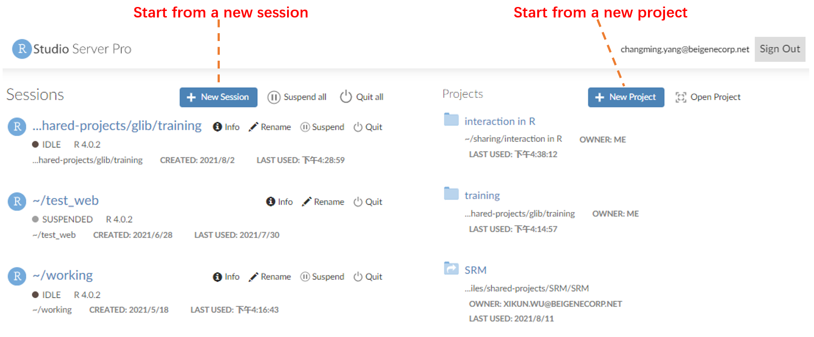
  </label>
</div>

<div class="click-zoom-1-5-left-100">
  <label>
    <input type="checkbox">
    
  </label>
</div>

> Note: If you failed reach the Rstudio Server Pro login page, try to open the url in your AWS.

You can choose pane layout via `View > Panes > Pane Layout` (or `Tools > Global Options > Pane Layout`):

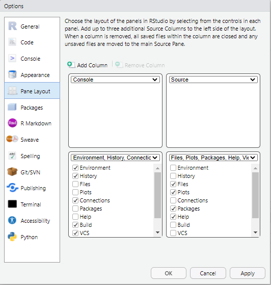

# RStudio views

## Source pane

You can open `.R` (R script), `.Rmd`(R Markdown), `.R` (shiny app) and more in Source pane, and write your code.

### `.R` R script file {-}

<div class="click-zoom-1-5-left-100">
  <label>
    <input type="checkbox">
    
  </label>
</div>

- You can double click to select a word (or texts between `(` `[` `{`), triple click to select a line.

- `Ctrl` + `Enter` to run the current line or selection.

- After select a piece of code, you can type `'` `"` `` ` `` `(` `[` `{` to add symbols at both side of the selected code. In `.Rmd` file, this feature also apply to `*` and `_`.

- You can click the "Source" button to source file with or without echo, or use keyboard shortcuts: `Ctrl` + `Shift` + `Enter` (with echo), `Ctrl` + `Shift` + `S` (without echo).

- `Ctrl` + `F` to find and replace.

- Comments start with `#`, `Ctrl` + `Shift` + `C` can comment/uncomment current line(s).

- A code section is a line which start with `#` and end with at least four `-` (or `=`). You can use `Ctrl` + `Shift` + `R` to insert a code section. Code section is more than comments, it's helpful in dividing code and you can find the label of code section in document outline.

### `.Rmd` R Markdown file {-}

<div class="click-zoom-1-5-left-100">
  <label>
    <input type="checkbox">
    
  </label>
</div>

- Learn more about rmarkdown: [https://rmarkdown.rstudio.com/](https://rmarkdown.rstudio.com/){target="_blank"}

### Shiny app {-}

<div class="click-zoom-1-5-left-100">
  <label>
    <input type="checkbox">
    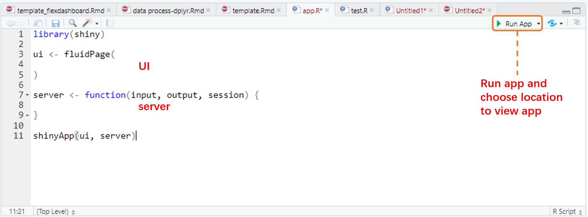
  </label>
</div>

- RStudio recognizes that files named __app.R__, __sever.R__, __ui.R__ and __global.R__ belong to a shiny app.

- Learn more about shiny: [https://shiny.rstudio.com/](https://shiny.rstudio.com/){target="_blank"}

## Colsole pane

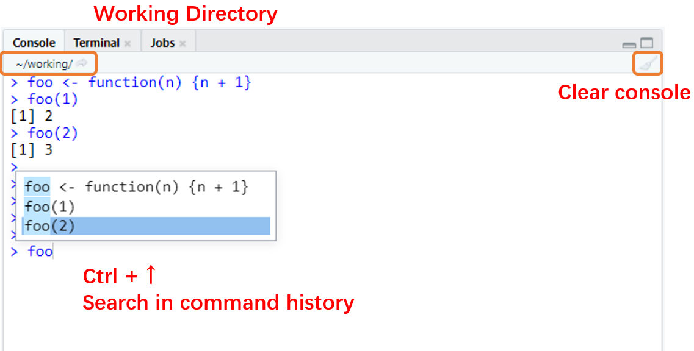

- Once you run a piece of code, you can see the code and the output in console pane. You can also type the code in console directly, and press `Enter` to run.

- The working directory locate at the top of the console, you can click the small button to jump to the working directory (in __Files tab__).

- Press `↑` and `↓` to switch between history command.

- `Ctrl` + `↑` helps you search in command history (usually with prefix).

- `Ctrl` + `L` to clear all the message in console.

- 

  A completion popup (pop up automatically or called by `Tab`) can help you complete your code, `↑` and `↓` to switch, `Enter` to select, and `Esc` to dismiss completion popup. Completion popup works in both source pane and console pane.

-  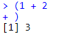

  The current typed commands always start with `>`, but when you try to run a piece of code with not closed quotes and brackets, such as `(1 + 2` or `'foo`, the start of the command will change to `+` and keep accepting your input, until you close the quotes or brackets. You can also press `Esc` to force to exit.

## Terminal tab

You can also work with command line for your operating system. Our RStudio Sever Pro build on linux system so you can run the linux command in terminal tab.


## Environment tab

Environment tab displays saved objects by type with short description.

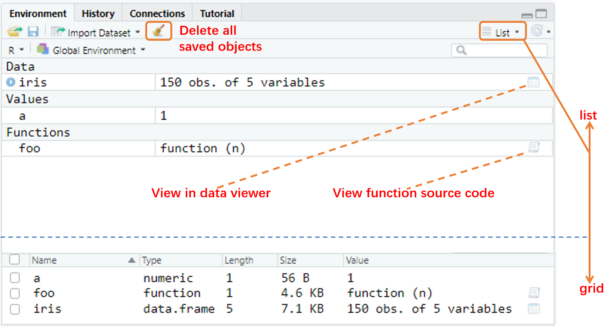

- Click the object to view the details of a dataframe (or list) or view the source code of a function. Same as `View(iris)` and `View(foo)`.

- You can clear all objects (include hidden objects or not) by the small broom button. Same as `rm(list = ls())` and `rm(list = ls(all.names = T))`

## History tab

History tab contains the history commands, you can select lines of codes and send it to source pane or console pane.

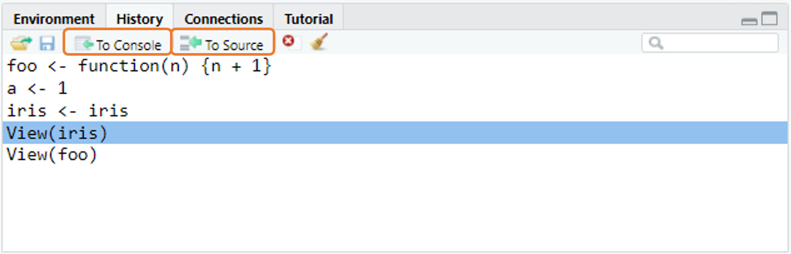

## Files tab

<div class="click-zoom-1-5-left-100">
  <label>
    <input type="checkbox">
    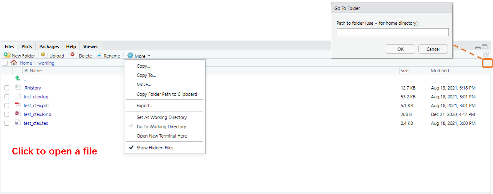
  </label>
</div>

- There are a lot of files (folder) operations in Files tab. Moving files, upload, export and so on.

- You can go to folder with the folder path, `~` for home directory, `/` for the linux root directory, and `/mnt/usrfiles` for our bgcrh directory.

- Note that the working directory is important in R. `getwd()` and `setwd()` can help you get and set the working directory. Be aware of your working directory (not your script file directory) and use relative path in your work.

## Packages tab

Packages tab shows all the package you have installed. Our work in R is also highly dependent on R packages.


- You can install packages via Install button, or do it by `install.packages()`. To install a specific versions of the requested package, use `remotes::install_version()`.

- If you want to use a function (dataset) in a package, you can specify it like: `dplyr::mutate()` or `dplyr::starwars`. Or you can use `library()` to load the whole package into your environment, like `library(dplyr)`, then call the function (dataset) directly: `mutate()` or `starwars`.

- Unclick to detach a package with `detach()`, for example: `detach('package:dplyr')`

- `.libPaths()` gets/sets the library trees within which packages are looked for.

## Help tab

Help tab is the most helpful tool when you are confused about any function. All the documentations (from installed packages) can be searched here via function `help()` (or its shortcuts `?`).

For example, `?mean` (same as `?mean()` and `help(mean)`) show you the documentation of function `mean()` from package `base`. `?starwars` show you the documentation of dataset `starwars` from package `dplyr`, note that you must attach the package first (via `library(dplyr)`) or call it directly: `?dplyr::starwars`.

Documentation of functions, symbols and concepts with non-syntactic names can be also searched: `` ?`+` ``, `?'+'`, `` ?`'` ``, `` ?`?` ``, `` ?`/` ``, `` ?`%/%` ``, `` ?`(` ``, `` ?`for` ``, `` ?`if` `` and so on. You should use backticks or quotes around them.

You can view the whole documentation of a package: `help(package = 'dplyr')`, the package can be not loaded.

`help.search()` (or its shortcuts `??`) is used for a wider range of search from all the package you have ever installed, using either fuzzy matching or regular expression matching. For example: `help.search('linear models')` and `??parallel`

## Plots and Viewer tab

You can use the Plots tab to view the plots that you create during your R analysis, and export plots to files.

Viewer tab displays HTML contents, such as shiny apps, rmarkdown reports, and interactive visualizations.

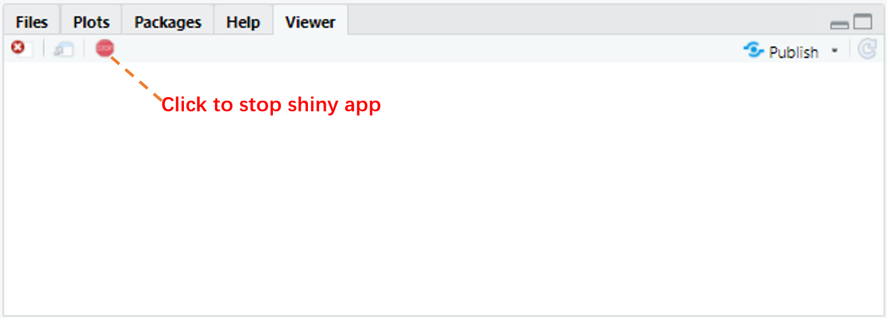

## R Session

You can work with same files in different R sessions. Things would be different in different R sessions (different objects, options, attached packages and so on). Opening a new R session can help you do something new without changing your current working environment.

{width=70%}

You can manage R sessions by "Sessions" button on the top toolbar, or in your main interface of RStudio workbench.

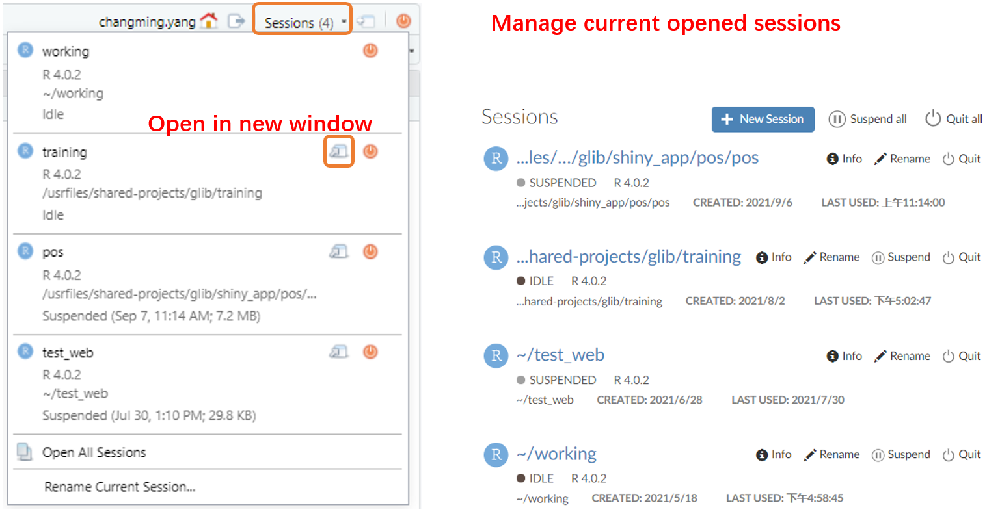

- It's a good habit to start your work from a fresh R session. You can restart your current R session via `Session > Restart R`

You can refer to [Multiple R Sessions in RStudio Workbench / RStudio Server Pro – RStudio Support](https://support.rstudio.com/hc/en-us/articles/211789298-Multiple-R-Sessions-in-RStudio-Workbench-RStudio-Server-Pro){target="_blank"} for more information.

## R Project

RStudio projects make it straightforward to divide your work into multiple contexts, each with their own working directory, workspace, history, and source documents.


When a project is opened within RStudio the following actions are taken:

- A new R session (process) is started

- The current working directory is set to the project directory.

- The .Rprofile file in the project's main directory (if any) is sourced by R

You can share R project to others, when you share a project, RStudio Workbench securely grants other users access to the project, and when multiple users are active in the project at once, you can see each others' activity and work together in a shared editor.

- A recommended path of a shared R project is `/usrfiles/shared-projects`

### Manage packages in R projects {-}

In production environment, it's better to attach the specific packages (`library(dplyr)` `library(tidyr)` and so on) rather than attach a collection of packages (`library(tidyverse)`). It increased the working when a project start, but may decrease the potential working for bug fixing during the project by declaring the specific packages.

It's recommended to use [renv](https://rstudio.github.io/renv/){target="_blank"} to manage packages in R projects. Once you start to use renv in a R project, you can add below code to the .Rprofile file then you can use package cache (quickly installing packages and save memory space).

````
# add this to the .RProf, then restart session.

## renv setup
options(repos = c(CRAN = "https://cran.rstudio.com"))
Sys.setenv(RENV_PATHS_ROOT = "/usrfiles/renv_cache/")
Sys.setenv(RENV_PATHS_CACHE = "/usrfiles/renv_cache/cache")
Sys.setenv(RENV_PATHS_LOCAL = "/usrfiles/renv_cache/local/repository")
Sys.setenv(RENV_PATHS_SOURCE = "/usrfiles/renv_cache/source")
Sys.setenv(RENV_CONFIG_SANDBOX_ENABLED = "FALSE")
Sys.setenv(R_BUILD_TAR = "/usr/bin/tar")
print("renv setup intitialized from .Rprofile")
##
source("renv/activate.R")
````

You can refer to [Using RStudio Projects – RStudio Support](https://support.rstudio.com/hc/en-us/articles/200526207-Using-RStudio-Projects){target="_blank"} and [Sharing Projects in RStudio Workbench / RStudio Server Pro – RStudio Support](https://support.rstudio.com/hc/en-us/articles/211659737-Sharing-Projects-in-RStudio-Workbench-RStudio-Server-Pro){target="_blank"} for more information.

# Other topics

## Keyboard shortcuts

You can get the keyboard shortcut quick reference via `Alt` + `Shift` + `K`, or use `Ctrl` + `Shift` + `P` to show Command Palette, below are some useful keyboard shortcuts (in windows and linux):

__Views__:

- `Ctrl` + `1`: Move focus to Source Editor, `Ctrl` + `2`: Move focus to Console

- `Ctrl` + `Shift` + `1`: Zoom Source Editor, `Ctrl` + `Shift` + `2`: Zoom Console, `Ctrl` + `Shift` + `3`: Zoom Help

__Console__

- `↑`/`↓`: Navigate command history

- `Ctrl` + `↑`: Popup command history

- `Esc`: Interrupt currently executing command

- `Ctrl` + `L`: Clear console

__Source__

- `Ctrl` + `Alt` + `←`/`→`: Previous (Next) tab

- `Ctrl` + `Shift` + `.`: Switch to tab

- `Ctrl` + `.`: Go to File/Function

- `Ctrl` + `F`: Find and Replace

- `Ctrl` + `Shift` + `F`: Find in Files

- `Ctrl` + `S`: Save active document, `Ctrl` + `Alt` + `S`: Save all documents

- `Ctrl` + `Enter`: Run current line/selection (also works in help tab)

- `Alt` + `Enter`: Run current line/selection (retain cursor position)

- `Ctrl` + `Shift` + `S`: Source the current document

- `Ctrl` + `Shift` + `Enter`: Source the current document (with echo)

- `Alt` + mouse drag: Multiple cursor/column selection

- `Ctrl` + `Shift` + `↑`: Expand selection (divided by pairs of `'` `"` `` ` `` `(` `[` `{`), `Ctrl` + `Shift` + `↓`: Shrink selection

- `Ctrl` + `Shift` + `C`: Comment/uncomment current line/selection

- `Ctrl` + `Shift` + `R`: Insert code section

- `Alt` + `L`: Fold Selected (function/code section), `Alt` + `Shift` + `L`: Unfold Selected

- `Alt` + `O`: Fold All (function/code section), `Alt` + `Shift` + `O`: Unfold All

__Editing (Console and Source)__

- `Ctrl` + `Z`: Undo, `Ctrl` + `Shift` + `Z`: Redo

- `Ctrl` + `X`: Cut, `Ctrl` + `C`: Copy, `Ctrl` + `V`: Paste

- `Ctrl` + `A`: Select All

- `Ctrl` + `D`: Delete Line

- `Tab` (at beginning of line): Indent, `Shift` + `Tab`: Outdent

- `Alt` + `-`: Insert assignment operator `<-`

- `Ctrl` + `Shift` + `M`: Insert pipe operator `%>%`

- `F1`: Show help for function at cursor

- `F2`: Show source code for function at cursor

__Completions (Console and Source)__

- `Tab`: Attempt completion

- `↑`/`↓`: Navigate candidates

- `Tab`/`Enter`: Accept selected candidate

- `Esc`/`→`: Dismiss completion popup

## Get help

### Help tab {-}

Help documentations in each package are helpful. You can get the "description", "usage", "arguments", "returned value", "related functions", "examples" and so on in function's help, and "description", "format" and so on in dataset's help.

Almost all the problem about single function's usage can be solved by reading help documentation.

### CRAN {-}

Once you want to learn the whole package's content, you can search the package in CRAN first: [Table of available packages, sorted by name](https://cran.r-project.org/web/packages/available_packages_by_name.html){target="_blank"}

For example, you can find some information about package __dplyr__ from [CRAN - Package dplyr](https://cran.r-project.org/web/packages/dplyr/index.html){target="_blank"}:

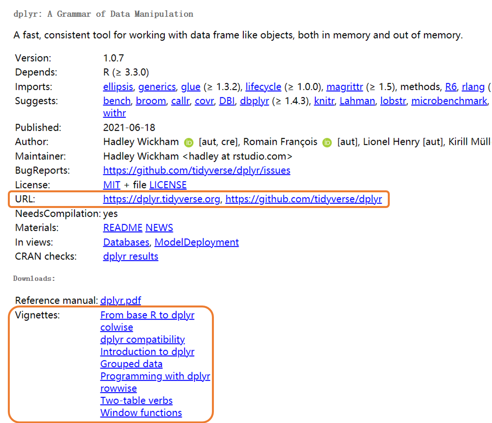

__URL__ link to the package's page (create by package's authors) and the github page, these page always contain the concept and usage of the whole package.

__Vignettes__ (if have) contain blocks of concepts and combined usage across functions.

You can also get the package's dependence information in this page.

### github {-}

You can view the source code, update history and report bugs in github page, for example, [GitHub - tidyverse/dplyr: dplyr: A grammar of data manipulation](https://github.com/tidyverse/dplyr){target="_blank"}:

<div class="click-zoom-1-5-left-100">
  <label>
    <input type="checkbox">
    
  </label>
</div>

### stackoverflow {-}

Sometimes you might want to raise questions or search for help, stackoverflow is a good community for R users. You can search questions or ask questions here: [Newest Questions - Stack Overflow](https://stackoverflow.com/questions){target="_blank"} or [Newest 'r' Questions - Stack Overflow](https://stackoverflow.com/questions/tagged/r){target="_blank"} (with R tags).

### Cheat Sheet {-}

Cheat sheets give quick view about packages or topics: [RStudio Cheatsheets - RStudio](https://rstudio.com/resources/cheatsheets/){target="_blank"} or [GitHub - rstudio/cheatsheets: RStudio Cheat Sheets](https://github.com/rstudio/cheatsheets){target="_blank"}

### Reading {-}

__base R and tidyverse__

- [CRAN: Manuals](https://cran.r-project.org/manuals.html){target="_blank"}

- [Welcome | R for Data Science](https://r4ds.had.co.nz/index.html){target="_blank"}

- [R语言教程](https://www.math.pku.edu.cn/teachers/lidf/docs/Rbook/html/_Rbook/index.html){target="_blank"}

- [Welcome | Advanced R](https://adv-r.hadley.nz/index.html){target="_blank"}

__graphics and interaction__

- [Welcome | ggplot2](https://ggplot2-book.org/){target="_blank"}

- [现代统计图形](https://bookdown.org/xiangyun/msg/){target="_blank"}

- [Interactive web-based data visualization with R, plotly, and shiny](https://plotly-r.com/){target="_blank"}

__rmarkdown__

- [R Markdown: The Definitive Guide](https://bookdown.org/yihui/rmarkdown/){target="_blank"}

- [R Markdown Cookbook](https://bookdown.org/yihui/rmarkdown-cookbook/){target="_blank"}

__shiny__

- [Welcome | Mastering Shiny](https://mastering-shiny.org/index.html){target="_blank"}

## Coding style

A good coding style can help you and others (you after three months) understanding the code more easily. It can save time in team works. Below is a small comparison between two coding style:

:::: {.cols2}

::: {}
Good:

```{r, eval=FALSE}
paste0(
  "Requirement: ", requires, "\n",
  "Result: ", result, "\n"
)
```
:::

::: {}
Bad:

```{r, eval=FALSE}
paste0(
  "Requirement: ", requires,
  "\n", "Result: ",
  result, "\n")
```
:::

::::

You can refer to [Welcome | The tidyverse style guide](https://style.tidyverse.org/index.html){target="_blank"}


