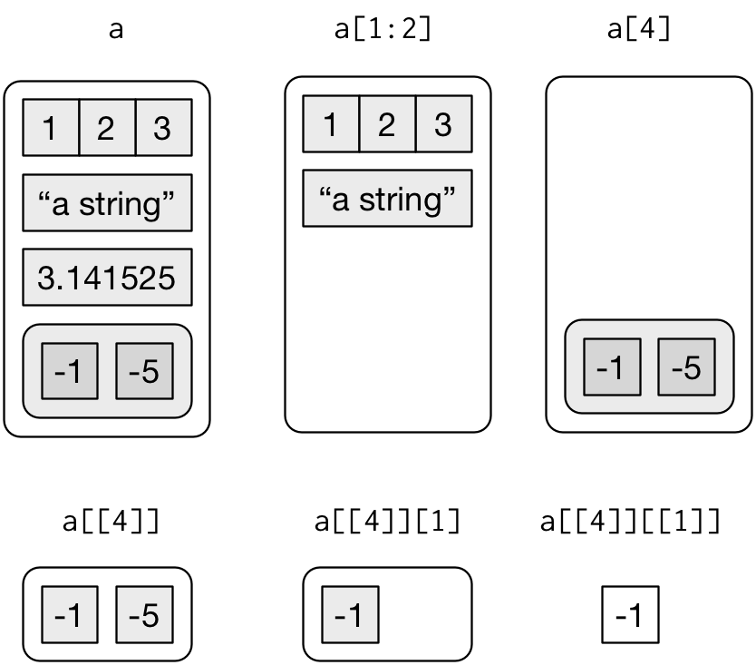

```{r setup, include=FALSE}
# global settings for this document

# options for r code chunk
knitr::opts_chunk$set(
  eval = TRUE,          # run (or not) the code in the chunk
  echo = TRUE,          # display (or not) the code of the chunk
  message = TRUE,       # display (or not) the messages of the chunk
  warning = TRUE,       # display (or not) the warning message of the chunk
  error = FALSE,        # display (or not) the error message of the chunk
  collapse = TRUE,      # collapse (or not) all the source and output blocks in to a single block
  comment = '#>'        # the start of each line of results in the final document
)
# for each r chunk, you can add setting respectively, overriding the global settings
# like: {r eval=FALSE}
# or:   {r eval=TRUE, collapse=FALSE}

# options for tibble print
# 10 rows will be print now
options(tibble.print_min = 10L, tibble.print_max = 10L)

# random seed
set.seed(233)
```

# 1 Introduction to R

R is a programming language developed by Ross Ihaka and Robert Gentleman in 1993. R is a free software environment for statistical computing and graphics. It compiles and runs on a wide variety of UNIX platforms, Windows and MacOS.

Data analysis with R is done in a series of steps; programming, transforming, discovering, modeling and communicate the results.

* **Program:** R is a clear and accessible programming tool
* **Transform:** R is made up of a collection of libraries designed specifically for data science
* **Discover:** Investigate the data, refine your hypothesis and analyze them
* **Model:** R provides a wide array of tools to capture the right model for your data
* **Communicate:** Integrate codes, graphs, and outputs to a report with R Markdown or build Shiny apps to share with the world

# 2 Objects

The `:` operator gives you a nice way to create a group of numbers.

```{r}
1:6
```

Running `1:6` generated a vector of numbers for you to see, but it didn't save that vector anywhere in your computer's memory. If you want to use those numbers again, you'll have to ask your computer to save them somewhere. You can do that by creating an R _object_.

R lets you save data by storing it inside an R object. What is an object? Just a name that you can use to call up stored data. For example, you can save data into an object like _`a`_ or _`b`_. Wherever R encounters the object, it will replace it with the data saved inside, like so:

```{r}
a <- 1
a
a + 2
```

So, for another example, the following code would create an object named `die` that contains the numbers one through six. To see what is stored in an object, just type the object's name by itself:

```{r}
die <- 1:6
die
```

When you create an object, the object will appear in the environment pane of RStudio.

You can name an object in R almost anything you want, but there are a few rules.

* It should contain letters, numbers, and only dot or underscore characters.
* It should not contain use some special symbols, like `^`, `!`, `$`, `@`, `+`, `-`, `/`, or `*`.
* It should not start with a number (eg: 2iota)
* It should not start with a dot followed by a number (eg: .2iota)
* It should not start with an underscore (eg: _iota)
* It should not be a reserved keyword.

|Good names|Names that cause errors
|:---------|:---------
|a         | 1trial
|b         | $
|FOO       | ^mean
|my_var    | 2nd
|.day      | !bad

But you can skip those rules by using ``.

```{r}
`!1` <- 2
`!1`
```

R is case-sensitive, so `name` and `Name` will refer to different objects:

```{r}
Name <- 1
name <- 0
Name + 1
```

Finally, R will overwrite any previous information stored in an object without asking you for permission. So, it is a good idea to _not_ use names that are already taken:

```{r}
my_number <- 1
my_number
my_number <- 999
my_number
```

The function `seq` can generate sequences of real numbers as follows:

```{r}
seq(5)
seq(2, 5)
seq(1, 5, 0.5)
```

The function `rep` creates a vector with all its elements identical:

```{r}
rep(1, 5)
rep(c(1, 3), 3)
rep(c(1, 3), each = 3)
rep(c(1, 3), c(2, 4))
```

You can see which object names you have already used with the function `ls`:

```{r}
ls()
```

You can also see which names you have used by examining RStudio's environment pane.

To delete objects in memory, we use the function `rm`:

```{r}
rm(die)
ls()
```

The statement `rm(list = ls())` will remove all objects from the working environment:
```{r}
rm(list = ls())
ls()
```

# 3 Vectors

## 3.1 Vector Basics

There are two types of vectors:

1.  **Atomic vectors**, of which there are six types: **logical**, **integer**, **double**, **character**, **complex**, and **raw**.
    Integer and double vectors are collectively known as **numeric** vectors.

2.  **Lists**, which are sometimes called recursive vectors because lists can contain other lists.

The chief difference between atomic vectors and lists is that atomic vectors are **homogeneous**, while lists can be **heterogeneous**.

There's one other related object: `NULL`.
`NULL` is often used to represent the absence of a vector (as opposed to `NA` which is used to represent the absence of a value in a vector).
`NULL` typically behaves like a vector of length 0.

```{r datatypes, echo = FALSE, out.width = "50%", fig.cap = "The hierarchy of R's vector types"}
knitr::include_graphics("diagrams/data-structures-overview.png")
```

Every vector has two key properties:

1.  Its **type**, which you can determine with `typeof()`.

```{r}
typeof(letters)
typeof(1:10)
```

2.  Its **length**, which you can determine with `length()`.

```{r}
x <- list("a", "b", 1:10)
length(x)
```

Vectors can also contain arbitrary additional metadata in the form of attributes.
These attributes are used to create **augmented vectors** which build on additional behaviour.
There are three important types of augmented vector:

* **Factors** are built on top of integer vectors.
* **Dates** and **date-times** are built on top of numeric vectors.
* **Data frames** and **tibbles** are built on top of lists.

Further, there are mainly six data types present in R:

1. **Vectors**
2. **Matrices**
3. **Arrays**
4. **Factors**
5. **Lists**
6. **DataFrames / tibble**

We'll start with the very basics. The most simple type of object in R is an _atomic vector_. If you look closely enough, you'll see that most structures in R are built from atomic vectors. 
 
## 3.2 Atomic Vectors

An atomic vector is just a simple vector of data. You can make an atomic vector by grouping some values of data together with `c`:

```{r}
die <- c(1, 2, 3, 4, 5, 6)
die
is.vector(die)
```

`is.vector` tests whether an object is an atomic vector. It returns `TRUE` if the object is an atomic vector and `FALSE` otherwise.

You can also make an atomic vector with just one value. R saves single values as an atomic vector of length 1:

```{r}
five <- 5
five
is.vector(five)
length(five)
length(die)
```

Each atomic vector stores its values as a one-dimensional vector, and each atomic vector can only store one type of data. You can save different types of data in R by using different types of atomic vectors. 

### 3.2.1 Doubles

A double vector stores regular numbers. The numbers can be positive or negative, large or small, and have digits to the right of the decimal place or not. In general, R will save any number that you type in R as a double.

```{r}
die <- c(1, 2, 3, 4, 5, 6)
die
typeof(die)
```

Some R functions refer to doubles as "numerics".

### 3.2.2 Integers

Integer vectors store integers, numbers that can be written without a decimal component.

You can specifically create an integer in R by typing a number followed by an uppercase  `L`. For example:

```{r}
int <- c(-1L, 2L, 4L)
int
typeof(int)
```

Note that R won't save a number as an integer unless you include the `L`. Integer numbers without the `L` will be saved as doubles. The only difference between `4` and `4L` is how R saves the number in your computer's memory. Integers are defined more precisely in your computer's memory than doubles (unless the integer is _very_ large or small). 

Sometimes a difference in precision can have surprising effects. Your computer allocates 64 bits of memory to store each double in an R program. As a result, each double is accurate to about 16 significant digits. This introduces a little bit of error. For example, you may expect the result of the expression below to be zero, but it is not:

```{r}
sqrt(2)^2
sqrt(2)^2 - 2
dplyr::near(sqrt(2)^2, 2)
```

These errors are known as _floating-point_ errors, and doing arithmetic in these conditions is known as _floating-point arithmetic_. Floating-point arithmetic is not a feature of R; it is a feature of computer programming. Luckily, the errors caused by floating-point arithmetic are usually insignificant (and when they are not, they are easy to spot). As a result, you'll generally use doubles instead of integers as a data scientist.

### 3.2.3 Characters

A character vector stores small pieces of text. You can create a character vector in R by typing a character or string of characters surrounded by quotes: 

```{r}
text <- c("Hello",  "World!")
text
typeof(text)
typeof("Hello")
```

The individual elements of a character vector are known as _strings_. Note that a string can contain more than just letters. You can assemble a character string from numbers or symbols as well. In fact, anything surrounded by quotes in R will be treated as a character string—no matter what appears between the quotes.

We can use the function `paste` and `paste0` joins multiple vectors together.

```{r}
paste("Hello", "World!", sep = " ")
paste("x", 1:3, sep = "_")
paste(text, collapse = " ")
paste0("Today is ", date())
```

### 3.2.4 Logicals

Logical vectors store `TRUE`s and `FALSE`s, R's form of Boolean data. Logicals are very helpful for doing things like comparisons:

```{r}
3 > 4
```

Any time you type `TRUE` or `FALSE` in capital letters (without quotation marks), R will treat your input as logical data. R also assumes that `T` and `F` are shorthand for `TRUE` and `FALSE`, unless they are defined elsewhere (e.g. `T <- 500`). Since the meaning of `T` and `F` can change, its best to stick with `TRUE` and `FALSE`:

```{r}
logic <- c(TRUE, FALSE, TRUE)
logic
typeof(logic)
typeof(F)
F <- 500
typeof(F)
```

### 3.2.5 Complex and Raw

Doubles, integers, characters, and logicals are the most common types of atomic vectors in R, but R also recognizes two more types: complex and raw.

Complex vectors store complex numbers. To create a complex vector, add an imaginary term to a number with `i`:

```{r}
comp <- c(1 + 1i, 1 + 2i, 1 + 3i)
comp
typeof(comp)
```

Raw vectors store raw bytes of data. Making raw vectors gets complicated, but you can make an empty raw vector of length _n_ with `raw(n)`. See the help page of `raw` for more options when working with this type of data:

```{r}
raw(3)
typeof(raw(3))
```

## 3.3 Attributes

An attribute is a piece of information that you can attach to an atomic vector (or any R object). The attribute won't affect any of the values in the object, and it will not appear when you display your object. You can think of an attribute as "metadata"; it is just a convenient place to put information associated with an object. R will normally ignore this metadata, but some R functions will check for specific attributes. These functions may use the attributes to do special things with the data.

You can see which attributes an object has with `attributes`. `attributes` will return `NULL` if an object has no attributes. An atomic vector, like `die`, won't have any attributes unless you give it some: 

```{r}
attributes(die)
```

R uses `NULL` to represent the null set, an empty object. `NULL` is often returned by functions whose values are undefined. You can create a `NULL` object by typing `NULL` in capital letters.

### 3.3.1 Names

The most common attributes to give an atomic vector are names, dimensions (dim), and classes. Each of these attributes has its own helper function that you can use to give attributes to an object. You can also use the helper functions to look up the value of these attributes for objects that already have them. For example, you can look up the value of the names attribute of `die` with `names`:

```{r}
names(die)
```

`NULL` means that `die` does not have a names attribute. You can give one to `die` by assigning a character vector to the output of `names`. The vector should include one name for each element in `die`: 

```{r}
names(die) <- c("one", "two", "three", "four", "five", "six")
```

Now `die` has a names attribute:

```{r}
names(die)
attributes(die)
```

R will display the names above the elements of `die` whenever you look at the vector:

```{r}
die
```

However, the names won't affect the actual values of the vector, nor will the names be affected when you manipulate the values of the vector:

```{r}
die + 1
```

You can also use `names` to change the names attribute or remove it all together. To change the names, assign a new set of labels to `names`: 

```{r}
names(die) <- c("uno", "dos", "tres", "quatro", "cinco", "seis")
die
```

To remove the names attribute, set it to `NULL`:

```{r}
names(die) <- NULL
die
```

### 3.3.2 Dim

You can transform an atomic vector into an _n_-dimensional array by giving it a dimensions attribute with `dim`. To do this, set the `dim` attribute to a numeric vector of length _n_. R will reorganize the elements of the vector into _n_ dimensions. Each dimension will have as many rows (or columns, etc.) as the _nth_ value of the `dim` vector. For example, you can reorganize `die` into a 2 &#x00D7; 3 matrix (which has 2 rows and 3 columns):

```{r}
dim(die) <- c(2, 3)
die
```

or a 3 &#x00D7; 2 matrix (which has 3 rows and 2 columns):

```{r}
dim(die) <- c(3, 2)
die
```

or a 1 &#x00D7; 2 &#x00D7; 3 hypercube (which has 1 row, 2 columns, and 3 "slices"). This is a three-dimensional structure, but R will need to show it slice by slice by slice on your two-dimensional computer screen:

```{r}
dim(die) <- c(1, 2, 3)
die
```

R will always use the first value in `dim` for the number of rows and the second value for the number of columns. In general, rows always come first in R operations that deal with both rows and columns. 

You may notice that you don't have much control over how R reorganizes the values into rows and columns. For example, R always fills up each matrix by columns, instead of by rows. If you'd like more control over this process, you can use one of R's helper functions, `matrix` or `array`. They do the same thing as changing the `dim` attribute, but they provide extra arguments to customize the process.

## 3.4 Matrices

Matrices store values in a two-dimensional array, just like a matrix from linear algebra. To create one, first give `matrix` an atomic vector to reorganize into a matrix. Then, define how many rows should be in the matrix by setting the `nrow` argument to a number. `matrix` will organize your vector of values into a matrix with the specified number of rows. Alternatively, you can set the `ncol` argument, which tells R how many columns to include in the matrix: 

```{r}
m <- matrix(die, nrow = 2)
m
```

`matrix` will fill up the matrix column by column by default, but you can fill the matrix row by row if you include the argument `byrow = TRUE`:

```{r}
m <- matrix(die, nrow = 2, byrow = TRUE)
m
```

You can use `nrow` and `ncol` to access the number of rows and columns of the matrix:

```{r}
nrow(m)
ncol(m)
```

The matrix has a dim attribute that contains a vector of two elements, the number of rows and columns of the matrix.The dim property can be accessed using the `dim`:

```{r}
attributes(m)
dim(m)
```


## 3.5 Arrays

The `array` function creates an n-dimensional array. For example, you could use `array` to sort values into a cube of three dimensions or a hypercube in 4, 5, or _n_ dimensions. `array` is not as customizeable as `matrix` and basically does the same thing as setting the `dim` attribute. To use `array`, provide an atomic vector as the first argument, and a vector of dimensions as the second argument, now called `dim`:

```{r}
ar <- array(c(11:14, 21:24, 31:34), dim = c(2, 2, 3))
ar
```

## 3.6 Class

Notice that changing the dimensions of your object will not change the type of the object, but it _will_ change the object's `class` attribute:

```{r}
dim(die) <- c(2, 3)
typeof(die)
class(die)
```

A matrix is a special case of an atomic vector. For example, the `die` matrix is a special case of a double vector. Every element in the matrix is still a double, but the elements have been arranged into a new structure. R added a `class` attribute to `die` when you changed its dimensions. This class describes `die`'s new format. Many R functions will specifically look for an object's `class` attribute, and then handle the object in a predetermined way based on the attribute.

Note that an object's `class` attribute will not always appear when you run `attributes`; you may need to specifically search for it with `class`:

```{r}
attributes(die)
```

You can apply `class` to objects that do not have a `class` attribute. `class` will return a value based on the object's atomic type. Notice that the "class" of a double is "numeric":

```{r}
class("Hello")
class(5)
```

### 3.6.1 Dates and Times

Dates in R are numeric vectors that represent the number of days since 1 January 1970.

```{r}
today <- Sys.Date()
today
typeof(today)
class(today)
unclass(today)
```

Date-times are numeric vectors with class `POSIXct` that represent the number of seconds since 12:00 AM January 1st 1970 (in the Universal Time Coordinated (UTC) zone).
(In case you were wondering, "POSIXct" stands for "Portable Operating System Interface", calendar time.)

```{r}
now <- Sys.time()
now
typeof(now)
class(now)
unclass(now)
Sys.timezone()
lubridate::with_tz(now, tzone = "Asia/Shanghai")
```

### 3.6.2 Factors

Factors are R's way of storing categorical information, like ethnicity or eye color. To make a factor, pass an atomic vector into the `factor` function. R will recode the data in the vector as integers and store the results in an integer vector. R will also add a `levels` attribute to the integer, which contains a set of labels for displaying the factor values, and a `class` attribute, which contains the class `factor`:

```{r}
gender <- factor(c("male", "female", "female", "male"))
gender
typeof(gender)
attributes(gender)
```

You can see exactly how R is storing your factor with `unclass`:

```{r}
unclass(gender)
```

Factors make it easy to put categorical variables into a statistical model because the variables are already coded as numbers. However, factors can be confusing since they look like character strings but behave like integers. 

R will often try to convert character strings to factors when you load and create data. You can convert a factor to a character string with the `as.character` function. R will retain the display version of the factor, not the integers stored in memory:

```{r}
as.character(gender)
```

## 3.7 Using Atomic Vectors

Now that you understand the different types of atomic vector, it's useful to review some of the important tools for working with them.
These include:

1.  How to convert from one type to another, and when that happens automatically.

2.  How to tell if an object is a specific type of vector.

3.  What happens when you work with vectors of different lengths.

4.  How to pull out elements of interest.

5.  How to merge the elements of vectors.

### 3.7.1 Coercion

If you try to put multiple types of data into a vector, R will convert the elements to a single type of data.R's coercion behavior may seem inconvenient, but it is not arbitrary. R always follows the same rules when it coerces data types. Once you are familiar with these rules, you can use R's coercion behavior to do surprisingly useful things.

So how does R coerce data types? If a character string is present in an atomic vector, R will convert everything else in the vector to character strings. If a vector only contains logicals and numbers, R will convert the logicals to numbers; every `TRUE` becomes a 1, and every `FALSE` becomes a 0. 

```{r coercion, echo = FALSE, out.width = "50%", fig.cap = "R always uses the same rules to coerce data to a single type."}
knitr::include_graphics("images/hopr_0301.png")
```

R uses the same coercion rules when you try to do math with logical values. So the following code:

```{r}
sum(c(TRUE, TRUE, FALSE, FALSE))
```

will become:

```{r}
sum(c(1, 1, 0, 0))
```

You can explicitly ask R to convert data from one type to another with the `as` functions. R will convert the data whenever there is a sensible way to do so:

```{r}
as.character(1)
as.logical(1)
as.numeric(FALSE)
```

In some cases, using only a single type of data is a huge advantage. Vectors, matrices, and arrays make it very easy to do math on large sets of numbers because R knows that it can manipulate each value the same way. Operations with vectors, matrices, and arrays also tend to be fast because the objects are so simple to store in memory.

### 3.7.2 Test Functions

Sometimes you want to do different things based on the type of vector.
One option is to use `typeof()`.
Another is to use a test function which returns a `TRUE` or `FALSE`.
Base R provides many functions like `is.vector()` and `is.atomic()`, but they often return surprising results.
Instead, it's safer to use the `is_*` functions provided by purrr, which are summarised in the table below.

|                  | logical | integer | double | character  | list |
|:-----------------|:--------|:--------|:-------|:-----------|:-----|
| `is_logical()`   | x       |         |        |            |      |
| `is_integer()`   |         | x       |        |            |      |
| `is_double()`    |         |         | x      |            |      |
| `is_numeric()`   |         | x       | x      |            |      |
| `is_character()` |         |         |        | x          |      |
| `is_atomic()`    | x       | x       | x      | x          |      |
| `is_list()`      |         |         |        |            | x    |
| `is_vector()`    | x       | x       | x      | x          | x    |

### 3.7.3 Scalars and Recycling Rules

As well as implicitly coercing the types of vectors to be compatible, R will also implicitly coerce the length of vectors.
This is called vector **recycling**, because the shorter vector is repeated, or recycled, to the same length as the longer vector.

This is generally most useful when you are mixing vectors and "scalars".
I put scalars in quotes because R doesn't actually have scalars: instead, a single number is a vector of length 1.
Because there are no scalars, most built-in functions are **vectorised**, meaning that they will operate on a vector of numbers.
That's why, for example, this code works:

```{r}
sample(10) + 100
runif(10) > 0.5
```

In R, basic mathematical operations work with vectors.
That means that you should never need to perform explicit iteration when performing simple mathematical computations.

It's intuitive what should happen if you add two vectors of the same length, or a vector and a "scalar", but what happens if you add two vectors of different lengths?

```{r}
1:10 + 1:2
```

Here, R will expand the shortest vector to the same length as the longest, so called recycling.
This is silent except when the length of the longer is not an integer multiple of the length of the shorter:

```{r}
1:10 + 1:3
```

While vector recycling can be used to create very succinct, clever code, it can also silently conceal problems.

### 3.7.4 Subsetting

`[` is the subsetting function, and is called like `x[a]`.
There are four types of things that you can subset a vector with:

1.  A numeric vector containing only integers.
    The integers must either be all positive, all negative, or zero.

    Subsetting with positive integers keeps the elements at those positions:

    ```{r}
    x <- c("one", "two", "three", "four", "five")
    x[c(3, 2, 5)]
    ```

    By repeating a position, you can actually make a longer output than input:

    ```{r}
    x[c(1, 1, 5, 5, 5, 2)]
    ```

    Negative values drop the elements at the specified positions:

    ```{r}
    x[c(-1, -3, -5)]
    ```

    It's an error to mix positive and negative values:

    ```{r, error = TRUE}
    x[c(1, -1)]
    ```

    The error message mentions subsetting with zero, which returns no values:

    ```{r}
    x[0]
    ```

    This is not useful very often, but it can be helpful if you want to create unusual data structures to test your functions with.

2.  Subsetting with a logical vector keeps all values corresponding to a `TRUE` value.
    This is most often useful in conjunction with the comparison functions.

    ```{r}
    x <- c(10, 3, NA, 5, 8, 1, NA)
    # All non-missing values of x
    x[!is.na(x)]
    # All even (or missing!) values of x
    x[x %% 2 == 0]
    x[!is.na(x) & x %% 2 == 0]
    ```

3.  If you have a named vector, you can subset it with a character vector:

    ```{r}
    x <- c(abc = 1, def = 2, xyz = 5)
    x[c("xyz", "def")]
    ```

    Like with positive integers, you can also use a character vector to duplicate individual entries.

4.  The simplest type of subsetting is nothing, `x[]`, which returns the complete `x`.
    This is not useful for subsetting vectors, but it is useful when subsetting matrices (and other high dimensional structures) because it lets you select all the rows or all the columns, by leaving that index blank.
    
    ```{r}
    m <- matrix(1:6, nrow = 2)
    m
    m[1, ]
    m[ ,-1]
    ```
    
    Notice that when you take a subset of a matrix, if you take a subset that has only one row or only one column, you're no longer going to be a matrix but you're going to be an R vector, which is neither a row vector nor a column vector.To prevent this rule from working, add the `drop = FALSE` option to the square bracket subscript.
    
    ```{r}
    m1 <- m[ , 1]
    m1
    attributes(m1)
    m2 <- m[ , 1, drop = FALSE]
    m2
    attributes(m2)
    ```
   
### 3.7.5 Merging

If `x` is a vector, `cbind(x)` turns x into a column vector, that is, a matrix with columns of 1, and `rbind(x)` turns x into a row vector.

If `x1`, `x2`, `x3` are equal length vectors, `cbind(x1, x2, x3)` treats them as column vectors and puts them together to form a matrix.The arguments of `cbind` can contain both a vector and a matrix, and the length of the vector must be equal to the number of rows in the matrix.

```{r}
c1 <- cbind(c(1,2,3))
c1
cbind(c(1,2), c(3,4), c(5,6))
c2 <- matrix(1:6, nrow = 3)
c2
cbind(c2, c(1,-1,10))
```

`cbind` is also allowed to have scalars in its arguments, where the scalars are reused

```{r}
cbind(1, c(1,-1,10))
cbind(c(1,2), c(1,-1,10))
```

`rbind` is used in a similar way. You can put a vector of equal length together as a row vector, or a matrix together with a vector of length equal to the number of columns in the matrix, or a vector of length one.

```{r, warning=TRUE}
r1 <- rbind(c(1,2,3))
r1
rbind(c(1,2), c(3,4), c(5,6))
r2 <- matrix(1:6, ncol = 3)
r2
rbind(r2, c(1,-1,10))
rbind(1, c(1,-1,10))
rbind(c(1,2), c(1,-1,10))
```

## 3.8 Lists

Lists are like atomic vectors because they group data into a one-dimensional set. However, lists do not group together individual values; lists group together R objects, such as atomic vectors and other lists. For example, you can make a list that contains a numeric vector of length 31 in its first element, a character vector of length 1 in its second element, and a new list of length 2 in its third element. To do this, use the `list` function. 

`list` creates a list the same way `c` creates a vector. Separate each element in the list with a comma:

```{r}
list1 <- list(100:130, "R", list(TRUE, FALSE))
list1
```

Lists are a basic type of object in R, on par with atomic vectors. Like atomic vectors, they are used as building blocks to create many more spohisticated types of R objects.

As you can imagine, the structure of lists can become quite complicated, but this flexibility makes lists a useful all-purpose storage tool in R: you can group together anything with a list. 

A very useful tool for working with lists is `str()` because it focusses on the **structure**, not the contents.

```{r}
str(list1)
```

### 3.8.1 Subsetting

There are three ways to subset a list, which I'll illustrate with a list named `a`:

```{r}
a <- list(a = 1:3, b = "a string", c = pi, d = list(-1, -5))
str(a)
```

1.  `[` extracts a sub-list.
    The result will always be a list.

    ```{r}
    str(a[1:2])
    str(a[4])
    ```

    Like with vectors, you can subset with a logical, integer, or character vector.

2.  `[[` extracts a single component from a list.
    It removes a level of hierarchy from the list.

    ```{r}
    str(a[[1]])
    str(a[[4]])
    ```

3.  `$` is a shorthand for extracting named elements of a list.
    It works similarly to `[[` except that you don't need to use quotes.

    ```{r}
    a$a
    a[["a"]]
    ```

The distinction between `[` and `[[` is really important for lists, because `[[` drills down into the list while `[` returns a new, smaller list.

```{r lists-subsetting, echo = FALSE, out.width = "40%", fig.cap = "Subsetting a list, visually."}

```


## 3.9 Data Frames

Data frames are the two-dimensional version of a list. They are far and away the most useful storage structure for data analysis. You can think of a data frame as R's equivalent to the Excel spreadsheet because it stores data in a similar format. 

Data frames group vectors together into a two-dimensional table. Each vector becomes a column in the table. As a result, each column of a data frame can contain a different type of data; but within a column, every cell must be the same type of data.

Creating a data frame by hand takes a lot of typing, but you can do it (if you like) with the `data.frame` function. Give `data.frame` any number of vectors, each separated with a comma. Each vector should be set equal to a name that describes the vector. `data.frame` will turn each vector into a column of the new data frame: 

```{r}
df <- data.frame(face = c("ace", "two", "six"), suit = c("clubs", "clubs", "clubs"), value = c(1, 2, 3), stringsAsFactors = TRUE)
df
```

You'll need to make sure that each vector is the same length (or can be made so with R's recycling rules), as data frames cannot combine columns of different lengths.

If you look at the type of a data frame, you will see that it is a list. In fact, each data frame is a list with class `data.frame`. You can see what types of objects are grouped together by a list (or data frame) with the `str` function:

```{r}
typeof(df)
class(df)
str(df)
```

Notice that R saved your character strings as factors. It is not a very big deal here, but you can prevent this behavior by adding the argument `stringsAsFactors = FALSE` to `data.frame`:

**Note:** `StringsAsFactors` determines should character vectors be converted to factors. The ‘factory-fresh’ default has been TRUE previously but has been changed to FALSE for R 4.0.0. Only as short time workaround, you can revert by setting options(stringsAsFactors = TRUE) which now warns about its deprecation.

```{r}
df1 <- data.frame(face = c("ace", "two", "six"), suit = c("clubs", "clubs", "clubs"), value = c(1, 2, 3))
str(df1)
```

You can use `View` to See the full dataframe. And you can use `head` to list the first few lines(default = 6) of the dataframe.

```{r}
# View(df1)
head(df1, n=2L)
```

### 3.9.1 Tibbles

Tibbles are augmented lists: they have class "tbl_df" + "tbl" + "data.frame", and `names` (column) and `row.names` attributes:

```{r}
tb <- tibble::tibble(x = 1:5, y = 5:1)
tb
typeof(tb)
attributes(tb)
```

The difference between a tibble and a list is that all the elements of a data frame must be vectors with the same length.
All functions that work with tibbles enforce this constraint.

Traditional data.frames have a very similar structure:

```{r}
df2 <- data.frame(x = 1:5, y = 5:1)
df2
typeof(df2)
attributes(df2)
```

The main difference is the class.
The class of tibble includes "data.frame" which means tibbles inherit the regular data frame behaviour by default.

# 4 Operators

There are four main categories of Operators in R programming language.

1.  Assignment Operators

2.  Arithmetic Operators

3.  Relational Operators

4.  Logical Operators

## 4.1 Assignment Operators

Assignment Operators are those that help in assigning a value to the variable.

```{r}
a = 2
a
a <- TRUE
a
454 -> a
a
a <<- 2.9
a
c(6, 8, 9) -> a
a
```

## 4.2 Arithmetic Operators

Arithmetic Operators are used to accomplish arithmetic operations.

:::: {.cols2}

::: {}
Example for scalars:

```{r}
a <- 7.5
b <- 2

print ( a+b ) #addition
print ( a-b ) #subtraction
print ( a*b ) #multiplication
print ( a/b ) #Division
print ( a%%b ) #Reminder
print ( a%/%b ) #Quotient
print ( a^b ) #Power of
```
:::

::: {}
Example for vectors:

```{r}
a <- c(8, 9, 6)
b <- c(2, 4, 5)

print ( a+b ) #addition
print ( a-b ) #subtraction
print ( a*b ) #multiplication
print ( a/b ) #Division
print ( a%%b ) #Reminder
print ( a%/%b ) #Quotient
print ( a^b ) #Power of
```
:::

::::

You can do inner multiplication with the `%*%` operator and outer multiplication with the `%o%` operator:

```{r}
die <- c(1:6)
die %*% die
die %o% die
```

## 4.3 Relational Operators

Relational Operators are those that find out relation between the two operands provided to them.
The output is boolean (TRUE or FALSE) for all of the Relational Operators in R programming language.

|Operator |Syntax             |Tests
|:--------|:------------------|:-----
|`>`      |`a > b`            |Is a greater than b?
|`>=`     |`a >= b`           |Is a greater than or equal to b?
|`<`      |`a < b`            |Is a less than b?
|`<=`     |`a <= b`           |Is a less than or equal to b?
|`==`     |`a == b`           |Is a equal to b?
|`!=`     |`a != b`           |Is a not equal to b?
|`%in%`   |`a %in% c(a, b, c)`|Is a in the group c(a, b, c)? 

:::: {.cols2}

::: {}
Example for scalars:

```{r}
a <- 7.5
b <- 2

print ( a<b ) # less than
print ( a>b ) # greater than
print ( a==b ) # equal to
print ( a<=b ) # less than or equal to
print ( a>=b ) # greater than or equal to
print ( a!=b ) # not equal to
```
:::

::: {}
Example for vectors:

```{r}
a <- c(7.5, 3, 5)
b <- c(2, 7, 0)

print ( a<b ) # less than
print ( a>b ) # greater than
print ( a==b ) # equal to
print ( a<=b ) # less than or equal to
print ( a>=b ) # greater than or equal to
print ( a!=b ) # not equal to
```
:::

::::


`%in%` is the only operator that does not do normal element-wise execution. `%in%` tests whether the value(s) on the left side are in the vector on the right side. If you provide a vector on the left side, `%in%` will _not_ pair up the values on the left with the values on the right and then do element-wise tests. Instead, `%in%` will independently test whether each value on the left is _somewhere_ in the vector on the right: 

```{r}
1 %in% c(3, 4, 5)
c(1, 2) %in% c(3, 4, 5)
c(1, 2, 3) %in% c(3, 4, 5)
c(1, 2, 3, 4) %in% c(3, 4, 5)
```

Notice that you test for equality with a double equals sign, `==`, and not a single equals sign, `=`, which is another way to write `<-`.

## 4.4 Logical Operators

Logical Operators in R programming language work only for the basic data types logical, numeric and complex and vectors of these basic data types.

|Operator |Syntax |Tests
|:--------|:------|:----
|`&`      |`cond1 & cond2`                |Are both `cond1` and `cond2` true?
|`|`      |`cond1 | cond2`                |Is one or more of `cond1` and `cond2` true?
|`xor`    |`xor(cond1, cond2)`            |Is exactly one of `cond1` and `cond2` true?
|`!`      |`!cond1`                       |Is `cond1` false? (e.g., `!` flips the results of a logical test)
|`any`    |`any(cond1, cond2, cond3, ...)`|Are any of the conditions true?
|`all`    |`all(cond1, cond2, cond3, ...)`|Are all of the conditions true?

:::: {.cols2}

::: {}
Example for basic logical elements:

```{r}
a <- 0 # logical FALSE
b <- 2 # logical TRUE

print ( a & b ) # logical AND element wise
print ( a | b ) # logical OR element wise
print ( !a ) # logical NOT element wise
print ( a && b ) # logical AND consolidated for all elements
print ( a || b ) # logical OR consolidated for all elements
```
:::

::: {}
Example for boolean vectors:

```{r}
a <- c(TRUE, TRUE, FALSE, FALSE)
b <- c(TRUE, FALSE, TRUE, FALSE)

print ( a & b ) # logical AND element wise
print ( a | b ) # logical OR element wise
print ( !a ) # logical NOT element wise
print ( a && b ) # logical AND consolidated for all elements
print ( a || b ) # logical OR consolidated for all elements
```
:::

::::

You can use `||` (or) and `&&` (and) to combine multiple logical expressions.
These operators are "short-circuiting": as soon as `||` sees the first `TRUE` it returns `TRUE` without computing anything else.
As soon as `&&` sees the first `FALSE` it returns `FALSE`.
You should never use `|` or `&` in an `if` statement: these are vectorised operations that apply to multiple values.
If you do have a logical vector, you can use `any()` or `all()` to collapse it to a single value.

```{r}
a <- c(TRUE, TRUE, FALSE, FALSE)
b <- c(TRUE, FALSE, TRUE, FALSE)

xor(a,b)
any(a,b)
all(a,b)
```

## 4.5 Missing Information

Missing information problems happen frequently in data science. Usually, they are more straightforward: you don't know a value because the measurement was lost, corrupted, or never taken to begin with. R has a way to help you manage these missing values.

The `NA` character is a special symbol in R. It stands for "not available" and can be used as a placeholder for missing information. R will treat NA exactly as you should want missing information treated.

```{r}
1 + NA
NA == 1
NA != 1
NA == NA
!NA
NA %in% c(TRUE, 0, FALSE)
NA %in% c(TRUE, NA, FALSE)
NA & TRUE
NA | TRUE
NA & FALSE
NA | FALSE
```

### 4.5.1 na.rm

Missing values can help you work around holes in your data sets, but they can also create some frustrating problems.

```{r}
c(NA, 1:50)
mean(c(NA, 1:50))
```

Most R functions come with the optional argument, `na.rm`, which stands for `NA` remove. R will ignore `NA`s when it evaluates a function if you add the argument `na.rm = TRUE`:

```{r}
mean(c(NA, 1:50), na.rm = TRUE)
```

### 4.5.2 is.na

On occasion, you may want to identify the `NA`s in your data set with a logical test, but that too creates a problem.

```{r}
NA == NA
c(1, 2, 3, NA) == NA
```

R supplies a special function that can test whether a value is an `NA`. The function is sensibly named `is.na`:

```{r}
is.na(NA)
vec <- c(1, 2, 3, NA)
is.na(vec)
```

# 5 Conditional Statement

An `if` statement allows you to conditionally execute code.
It looks like this:

```{r, eval = FALSE}
if (condition) {
  # code executed when condition is TRUE
} else {
  # code executed when condition is FALSE
}
```

## 5.1 If Statement

The If statement helps you in evaluating a single expression as part of the flow. To perform this evaluation, you just need to write the If keyword followed by the expression to be evaluated.It looks like this:

```{r}
num1 <- 10
num2 <- 20

if(num1 <= num2){
  print("Num1 is less or equal to Num2")
}
```

The `condition` must evaluate to either `TRUE` or `FALSE`.
If it's a vector, you'll get a warning message; if it's an `NA`, you'll get an error.
Watch out for these messages in your own code:

```{r, error = TRUE}
if (c(TRUE, FALSE)) {}
if (NA) {}
```

## 5.2 Else If Statement:

The Else if statement helps you in extending branches to the flow created by the If statement and give you the opportunity to evaluate multiple conditions by creating new branches of flow.

```{r}
Num1 <-  10
Num2 <-  20

if (Num1 < Num2) { 
  print("Num1 is lesser than Num2") 
} else if( Num1 > Num2) {
  print("Num2 is lesser than Num1") 
} else {
  print("Num1 and Num2 are Equal")
}
```

```{r}
x <- 2

if (x > 2) {
  print("x is greater than 2")
} else if (x == 2) {
  print("x is equal to 2")
} else {
  print("x is not greater than 2")
}
```

## 5.3 Else Statement:

The else statement is used when all the other expressions are checked and found invalid. This will be the last statement that gets executed as part of the If – Else if branch.

```{r}
x <- -5

if (x > 0) {
  print("Non-negative number")
} else {
  print("Negative number")
}
```

## 5.4 ifelse

`ifelse()` has three arguments.
The first argument `test` should be a logical vector.
The result will contain the value of the second argument, `yes`, when `test` is `TRUE`, and the value of the third argument, `no`, when it is false.

```{r}
x <- c(-2, 0, 1)
y <- ifelse(x >= 0, 1, 0); print(y)

ifelse((1:6) >= 3, 1:2, c(-1,-2))
```

# 6 Loops

Loops are R's method for repeating a task, which makes them a useful tool for programming simulations.
A loop statement allows us to execute a statement or group of statements multiple times. There are mainly 3 types of loops in R:

## 6.1 Repeat Loop

It repeats a statement or group of statements while a given condition is TRUE. Repeat loop is the best example of an exit controlled loop where the code is first executed and then the condition is checked to determine if the control should be inside the loop or exit from it.

A block of statements are repeated forever. A breaking condition has to be provided inside the repeat block to come out of the loop.

It looks like this:

```{r, eval = FALSE}
repeat {   
  statements  
  if (stop_condition) {    
    break   
  } 
}
```

```{r}
a <-  1

repeat {
  # starting of repeat statements block
  print(a)
  a <- a + 1
  # ending of repeat statements block
  if(a > 5) { # breaking condition
    break
  }
}
```

## 6.2 While Loop

It helps to repeats a statement or group of statements while a given condition is TRUE. While loop, when compared to the repeat loop is slightly different, it is an example of an entry controlled loop where the condition is first checked and only if the condition is found to be true does the control be delivered inside the loop to execute the code.

A block of statements are executed repeatedly in a loop till the condition provided to while statement returns TRUE.

It looks like this:

```{r, eval = FALSE}
while (condition) {  
  statements
}
```

```{r}
a <- 1

while(a <= 5) {
  print(a)
  a <- a + 1
}
```

## 6.3 For Loop

It is used to repeats a statement or group of for a fixed number of times. Unlike repeat and while loop, the for loop is used in situations where we are aware of the number of times the code needs to executed beforehand. It is similar to the while loop where the condition is first checked and then only does the code written inside get executed.

A block of statements are executed for each of the items in the list provided to the for loop.

It looks like this:

```{r, eval = FALSE}
for (x in vector) {
  statements
}
```

```{r}
a <- c(1:5)

for(i in a) {
  print(i)
}
```

To save output from a `for` loop, you must write the loop so that it saves its own output as it runs. You can do this by creating an empty vector or list before you run the `for` loop. Then use the `for` loop to fill up the vector or list. When the `for` loop is finished, you'll be able to access the vector or list, which will now have all of your results.

```{r}
a <- c(1:5)
output <- vector(length = length(a))

for(i in seq_along(a)) {
  output[i] <- a[i] * 2
}
output
```

You might not have seen `seq_along()` before.It's a safe version of the familiar `1:length(l)`, with an important difference: if you have a zero-length vector, `seq_along()` does the right thing:

```{r}
y <- vector("double", 0)
seq_along(y)
1:length(y)
```

You probably won't create a zero-length vector deliberately, but it's easy to create them accidentally.
If you use `1:length(x)` instead of `seq_along(x)`, you're likely to get a confusing error message.

# 7 Functions

R comes with many functions that you can use to do sophisticated tasks like random sampling. Using a function is pretty simple. Just write the name of the function and then the data you want the function to operate on in parentheses: 

```{r}
round(3.1415)
factorial(3)
cumsum(1:5)
cumprod(1:5)
```

The data that you pass into the function is called the function's _argument_. The argument can be raw data, an R object, or even the results of another R function. And R will work from the innermost function to the outermost.

```{r}
die <- c(1:6)
mean(die)
round(mean(die))
sample(die, size = 3)
sample(die, size = 3, replace = TRUE)
```

If you're not sure which names to use with a function, you can look up the function's arguments with `args`. To do this, place the name of the function in the parentheses behind `args`.

```{r}
args(round)
args(sample)
```

## 7.1 Writing Your Own Functions

Every function in R has three basic parts: a name, a body of code, and a set of arguments. To make your own function, you need to replicate these parts and store them in an R object, which you can do with the `function` function. To do this, call `function()` and follow it with a pair of braces, `{}`:

```{r, eval = FALSE}
my_function <- function(arguments) {
  # code
}
```

```{r}
roll <- function() {
  die <- 1:6
  dice <- sample(die, size = 2, replace = TRUE)
  sum(dice)
}
```

You can think of the parentheses as the "trigger" that causes R to run the function. If you type in a function's name _without_ the parentheses, R will show you the code that is stored inside the function. If you type in the name _with_ the parentheses, R will run that code:

```{r}
roll
roll()
```

The code that you place inside your function is known as the _body_ of the function. When you run a function in R, R will execute all of the code in the body and then return the result of the last line of code. If the last line of code doesn't return a value, neither will your function, so you want to ensure that your final line of code returns a value. 

Here's some code that would display a result:

```{r, eval=FALSE}
dice
1 + 1
sqrt(2)
```

And here's some code that would not:

```{r, eval=FALSE}
dice <- sample(die, size = 2, replace = TRUE)
two <- 1 + 1
a <- sqrt(2)
```

These lines of code do not return a value to the command line; they save a value to an object.

You can supply `bones` when you call `roll2` if you make `bones` an argument of the function. To do this, put the name `bones` in the parentheses that follow `function` when you define `roll2`:

```{r}
roll2 <- function(bones) {
  dice <- sample(bones, size = 2, replace = TRUE)
  sum(dice)
}
roll2(bones = 1:4)
roll2(1:6)
```

Notice that `roll2` will still give an error if you do not supply a value for the `bones` argument when you call `roll2`:

```{r, error=TRUE}
roll2()
```

You can prevent this error by giving the `bones` argument a default value. To do this, set `bones` equal to a value when you define `roll2`:

```{r}
roll2 <- function(bones = 1:6) {
  dice <- sample(bones, size = 2, replace = TRUE)
  sum(dice)
}
```

Now you can supply a new value for `bones` if you like, and `roll2` will use the default if you do not:

```{r}
roll2()
roll2(1:20)
```

You can give your functions as many arguments as you like. Just list their names, separated by commas, in the parentheses that follow `function`. When the function is run, R will replace each argument name in the function body with the value that the user supplies for the argument. If the user does not supply a value, R will replace the argument name with the argument's default value (if you defined one).

# Reference

[Hands-On Programming with R](https://rstudio-education.github.io/hopr/){target="_blank"}

[R for Data Science](https://r4ds.had.co.nz/index.html){target="_blank"}

[R for Beginners](https://github.com/suneelpatel/R-for-Beginners){target="_blank"}

[R语言教程](https://www.math.pku.edu.cn/teachers/lidf/docs/Rbook/html/_Rbook/index.html){target="_blank"}

[Cheatsheet Base-R](https://github.com/rstudio/cheatsheets/blob/master/base-r.pdf){target="_blank"}


