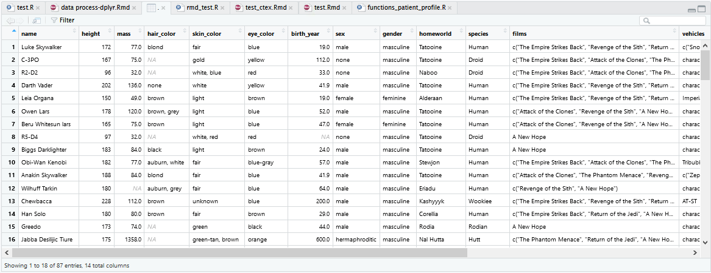
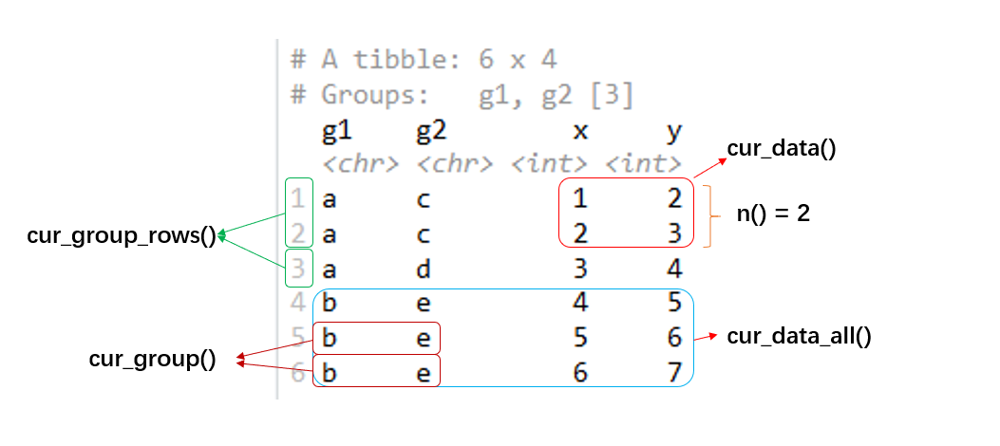

```{r setup, include=FALSE}
knitr::opts_chunk$set(
  echo = TRUE,
  collapse = TRUE,
  # cache = TRUE,
  comment = '#>'
)
options(tibble.print_min = 4L, tibble.print_max = 4L)
set.seed(233)
```

```{r message=FALSE}
# install.packages("dplyr")
library(tidyverse)
```

### This document is based on package version of dplyr: {-}

```{r}
packageVersion("dplyr")
```

# Why dplyr

When working with data you must:

  * Figure out what you want to do.

  * Describe those tasks in the form of a computer program.

  * Execute the program.

The dplyr package makes these steps fast and easy:

  * By constraining your options, it helps you think about your data manipulation 
  challenges.

  * It provides simple "verbs", functions that correspond to the most common data 
  manipulation tasks, to help you translate your thoughts into code.

  * It uses efficient backends, so you spend less time waiting for the computer.

### dplyr codes usually looks like: {-}

```{r eval=FALSE}
starwars %>% 
  select(name, height, species) %>% 
  filter(species %in% c('Human', 'Droid')) %>% 
  mutate(mean_height = mean(height, na.rm = T)) %>% 
  group_by(species) %>% 
  mutate(mean_height_by_species = mean(height, na.rm = T)) %>% 
  ungroup()
```

Here we use several dplyr "verbs" (`select()` `filter()` `mutate()`) to operate the "data" `starwars` step by step,
and string them together into a pipeline by `%>%`.
We also finish one "by-group" work by wrapping `mutate()` with `group_by()` and `ungroup()`.
This code block looks like working left-to-right, top-to-bottom and you can easily find what is done to the data.

So how dplyr do this?

  1.  The code dplyr verbs input and output data frames.

  1.  dplyr relies heavily on "non-standard evaluation" so that you don't need to 
      use `$` to refer to columns in the "current" data frame.
    
  1.  dplyr solutions tend to use a variety of single purpose verbs. 
    
  1.  Multiple dplyr verbs are often strung together into a pipeline by `%>%`.

  1.  All dplyr verbs handle "grouped" data frames so that the code to perform a
      computation per-group looks very similar to code that works on a whole 
      data frame.


# Tibble

A __tibble__, or `tbl_df`, is a modern reimagining of the data.frame,
keeping what time has proven to be effective, and throwing out what is not.
Tibbles are data.frames that are lazy and surly:
they do less (i.e. they don't change variable names or types, and don't do partial matching)
and complain more (e.g. when a variable does not exist).
This forces you to confront problems earlier, typically leading to cleaner, more expressive code.
Tibbles also have an enhanced `print()` method which makes them easier to use with large datasets containing complex objects.

```{r}
mtcars %>% class()
mtcars %>% as_tibble() %>% class()
```

You can refer to [tibbles chapter](https://r4ds.had.co.nz/tibbles.html){target="_blank"} in *R for data science*
or [`vignette("tibble")`](https://cran.r-project.org/web/packages/tibble/vignettes/tibble.html){target="_blank"}
to find the difference between `tibble` and `data.frame`.

**Tibble is the central data structure for the set of packages known as the [tidyverse](https://www.tidyverse.org/packages/){target="_blank"}, including [dplyr](https://dplyr.tidyverse.org/){target="_blank"}, [ggplot2](https://ggplot2.tidyverse.org/){target="_blank"}, [tidyr](https://tidyr.tidyverse.org/){target="_blank"}, and [readr](https://readr.tidyverse.org/){target="_blank"}.**


## Creating tibbles

Create a tibble from an existing object with `as_tibble()`.
This will work for reasonable inputs that are already data.frames, lists, matrices, or tables.

```{r}
as_tibble(iris)
```

You can also create a new tibble from column vectors with `tibble()`.
`tibble()` **will automatically recycle inputs of length 1**, and allows you to refer to variables that you just created, as shown below.

```{r}
tibble(x = 1:5, y = 1, z = x ^ 2 + y)
```

You can define a tibble row-by-row with `tribble()`, short for **tr**ansposed tibble.
`tribble()` is customised for data entry in code:
column headings are defined by formulas (i.e. they start with `~`), and entries are separated by commas.
This makes it possible to lay out small amounts of data in easy to read form.

```{r}
tribble(
  ~x, ~y,  ~z,
  "a", 2,  3.6,
  "b", 1,  8.5
)
```


## Display

Tibbles have a refined print method that shows only the first 10 rows (we set it to 4 in this document), and all the columns that fit on screen (by default).
This makes it much easier to work with large data.
In addition to its name, each column reports its type, a nice feature borrowed from `str()`:

```{r}
starwars
```

You can also control the default print behaviour by setting options:

  * `options(tibble.print_max = n, tibble.print_min = m)`: if more than n rows, print only m rows. Use `options(tibble.print_min = Inf)` to always show all rows.

  * Use `options(tibble.width = Inf)` to always print all columns, regardless of the width of the screen.

You can see a complete list of options by looking at the package help with [`package?tibble`](https://tibble.tidyverse.org/reference/tibble-package.html#package-options){target="_blank"}.

A final option is to use RStudio's built-in data viewer to get a scrollable view of the complete dataset.
This is also often useful at the end of a long chain of manipulations.

```{r}
starwars %>% view()
```

<div class="click-zoom-2-0">
  <label>
    <input type="checkbox">
    
  </label>
</div>


## Column data types

Refer to [`vignette("types")`](https://cran.r-project.org/web/packages/tibble/vignettes/types.html){target="_blank"},
you can find all kinds of column data type in `tibble`,
common are `<lgl>` for logical, `<int>` for integer, `<dbl>` for double, `<chr>` for character, `<date>` for Date and so on.

```{r}
tibble(x1 = T, x2 = 1L, x3 = 1.5, x4 = 'a', x5 = as.Date('2021-03-10'))
```

And sometimes you would find `<list>` for list (list-columns).

```{r}
tibble(x = list(1, 2:3))

mtcars %>% nest_by(cyl)
```

list-columns might be confusing but sometimes it would be useful in modeling while the input are multi tibbles,
you can see more details in
[`vignette("rowwise")`](https://cran.r-project.org/web/packages/dplyr/vignettes/rowwise.html#list-columns){target="_blank"} and
[Many models chapter](https://r4ds.had.co.nz/many-models.html#list-columns-1){target="_blank"} in *R for data science*.
Later we will also meet list-columns with "nest" data while study the package `tidyr`.


## Column names

The name repair described below is exposed to users via the `.name_repair` argument of `tibble::tibble()`, `tibble::as_tibble()`, `readxl::read_excel()`, and, eventually other packages in the tidyverse.

Tidyverse deals with a few levels of name repair that are practically useful:

  * `minimal`: The `names` attribute is not `NULL`.
    The name of an unnamed element is `""` (the empty string) and never `NA`.
    
  * `unique`: No element of `names` appears more than once.
    A couple specific names are also forbidden in unique names, such as `""` (the empty string).
    
    * All columns can be accessed by name via `df[["name"]]` and, more generally,
      by quoting with backticks: `` df$`name` ``, `` subset(df, select = `name`) ``, and `` dplyr::select(df, `name`) ``.
      
  * `check_unique`: It doesn't perform any name repair. Instead, an error is raised if the names don't suit the "unique" criteria.
  
  * `universal`: The `names` are unique and syntactic.
  
    * Names work everywhere, without quoting: `df$name` and `lm(name1 ~ name2, data = df)` and `dplyr::select(df, name)` all work.

```{r error=TRUE}
c('a', '', NA) %>% vctrs::vec_as_names(repair = 'minimal')

c('a', 'b', 'c', 'a') %>% vctrs::vec_as_names(repair = 'unique')

c('a', 'b', 'c', 'a') %>% vctrs::vec_as_names(repair = 'check_unique')

c('(a)', 'b c', '') %>% vctrs::vec_as_names(repair = 'universal')
```

You can see more details in
[`?vctrs::vec_as_names`](https://vctrs.r-lib.org/reference/vec_as_names.html){target="_blank"} and
[Names attribute chapter](https://design.tidyverse.org/names-attribute.html){target="_blank"} in *Tidyverse design guide*.


# Single table verbs

## Arrange rows by column values: `arrange()`

`arrange()` orders the rows of a data frame by the values of selected columns.

```{r}
starwars %>% arrange(height, mass)

starwars %>% arrange(desc(height))
```

## Subset distinct/unique rows: `distinct()`

`distinct()` select only unique/distinct rows from a data frame.

```{r}
df <- tibble(
  x = sample(10, 100, rep = TRUE),
  y = sample(10, 100, rep = TRUE)
)
df

df %>% nrow()

df %>% distinct()

df %>% distinct() %>% nrow()


df %>% distinct(x)

df %>% distinct(y)


df %>% distinct(x, .keep_all = T)

df %>% distinct(y, .keep_all = T)
```

## Subset rows using column values: `filter()`

The `filter()` function is used to subset a data frame, retaining all rows that satisfy your conditions.
To be retained, the row must produce a value of `TRUE` for all conditions.
Note that when a condition evaluates to `NA` the row will be dropped.

```{r}
starwars %>% 
  filter(hair_color == "none" & eye_color == "black")

starwars %>% 
  filter(hair_color == "none" | eye_color == "black")
```

## Subset columns using their names and types: `select()`

`select()` select variables in a data frame

```{r}
starwars %>% select(hair_color, skin_color, eye_color)
```

## Create, modify, and delete columns: `mutate()` `transmute()`

`mutate()` adds new variables and preserves existing ones; `transmute()` adds new variables and drops existing ones.
New variables overwrite existing variables of the same name.
Variables can be removed by setting their value to `NULL`.

```{r}
starwars %>% 
  select(name, mass) %>% 
  mutate(
    mass2 = mass * 2,
    mass2_squared = mass2 * mass2
  )

starwars %>% 
  transmute(mass2 = mass * 2)

starwars %>% 
  select(name, height, mass, homeworld) %>% 
  mutate(
    mass = NULL,
    height = height * 0.0328084
  )
```

## Extract a single column: `pull()`

`pull()` is similar to `$`.
It's mostly useful because it looks a little nicer in pipes, it can optionally name the output.

```{r}
mtcars %>% as_tibble()

mtcars %>% pull(-1)

mtcars %>% pull(1)

mtcars %>% pull(cyl)
```

## Change column order: `relocate()`

Use `relocate()` to change column positions.

```{r}
df <- tibble(a = 1, b = 1, c = 1, d = "a", e = "a", f = "a")

df %>% relocate(f)

df %>% relocate(a, .after = c)

df %>% relocate(f, .before = b)
```

## Rename columns: `rename()` `rename_with()`

`rename()` changes the names of individual variables using `new_name = old_name` syntax;
`rename_with()` renames columns using a function.

```{r}
starwars %>% rename(home_world = homeworld) %>% relocate(home_world)

starwars %>% rename_with(str_to_upper)
```

## Subset rows using their positions: `slice()` `slice_head()` `slice_tail()` `slice_min()` `slice_max()` `slice_sample()`

`slice()` lets you index rows by their (integer) locations.
It allows you to select, remove, and duplicate rows.
It is accompanied by a number of helpers for common use cases:

  * `slice_head()` and `slice_tail()` select the first or last rows.
  
  * `slice_sample()` randomly selects rows.
    Use the option `prop` to choose a certain proportion of the cases.
  
  * `slice_min()` and `slice_max()` select rows with highest or lowest values of a variable.

```{r}
starwars %>% slice(5:10)

starwars %>% slice_head(n = 3)

starwars %>% slice_tail(n = 3)

starwars %>% slice_sample(n = 5)

starwars %>% slice_sample(prop = 0.1)

starwars %>% slice_min(height, n = 3)

starwars %>% slice_max(height, n = 3)
```

## Summarise each group to fewer rows: `summarise()` `summarize()`

`summarise()` creates a new data frame.
It will have one (or more) rows for each combination of grouping variables;
if there are no grouping variables, the output will have a single row summarising all observations in the input.
It will contain one column for each grouping variable and one column for each of the summary statistics that you have specified.

`summarise()` and `summarize()` are synonyms.

`summarise()` often work together with  `group_by()`.

```{r}
starwars %>% 
  summarise(mean_height = mean(height, na.rm = TRUE))

starwars %>% 
  group_by(species) %>% 
  summarise(mean_height = mean(height, na.rm = TRUE))
```

## Count observations by group: `count()` `tally()` `add_count()` `add_tally()`

`count()` lets you quickly count the unique values of one or more variables, `tally()` count number of rows.
`add_count()` and `add_tally()` add a new column with group-wise counts.

```{r}
starwars %>% count(species)

starwars %>% tally()


df <- tribble(
  ~name,    ~gender,   ~runs,
  "Max",    "male",       10,
  "Sandra", "female",      1,
  "Susan",  "female",      4
)

df %>% count(gender)

df %>% count(gender, wt = runs)


df %>% add_count(gender)

df %>% add_tally()
```

You can also do it by using `group_by()` `summarise()` `mutate()`:

```{r}
df %>% 
  group_by(gender) %>% 
  summarise(n = n()) %>% 
  ungroup()

df %>% 
  group_by(gender) %>% 
  mutate(n = n()) %>% 
  ungroup()
```


# Two(multi) table verbs

## Efficiently bind multiple data frames by row and column: `bind_rows()` `bind_cols()`

```{r}
one <- starwars[1:2, 1:4]
two <- starwars[9:10, 1:4]

bind_rows(one, two)

bind_rows(list(one, two))


bind_rows(list(one, two), .id = "id")

bind_rows("group 1" = one, "group 2" = two, .id = "groups")


bind_cols(one, two)
```

## Set operations: `intersect()` `union()` `union_all()` `setdiff()`

Set operation functions expect the `x` and `y` inputs to **have the same variables**, and treat the observations like sets:

* `intersect(x, y)`: return only observations in both `x` and `y`
* `union(x, y)`: return unique observations in `x` and `y`
* `union_all(x, y)`: return all observations in `x` and `y`
* `setdiff(x, y)`: return observations in `x`, but not in `y`.

Beware that `intersect()`, `union()` and `setdiff()` remove duplicates.

```{r}
(df1 <- tibble(x = 1:2, y = c(1L, 1L)))

(df2 <- tibble(x = 1:2, y = 1:2))


intersect(df1, df2)

union(df1, df2)

union_all(df1, df2)

setdiff(df1, df2)

setdiff(df2, df1)
```

## Mutating joins: `inner_join()` `left_join()` `right_join()` `full_join()`

The mutating joins add columns from `y` to `x`, matching rows based on the keys:

* `inner_join()`: includes all rows in `x` and `y`.

* `left_join()`: includes all rows in `x`.

* `right_join()`: includes all rows in `y`.

* `full_join()`: includes all rows in `x` or `y`.

If a row in `x` matches multiple rows in `y`, all the rows in `y` will be returned once for each matching row in `x`.

```{r}
band_members

band_instruments


band_members %>% inner_join(band_instruments)

band_members %>% left_join(band_instruments)

band_members %>% right_join(band_instruments)

band_members %>% full_join(band_instruments)
```

The value of these mutating join functions are an object of the same type as `x`.
The order of the rows and columns of `x` is preserved as much as possible.
The output has the following properties:

* For `inner_join()`, a subset of `x` rows.
  For `left_join()`, all `x` rows.
  For `right_join()`, a subset of `x` rows, followed by unmatched `y` rows.
  For `full_join()`, all `x` rows, followed by unmatched `y` rows.

* For all joins, rows will be duplicated if one or more rows in `x` matches multiple rows in `y`.

* Output columns include all `x` columns and all `y` columns.
  If columns in `x` and `y` have the same name (and aren't included in `by`), `suffix`es are added to disambiguate.

* Output columns included in `by` are coerced to common type across `x` and `y`.

* Groups are taken from `x`.

```{r}
band_members

band_instruments

band_instruments2


band_members %>% inner_join(band_instruments)

band_members %>% inner_join(band_instruments, by = "name")

band_members %>% inner_join(band_instruments2, by = c("name" = "artist"))


band_members %>%
  inner_join(band_instruments2, by = c("name" = "artist"), keep = TRUE)

band_members %>%
  inner_join(band_instruments, by = "name", keep = TRUE)

band_members %>%
  inner_join(band_instruments, by = "name", keep = TRUE, suffix = c('_members', '_instruments'))
```

## Filtering joins: `semi_join()` `anti_join()`

Filtering joins filter rows from `x` based on the presence or absence of matches in `y`:

* `semi_join()` return all rows from `x` with a match in `y`.

* `anti_join()` return all rows from `x` without a match in `y`.

```{r}
band_members

band_instruments


band_members %>% semi_join(band_instruments)

band_members %>% anti_join(band_instruments)
```

Filtering joins perform like `filter()` rather than mutating joins.

```{r}
band_members %>% filter(name %in% band_instruments$name)

band_members %>% filter(!(name %in% band_instruments$name))
```

## Nest join: `nest_join()`

`nest_join()` returns all rows and columns in `x` with a new nested-df column that contains all matches from `y`.
When there is no match, the list column is a 0-row tibble.

```{r}
band_members %>% nest_join(band_instruments)
```

In some sense, a `nest_join()` is the most fundamental join since you can recreate the other joins from it:

* `inner_join()` is a `nest_join()` plus `tidyr::unnest()`,

* `left_join()` is a `nest_join()` plus `unnest(.drop = FALSE)`,

* `semi_join()` is a `nest_join()` plus a `filter()` where you check that every element of data has at least one row,

* `anti_join()` is a `nest_join()` plus a `filter()` where you check every element has zero rows.


# Tidy evaluation

Most dplyr verbs use **tidy evaluation** in some way. Tidy evaluation is a special type of non-standard evaluation used throughout the tidyverse. There are two basic forms found in dplyr:

* `arrange()`, `count()`, `add_count()`, `distinct()`, `filter()`, `group_by()`, `mutate()`, `transmute()`, and 
  `summarise()` use **data masking** so that you can use data variables as if 
  they were variables in the environment (i.e. you write `my_variable` not
  `df$my_variable`). 

* `across()`, `if_any()`, `if_all()`, `relocate()`, `rename()`, `select()`, and `pull()` use 
  **tidy selection** so you can easily choose variables based on their position, 
  name, or type (e.g. `starts_with("x")` or `is.numeric`).

To determine whether a function argument uses data masking or tidy selection, look at the documentation: in the arguments list, you'll see `<data-masking>` or `<tidy-select>`.


## Data masking

Data masking makes data manipulation faster because it requires less typing.
In most (but not all) base R functions you need to refer to variables with `$`,
leading to code that repeats the name of the data frame many times:

```{r, eval = FALSE}
starwars[starwars$homeworld == "Naboo" & starwars$species == "Human", ]
```

The dplyr equivalent of this code is more concise because data masking allows you to need to type `starwars` once:

```{r, eval = FALSE}
starwars %>% filter(homeworld == "Naboo", species == "Human")
```

### Data- and env-variables 

The key idea behind data masking is that it blurs the line between the two different meanings of the word "variable":

* **env-variables** are "programming" variables that live in an environment.
  They are usually created with `<-`. 

* **data-variables** are "statistical" variables that live in a data frame.
  They usually come from data files (e.g. `.csv`, `.xls`), or are created 
  manipulating existing variables. 
  
To make those definitions a little more concrete, take this piece of code:

```{r}
df <- tibble(x = runif(3), y = runif(3))
df$x
```

It creates a env-variable, `df`, that contains two data-variables, `x` and `y`.
Then it extracts the data-variable `x` out of the env-variable `df` using `$`.

This blurring of the meaning of "variable" is a really nice feature for interactive data analysis because it allows you to refer to data-vars as is, without any prefix. And this seems to be fairly intuitive since many newer R users will attempt to write `starwars[homeworld == "Naboo" & species == "Human", ]`.

### Call data- or env-variables straightforwardly

Data masking is convenient in most cases,
but it would be dangerous if you want to use both data-variables and env-variables in the same time.
They might own the same variable name so it's confused which variable has been used.

Let's begin with this code block

```{r}
df <- tibble(x = 1:3)
min_x <- 2

df %>% filter(x >= min_x)
```

It works well, but what would happen if there is a data-variable `min_x` in `df`?

```{r}
df <- tibble(x = 1:3, min_x = 0)
min_x <- 2

df %>% filter(x >= min_x)
```

There are no rows been dropped now.
So it would be dangerous if you want to use both data-variables and env-variables in the same time,
especially working with user-supplied data.

In this case, you need use `.data` and `.env` to declare witch variable you want to use.

```{r}
df %>% filter(.data$x >= .env$min_x)
```


## Tidy selection

Data masking makes it easy to compute on values within a dataset.
Tidy selection is a complementary tool that makes it easy to work with the (group of) columns of a dataset.
It provides a concise dialect of R for selecting variables based on their **names** or **properties**.

### Overview of selection features

Tidyverse selections implement a dialect of R where operators make it easy to select variables:

  * `:` for selecting a range of consecutive variables.

  * `!` for taking the complement of a set of variables.

  * `&` and `|` for selecting the intersection or the union of two sets of variables.

  * `c()` for combining selections.

    ```{r}
    iris <- iris %>% as_tibble()
    
    starwars %>% select(name:mass)
    
    starwars %>% select(!(name:mass))
    
    iris %>% select(starts_with("Petal") & ends_with("Width"))
    
    iris %>% select(starts_with("Petal") | ends_with("Width"))
    
    iris %>% select(c(starts_with("Petal"), Species))
    ```

In addition, you can use selection helpers. Some helpers select specific columns:

  * `everything()`: Matches all variables.

  * `last_col()`: Select last variable, possibly with an offset.

    ```{r}
    iris %>% select(everything())
    
    iris %>% select(last_col())
    
    iris %>% select(last_col(0:2))
    ```

These helpers select variables by matching patterns in their names:

  * `starts_with()`: Starts with a prefix.

  * `ends_with()`: Ends with a suffix.

  * `contains()`: Contains a literal string.

  * `matches()`: Matches a regular expression.

  * `num_range()`: Matches a numerical range like x01, x02, x03.

    ```{r}
    iris %>% select(starts_with("Sepal"))
    
    iris %>% select(ends_with("Width"))
    
    iris %>% select(starts_with(c("Petal", "Sepal")))
    
    iris %>% select(ends_with(c("Width", "Length")))
    
    iris %>% select(contains("al"))
    
    iris %>% select(matches("[pt]al"))
    
    billboard %>% select(starts_with("wk"))
    
    billboard %>% select(num_range("wk", 10:15))
    ```

These helpers select variables from a character vector:

  * `all_of()`: Matches variable names in a character vector. All names must be present, otherwise an out-of-bounds error is thrown.

  * `any_of()`: Same as `all_of()`, except that no error is thrown for names that don't exist.

    ```{r error=TRUE}
    vars <- c("Sepal.Length", "Sepal.Width")
    
    iris %>% select(all_of(vars))
    
    starwars %>% select(all_of(vars))
    
    starwars %>% select(any_of(vars))
    ```

This helper selects variables with a function:

  * `where()`: Applies a function to all variables and selects those for which the function returns `TRUE`.

    ```{r}
    iris %>% select(where(is.factor))
    
    iris %>% select(where(is.numeric))
    
    iris %>% select(where(~ is.numeric(.x)))
    
    iris %>% select(where(~ is.numeric(.x) && mean(.x) > 3.5))
    ```


## Column-wise operations

You can also use 'tidy-select' semantics in 'data-masking' functions, with the help of `across()` `if_any()` `if_all()`.
They make it easy to apply the same transformation to multiple columns.

### Basic usage

`across()` has two primary arguments:

* The first argument, `.cols`, selects the columns you want to operate on.
  It uses tidy selection (like `select()`) so you can pick variables by 
  position, name, and type.

* The second argument, `.fns`, is a function or list of functions to apply to
  each column. This can also be a purrr style formula (or list of formulas)
  like `~ .x / 2`. (This argument is optional, and you can omit it if you just want
  to get the underlying data.)

### Omit `.fns`

You can use 'tidy-select' semantics to select columns and then do future work based on the verb itself by omitting `.fns`.

```{r}
starwars %>% distinct(across(contains("color")))

starwars %>% count(across(contains("color")), sort = TRUE)

iris %>% 
  as_tibble() %>% 
  mutate(sum_length = rowSums(across(ends_with('Length'))))
```

### Usage of `.fns`

You can use `.fns` to generate new column (usually used in combination with `summarise()` and `mutate()`).

```{r}
starwars %>% 
  summarise(across(where(is.character), ~ length(unique(.x))))

starwars %>% 
  summarise(across(where(is.character), ~ length(unique(.x)), .names = 'count_{.col}'))

starwars %>% 
  mutate(across(!where(is.list), as.character))

starwars %>% 
  mutate(across(!where(is.list), as.character)) %>%
  summarise(across(where(is.character), ~ max(0, str_length(.x), na.rm = T)))
```

### Multiple functions

You can transform each variable with more than one function by supplying a named list of functions or lambda functions in the second argument:

```{r}
min_max <- list(
  min = ~min(.x, na.rm = TRUE), 
  max = ~max(.x, na.rm = TRUE)
)
starwars %>% summarise(across(where(is.numeric), min_max))
```

Control how the names are created with the `.names` argument which takes a [glue](https://glue.tidyverse.org/){target="_blank"} spec:

```{r}
starwars %>% summarise(across(where(is.numeric), min_max, .names = "{.fn}.{.col}"))
```

We can work around this by combining both calls to `across()` into a single expression that returns a tibble:

```{r}
starwars %>% summarise(
  tibble(
    across(where(is.numeric), ~min(.x, na.rm = TRUE), .names = "min_{.col}"),
    across(where(is.numeric), ~max(.x, na.rm = TRUE), .names = "max_{.col}")  
  )
)
```

### Current column

If you need to, you can access the **name** of the "current" column inside by calling `cur_column()`:

```{r}
df <- tibble(x = 1:3, y = 3:5, z = 5:7)
mult <- list(x = 1, y = 10, z = 100)

df %>% mutate(across(everything(), ~ .x * mult[[cur_column()]]))

df %>% mutate(across(everything(), ~ str_c(cur_column(), .x, sep = ': ')))
```

### filter()

We cannot directly use `across()` in `filter()` because we need an extra step to combine the results.
To that end, `filter()` has two special purpose companion functions (newly in dplyr v1.0.4): 

* `if_any()` keeps the rows where the predicate is true for *at least one* selected column: 
  
    ```{r}
    starwars %>% 
      filter(if_any(everything(), ~ !is.na(.x)))
    ```
  
* `if_all()` keeps the rows where the predicate is true for *all* selected columns:

    ```{r}
    starwars %>% 
      filter(if_all(everything(), ~ !is.na(.x)))
    ```

You can use `across()` to do the same things with some extra steps:

```{r}
iris %>% 
  as_tibble() %>% 
  filter(if_any(ends_with("Width"), ~ . > 4))

iris %>% 
  as_tibble() %>% 
  filter(rowSums(across(ends_with("Width"), ~ . > 4)) > 0)

iris %>% 
  as_tibble() %>% 
  filter(if_all(ends_with("Width"), ~ . > 2))

iris %>% 
  as_tibble() %>% 
  filter(rowSums(!across(ends_with("Width"), ~ . > 2)) == 0)
```


## Programming with dplyr

Data masking and tidy selection make interactive data exploration fast and fluid,
but they add some new challenges when you attempt to use them indirectly such as in a for loop or a function.
If you want to write some functions with the technique of `<data-masking>` and `<tidy-select>`,
you can get help in
[`?dplyr_data_masking`](https://dplyr.tidyverse.org/reference/dplyr_data_masking.html#indirection){target="_blank"}
[`?dplyr_tidy_select`](https://dplyr.tidyverse.org/reference/dplyr_tidy_select.html#indirection){target="_blank"}
and [`vignette("programming", package = "dplyr")`](https://cran.r-project.org/web/packages/dplyr/vignettes/programming.html){target="_blank"}.


# Grouped data

Most data operations are done on groups defined by variables.
`group_by()` takes an existing tbl and converts it into a grouped tbl where operations are performed "by group".
`ungroup()` removes grouping.

```{r}
by_species <- starwars %>% group_by(species)
by_sex_gender <- starwars %>% group_by(sex, gender)
```

You can see the grouping when you print the data:

```{r}
by_species

by_sex_gender
```

If you apply `group_by()` to an already grouped dataset, will overwrite the existing grouping variables.
For example, the following code groups by `homeworld` instead of `species`:

```{r}
by_species %>% group_by(homeworld)
```

To **augment** the grouping, using `.add = TRUE`.
For example, the following code groups by `species` and `homeworld`:

```{r}
by_species %>% group_by(homeworld, .add = TRUE)
```

To remove all grouping variables, use `ungroup()`:

```{r}
by_species %>% ungroup()
```

You can also choose to selectively ungroup by listing the variables you want to remove:

```{r}
by_sex_gender %>% ungroup(sex)
```


## How grouping affects the main dplyr verbs

### `summarise()`

`summarise()` computes a summary for each group.
It starts from grouping variables, adding summary variables to the right hand side:

```{r}
by_species %>%
  summarise(
    n = n(),
    height = mean(height, na.rm = TRUE)
  )
```

### `tally()` and `add_tally()`

`tally()` and `add_tally()` count number of rows by groups.

```{r}
by_species %>% tally()

by_sex_gender %>% tally()
```

### `select()`, `rename()`, and `relocate()`

`rename()` and `relocate()` behave identically with grouped and ungrouped data 
because they only affect the name or position of existing columns.
Grouped `select()` is almost identical to ungrouped select, except that it always includes the grouping variables:

```{r}
by_species %>% select(mass)
```

### `arrange()`

Grouped `arrange()` is the same as ungrouped `arrange()`

### `distinct()`

The same behavior applies for grouped data frames, except that the grouping variables are always included:

```{r}
by_species %>% distinct(mass)
```

### `mutate()` and `transmute()`

In simple cases with vectorised functions, grouped and ungrouped `mutate()` give the same results.
They differ when used with summary (or window) functions:

```{r}
by_species %>% 
  select(mass) %>% 
  mutate(mean_mass = mean(mass, na.rm = TRUE))

by_species %>% 
  select(mass) %>% 
  mutate(lag_mass = lag(mass))
```

### `filter()`

A grouped `filter()` effectively does a `mutate()` to generate a logical variable,
and then only keeps the rows where the variable is `TRUE`.
This means that grouped filters can be used with summary functions.
For example, we can find the tallest character of each species:

```{r}
by_species %>%
  select(name, species, height) %>% 
  filter(height == max(height))
```

You can also use `filter()` to remove entire groups.
For example, the following code eliminates all groups that only have a single member:

```{r}
by_species %>%
  filter(n() != 1) %>% 
  tally()
```

### `slice()` and friends

`slice()` and friends (`slice_head()`, `slice_tail()`, `slice_sample()`, `slice_min()` and `slice_max()`) select rows within a group.
For example, we can select the first observation within each species:

```{r}
by_species %>%
  relocate(species) %>% 
  slice(1)
```


## Information of grouped data

### Grouping metadata

You can see underlying group data with `group_keys()`.
It has one row for each group and one column for each grouping variable:

```{r group_vars}
by_species %>% group_keys()

by_sex_gender %>% group_keys()
```

You can see which group each row belongs to with `group_indices()`:

```{r}
by_sex_gender %>% group_indices()
```

And which rows each group contains with `group_rows()`:

```{r}
by_sex_gender %>% group_rows()
```

`group_size()` gives the size of each group:

```{r}
by_sex_gender %>% group_size()
```

`n_groups()` gives the total number of groups:

```{r}
by_sex_gender %>% n_groups()
```

Use `group_vars()` if you just want the names of the grouping variables:

```{r}
by_species %>% group_vars()
by_sex_gender %>% group_vars()
```

### "current" group information

Inside dplyr verbs, you can access various properties of the "current" group using a family of functions with the `cur_` prefix.
These functions are typically needed for everyday usage of dplyr,
but can be useful because they allow you to free from some of the typical constraints of dplyr verbs.

```{r}
df <- tibble(
  g1 = c('a', 'a', 'a', 'b', 'b', 'b'),
  g2 = c('c', 'c', 'd', 'e', 'e', 'e'),
  x = 1:6,
  y = 2:7
)
gf <- df %>% group_by(g1, g2)

gf
```

* `n()` gives the current group size.

    ```{r}
    gf %>% summarise(n = n())
    ```

* `cur_data()` gives the current data for the current group (excluding grouping variables).

    ```{r}
    gf %>% summarise(data = list(cur_data()))
    ```

* `cur_data_all()` gives the current data for the current group (including grouping variables).

    ```{r}
    gf %>% summarise(data = list(cur_data_all()))
    ```

* `cur_group()` gives the group keys, a tibble with one row and one column for each grouping variable.

    ```{r}
    gf %>% summarise(data = list(cur_group()))
    ```

* `cur_group_id()` gives a unique numeric identifier for the current group.

    ```{r}
    gf %>% mutate(id = cur_group_id())
    ```

* `cur_group_rows()` gives the row indices for the current group.

    ```{r}
    gf %>% summarise(data = list(cur_group_rows()))
    ```

You can easily distinguish these functions in the following picture:



## How `group_by()` works

`group_by()` create a new class of objects, `grouped_df`,
who is treated differently with `tbl_df`, in most dplyr verbs.

```{r}
df <- tibble(
  g1 = c('b', 'b', 'b', 'a', 'a', 'a'),
  g2 = c('c', 'c', 'd', 'e', 'e', 'e'),
  x = 1:6
)
gf <- df %>% group_by(g1, g2)

df %>% class()
gf %>% class()
```

But `group_by()` never change the value of datasets (even the order of rows):

```{r}
df

gf

df == gf
```

Here we can easily notice that dplyr verbs have different behavior for `df` and `gf`:

```{r}
df %>% mutate(sum = sum(x))

gf %>% mutate(sum = sum(x))
```

But in other places we should be cautious when we use a dataset output from a wrapped function,
or write a function who receive an user-supplied data.
For not knowing whether a `grouped_df` you get (or receive).


# Row-wise operations

dplyr, and R in general, are particularly well suited to performing operations over columns,
and performing operations over rows is much harder.

Let's start from a little problem.
We create a tibble `df` and want to calculate the sum of `w` `x` `y` `z` in each row:

```{r}
df <- tibble(id = 1:6, w = 10:15, x = 20:25, y = 30:35, z = 40:45)

df %>% mutate(total = sum(c(w, x, y, z)))
```

It doesn't work out as expected, `total` calculate the sum of all value from `w` `x` `y` `z` (not in each row).
This is because that `sum()` just return a single value calculated from the input:

```{r}
sum(c(df$w, df$x, df$y, df$z))
```

then tibble treat the input as `total = 660` and automatically recycle it.

The same problem will occur if you want to do row-wise aggregates with `mean()`, `min()`, `max()` 
and other functions who are not **vectorised function**.
In order to solve this problem,
you can use dplyr's approach centred around the row-wise data frame created by `rowwise()`.


## rowwise()

Row-wise operations require a special type of grouping where each group consists of a single row. You create this with `rowwise()`:

```{r}
df %>% rowwise()
```

Like `group_by()`, `rowwise()` doesn't really do anything itself;
it just changes how the other verbs work.
For example, compare the results of  `mutate()` in the following code:

```{r}
df %>% mutate(total = sum(c(w, x, y, z)))

df %>% rowwise() %>% mutate(total = sum(c(w, x, y, z)))
```

If you use `mutate()` with a regular data frame, it computes the sum of `w`, `x`, `y`, and `z` across all rows.
If you apply it to a row-wise data frame, it computes the sum for each row.

You can optionally supply "identifier" variables in your call to `rowwise()`.
These variables are preserved when you call `summarise()`,
so they behave somewhat similarly to the grouping variables passed to `group_by()`:

```{r}
df %>% 
  rowwise() %>% 
  summarise(total = sum(c(w, x, y, z)))

df %>% 
  rowwise(id) %>% 
  summarise(total = sum(c(w, x, y, z)))
```

`rowwise()` is just a special form of grouping, so if you want to remove it from a data frame, just call `ungroup()`.

You can use `c_across()` which uses tidy selection syntax so you can to succinctly select many variables:

```{r}
df %>% 
  rowwise() %>% 
  mutate(total = sum(c_across(w:z)))
```


## Other solution

The `rowwise()` approach will work for any summary function.
But if you need greater speed, it's worth looking for a built-in row-wise variant of your summary function.
These are more efficient because they operate on the data frame as whole;
they don't split it into rows, compute the summary, and then join the results back together again.

```{r}
df %>% mutate(total = rowSums(across(w:z)))

df %>% mutate(mean = rowMeans(across(w:z)))
```

**Note**: we don't use `rowwise()` and use `across()` in `rowMeans()` and `rowSums()` here 
because `across()` returns a tibble and `rowMeans()` and `rowSums()` take a multi-row data frame as input.

Or you can use vectorised function, such as `pmin()`, `pmax()`.
Similarly, they'll be much faster than `rowwise()`.

```{r}
df %>% mutate(
  min = pmin(w, x, y, z),
  max = pmax(w, x, y, z)
)
```


## Difference between `c_across()`, `across()`, `if_any()` and `if_all()`

You can view the output structure of `c_across()`, `across()`, `if_any()` and `if_all()` by wrapping with `list()`:

```{r}
df %>% rowwise() %>% mutate(new = list(c_across(w:z)))

df %>% rowwise() %>% mutate(new = list(across(w:z)))

df %>% rowwise() %>% mutate(new = list(if_any(w:z, ~ .x > 25)))


df %>% mutate(new = list(c_across(w:z)))

df %>% mutate(new = list(across(w:z)))

df %>% mutate(new = list(if_any(w:z, ~ .x > 25)))
```

`c_across()` returns a vector, `across()` returns a tibble, `if_any()` and `if_all()` return a logical vector.
We can also find that `c_across()` doesn't work well without `rowwise()`.
Use them cautiously depending on other function's needed input.


# Vector functions

## Vectorised if: `if_else()` `case_when()`

`if_else(condition, true, false, missing = NULL)`

`case_when(...)`

```{r}
x <- c(-5:5, NA)
if_else(x < 0, true = "negative", false = "positive", missing = "missing")

x <- 1:50
case_when(
  x %% 35 == 0 ~ "fizz buzz",
  x %% 5 == 0  ~ "fizz",
  x %% 7 == 0  ~ "buzz",
  TRUE         ~ as.character(x)
)
```

If none of the cases match in `case_when()` (or do not clarify `missing` in `if_else()`), `NA` is used as return value:

```{r}
x <- c(-1, 1, NA)

if_else(x < 0, 'negative', 'positive')

case_when(
  x < 0  ~ 'negative',
  x >= 0 ~ 'positive'
)
```

Use `%>%` with `if_else()` and `case_when()` (wrapped them with `{}`):

```{r}
x <- c(-1, 1, NA)

x %>% {
  if_else(. < 0, "negative", "positive", "missing")
}

x %>% {
  case_when(
    . < 0  ~ "negative",
    . >= 0 ~ "positive",
    TRUE   ~ "missing"
  )
}
```

Note that `if_else()` and `case_when()` are both strict,
`if_else()` checks that `true` and `false` are the same type,
in `case_when()`, all RHSs must evaluate to the same type of vector.
Inconsistent types will throw an error.
This applies also to NA values used in RHS (or `true` `false`):
`NA` is logical, use typed values like `NA_real_`, `NA_complex_`, `NA_character_`, `NA_integer_` as appropriate.

```{r error=TRUE}
x <- c(-1, 1)

case_when(
  x >= 0 ~ "positive",
  TRUE   ~ NA
)

case_when(
  x >= 0 ~ "positive",
  TRUE   ~ NA_character_
)
```

`if_else()` and `case_when()` evaluates all expressions **first**, and then constructs its result by extracting the selected parts.

```{r error=TRUE}
x <- -2:2 %>% as.double()

if_else(x >= 0, sqrt(x), x)

case_when(
  x >= 0 ~ sqrt(x),
  TRUE   ~ x
)
```

Sometimes it's hard to generate multiple variables in complex condition statement via `if_else()` and `case_when()`, you can turn to use `libr::datastep()`:

```{r}
df <- tibble(x = 1:3, y = 4:6)

df %>% libr::datastep({
  if (x <= 2 & y == 4) {
    var1 <- 'a'
    var_temp <- 1
  } else {
    var1 <- 'b'
    var_temp <- 0
  }
  
  if (var_temp == 1 | x == 3) {
    var2 <- 'c'
  }
  
  rm(var_temp)
})
```

## Cumulativate functions: `cumall()` `cumany()` `cummean()`

Cumulative aggregates: `cumsum()`, `cumprod()`, `cummin()`, `cummax()` (from base R),
and `cumall()`, `cumany()`, and `cummean()` (from dplyr).

```{r}
cumsum(1:10)

cumprod(1:5)

cummean(10:1)

cummin(c(3, 2, 1, 2, 1, 0, 4, 3, 2))

cummax(c(3, 2, 1, 2, 1, 0, 4, 3, 2))

cumall(c(T, T, F, T, F))

cumany(c(F, F, T, F, T))
```

Cumulative logical functions `cumall()` and `cumany()` are particularly useful in conjunction with `filter()`:

* `cumall(x)`: all cases until the first `FALSE.`

* `cumall(!x)`: all cases until the first `TRUE.`

* `cumany(x)`: all cases after the first `TRUE.`

* `cumany(!x)`: all cases after the first `FALSE.`

```{r}
df <- data.frame(
  date = as.Date("2020-01-01") + 0:6,
  balance = c(100, 50, 25, -25, -50, 30, 120)
)
df

# all rows after first overdraft
df %>% filter(cumany(balance < 0))

# all rows until first overdraft
df %>% filter(cumall(!(balance < 0)))
```

## Windowed rank functions: `row_number()` `ntile()` `min_rank()` `dense_rank()` `percent_rank()` `cume_dist()`

* `row_number()`: equivalent to `rank(ties.method = "first")`

* `min_rank()`: equivalent to `rank(ties.method = "min")`

* `dense_rank()`: like `min_rank()`, but with no gaps between ranks

* `percent_rank()`: a number between 0 and 1 computed by rescaling `min_rank()` to `[0, 1]`

* `cume_dist()`: a cumulative distribution function. Proportion of all values less than or equal to the current rank.

* `ntile()`: a rough rank, which breaks the input vector into `n` buckets.
             The size of the buckets may differ by up to one, larger buckets have lower rank.

```{r}
x <- c(5, 1, 3, 2, 2)

row_number(x)

min_rank(x)

dense_rank(x)

percent_rank(x)

cume_dist(x)

ntile(x, 2)
ntile(1:8, 3)
```

All ranking functions rank from lowest to highest so that small input values get small ranks.
Use `desc()` to rank from highest to lowest.

```{r}
x <- c(5, 1, 3, 2, 2)

row_number(desc(x))

min_rank(desc(x))

dense_rank(desc(x))

percent_rank(desc(x))

cume_dist(desc(x))

ntile(desc(x), 2)
```

`row_number()` can be used with single table verbs without specifying `x` to denote the row number,
and it would be affected by `group_by()`:

```{r}
starwars %>% 
  select(name, species) %>% 
  mutate(n = row_number())

starwars %>% 
  select(name, species) %>% 
  group_by(species) %>% 
  mutate(n = row_number())
```

## Extract the first, last or nth value from a vector: `nth()` `first()` `last()`

`first(x)`
`last(x)`
`nth(x, n)`

```{r}
x <- 1:10

first(x)
last(x)

nth(x, 1)
nth(x, 5)

nth(x, -2)

nth(x, 11)
```

## Compute lagged or leading values: `lag()` `lead()`

`lag(x, n = 1L, default = NA)`

`lead(x, n = 1L, default = NA)`

```{r}
lag(1:5)
lead(1:5)

lag(1:5, n = 1)
lag(1:5, n = 2)

lead(1:5, n = 1)
lead(1:5, n = 2)

lag(1:5, default = 0)
lead(1:5, default = 6)
```

## Find first non-missing element: `coalesce()`

```{r}
y <- c(1, 2, NA, NA, 5, NA)
z <- c(NA, NA, 3, 4, 5, NA)
coalesce(y, z)
```

You can use a single value to replace all missing values:

```{r}
x <- sample(c(1:5, NA, NA, NA))
x
coalesce(x, 0L)
```

## Convert values to `NA`: `na_if()`

`na_if(x, y)`

* `x`: Vector to modify
* `y`: Value to replace with `NA`

```{r}
na_if(1:5, 2)

na_if(1:5, 5:1)
```

## Compare two numeric vectors: `near()`

`near(x, y, tol = .Machine$double.eps^0.5)`

```{r}
sqrt(2) ^ 2 == 2

near(sqrt(2) ^ 2, 2)
```

## Shortcut of `left <= x & x <= right`: `between()`

`between(x, left, right)`

```{r}
between(1:12, 7, 9)
```

## Efficiently count the number of unique values in a set of vector: `n_distinct()`

`n_distinct(..., na.rm = FALSE)`

```{r}
x <- sample(1:10, 1e7, rep = TRUE)
n_distinct(x)

length(unique(x)) %>% system.time()

n_distinct(x) %>% system.time()
```


# Reference

[R for data science](https://r4ds.had.co.nz/){target="_blank"}

[A Grammar of Data Manipulation • dplyr](https://dplyr.tidyverse.org/){target="_blank"}

dplyr vignettes:

* [From base R to dplyr](https://cran.r-project.org/web/packages/dplyr/vignettes/base.html){target="_blank"}

* [Introduction to dplyr](https://cran.r-project.org/web/packages/dplyr/vignettes/dplyr.html){target="_blank"}

* [Two-table verbs](https://cran.r-project.org/web/packages/dplyr/vignettes/two-table.html){target="_blank"}

* [Programming with dplyr](https://cran.r-project.org/web/packages/dplyr/vignettes/programming.html){target="_blank"}

* [colwise](https://cran.r-project.org/web/packages/dplyr/vignettes/colwise.html){target="_blank"}

* [Grouped data](https://cran.r-project.org/web/packages/dplyr/vignettes/grouping.html){target="_blank"}

* [rowwise](https://cran.r-project.org/web/packages/dplyr/vignettes/rowwise.html){target="_blank"}

* [Window functions](https://cran.r-project.org/web/packages/dplyr/vignettes/window-functions.html){target="_blank"}


