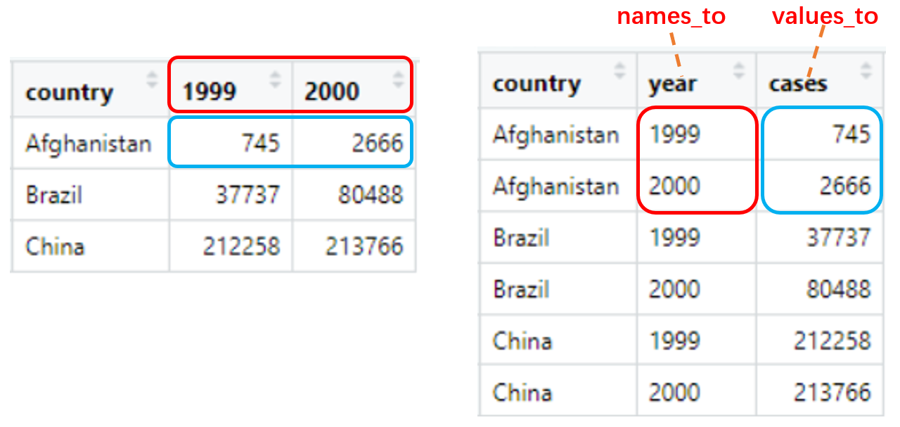
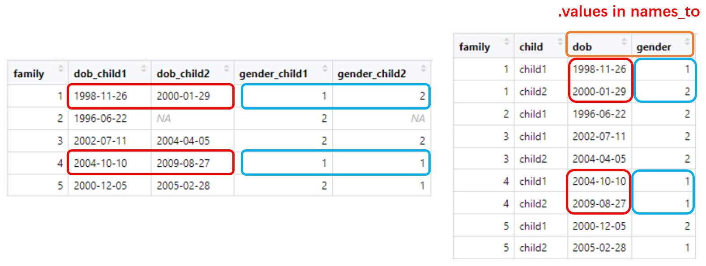
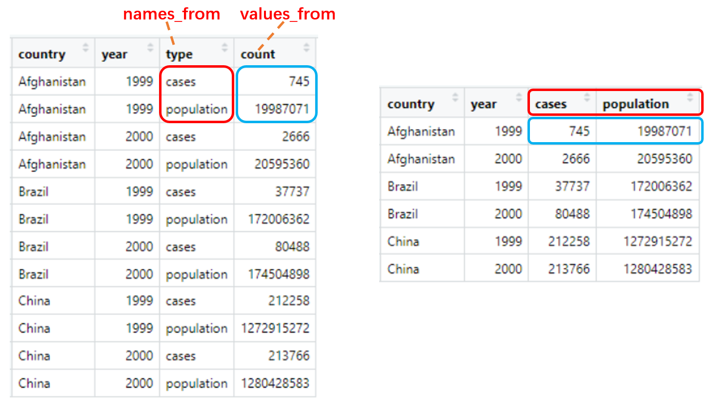
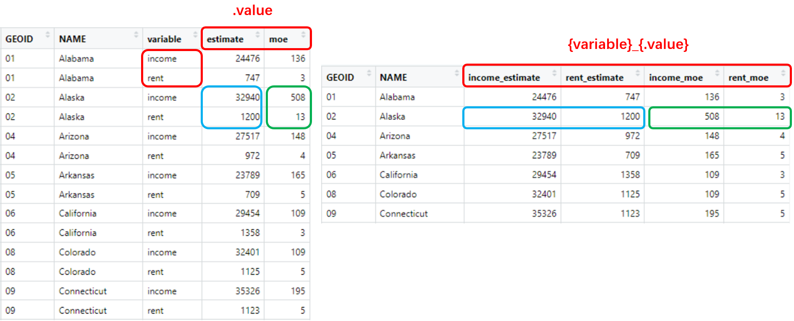

```{r setup, include=FALSE}
knitr::opts_chunk$set(
  echo = TRUE,
  collapse = TRUE,
  comment = '#>'
)
options(tibble.print_min = 10L, tibble.print_max = 10L)
set.seed(233)
```

```{r message=FALSE}
library(tidyverse)
packageVersion("tidyr")
```


# Separate and unite character vectors

## Extract character column with regex groups: `extract()`

Given a regular expression with capturing groups, `extract()` turns each group into a new column. If the groups don't match, or the input is `NA`, the output will be `NA.`

```{r}
df <- tibble(folder = c('Screening', 'Cycle 1 Day 1', 'Cycle 2 Day 15'))
df

df %>% extract(
  col = folder,
  into = c('cycle', 'day'),
  regex = 'Cycle (\\d+) Day (\\d+)'
)

df %>% extract(
  col = folder,
  into = c('cycle', 'day'),
  regex = 'Cycle (\\d+) Day (\\d+)',
  remove = F
)
```

## Separate character column with separator: `separate()`

Given either a regular expression or a vector of character positions, `separate()` turns a single character column into multiple columns.

- regex separator

    ```{r}
    df <- tibble(x = c('a,b:c', 'd_e_f'))
    df
    
    df %>% separate(
      col = x,
      into = c('x1', 'x2', 'x3'),
      sep = '[,:_]'
    )
    
    df %>% separate(
      col = x,
      into = c('x1', 'x2', 'x3'),
      sep = '[,:_]',
      remove = F
    )
    ```

- numeric vector is interpreted as character positions to split at.

    ```{r}
    df <- tibble(fruit = c('apple', 'orange', 'pear', 'banana'))
    df
    
    df %>% separate(
      col = fruit,
      into = c('var1', 'var2', 'var3'),
      sep = c(2, 5)
    )
    
    df %>% separate(
      col = fruit,
      into = c('var1', 'var2'),
      sep = -2
    )
    ```

You can use `extra` and `fill` when there are too many pieces (or not enough pieces):

`extra`: If `sep` is a character vector, this controls what happens when there are too many pieces. There are three valid options:

- "warn" (the default): emit a warning and drop extra values.

- "drop": drop any extra values without a warning.

- "merge": only splits at most `length(into)` times

    ```{r}
    df <- tibble(fruits = c('apples, oranges, pears, bananas', 'pineapples, mangos, guavas'))
    df
    
    df %>% separate(
      col = fruits,
      into = c('fruit1', 'fruit2'),
      sep = ', '
    )
    
    df %>% separate(
      col = fruits,
      into = c('fruit1', 'fruit2'),
      sep = ', ',
      extra = 'drop'
    )
    
    df %>% separate(
      col = fruits,
      into = c('fruit1', 'fruit2'),
      sep = ', ',
      extra = 'merge'
    )
    ```

`fill`: If `sep` is a character vector, this controls what happens when there are not enough pieces. There are three valid options:

- "warn" (the default): emit a warning and fill from the right

- "right": fill with missing values on the right

- "left": fill with missing values on the left

    ```{r, warning=TRUE}
    df %>% separate(
      col = fruits,
      into = c('fruit1', 'fruit2', 'fruit3', 'fruit4', 'fruit5'),
      sep = ', '
    )
    
    df %>% separate(
      col = fruits,
      into = c('fruit1', 'fruit2', 'fruit3', 'fruit4', 'fruit5'),
      sep = ', ',
      fill = 'right'
    )
    
    df %>% separate(
      col = fruits,
      into = c('fruit1', 'fruit2', 'fruit3', 'fruit4', 'fruit5'),
      sep = ', ',
      fill = 'left'
    )
    ```

## Separate character column into multiple rows: `separate_rows()`

```{r}
df <- tibble(
  id = 1:2,
  fruits = c(
    "apples and oranges and pears and bananas",
    "pineapples and mangos and guavas"
  )
)
df

df %>% separate_rows(fruits, sep = ' and ')
```

## Unite multiple columns into one: `unite()`

```{r}
df <- tibble(x = c('a', 'b'), y = c('c', 'd'), z = c('e', 'f'))
df

df %>% unite(xy, c(x, y), sep = '_')

df %>% unite(xyz, x:z, sep = '.')

df %>% unite(xyz, x:z, sep = '.', remove = F)
```

You can use `na.rm` to remove missing values:

```{r}
df <- tibble(x = c('a', 'b', 'c'), y = c('d', 'e', NA))
df

df %>% unite(xy, c(x, y), sep = '_')

df %>% unite(xy, c(x, y), sep = '_', na.rm = T)
```


# Handle missing values

## Drop rows containing missing values: `drop_na()`

```{r}
df <- tibble(x = c(1, 2, NA), y = c("a", NA, "b"))
df

df %>% drop_na()

df %>% drop_na(x)
```

## Replace NAs with specified values: `replace_na()`

- Replace NAs for vector

    ```{r}
    x <- c('a', 'b', NA)
    replace_na(x, 'missing')
    ```

- Replace NAs for dataframe

    ```{r}
    df <- tibble(x = c(1, 2, NA), y = c("a", NA, "b"))
    df
    
    df %>% replace_na(list(x = 0, y = "unknown"))
    ```

## Fill in missing values with previous or next value: `fill()`

You can fill missing values in selected columns using the next or previous entry. The direction can be chose as "down" (the default), "up", "downup" (i.e. first down and then up) or "updown" (first up and then down).

```{r}
df <- tribble(
  ~quarter, ~year, ~sales,
  "Q1",      NA,    66013,
  "Q2",      NA,    69182,
  "Q3",    2000,    53175,
  "Q4",      NA,    21001,
  "Q1",    2001,    46036,
  "Q2",      NA,    58842,
  "Q3",      NA,    44568,
  "Q4",      NA,    50197,
)

df %>% fill(year)

df %>% fill(year, .direction = 'up')

df %>% fill(year, .direction = 'downup')
```

You can use `fill()` to "retain" value from previous observations. For example, you can get the dosage from latest cycle (dosage who is not `0` or `NA`):

```{r}
df <- tibble(cycle = 1:7, dose = c(1, 0, NA, 2, 3, NA, 4))
df

df %>% 
  mutate(
    last_dose = if_else(dose %in% c(0, NA), NA_real_, dose),
    last_dose = lag(last_dose)
  ) %>% 
  fill(last_dose)
```

# Reshape data

## Pivot data from wide to long: `pivot_longer()`

`pivot_longer()` "Lengthen" data by collapsing several columns into two. You can select columns by `cols` with `<tidy-select>`, column names move to a new `names_to` column and values to a new `values_to` column.

```{r, eval=FALSE}
pivot_longer(
  data,
  cols,
  names_to = "name",
  names_prefix = NULL,
  names_sep = NULL,
  names_pattern = NULL,
  values_to = "value",
  values_drop_na = FALSE
)
```

### Simplest case {-}

```{r}
table4a

table4a %>% pivot_longer(c(`1999`, `2000`), names_to = 'year', values_to = 'cases')
```



### Drop rows that correspond to missing values {-}

You can drop rows that contain only `NA` in the `values_to` column:

```{r}
df <- tribble(
  ~id, ~choice1, ~choice2, ~choice3,
  1, "A", "B", "C",
  2, "C", "B",  NA,
  3, "D",  NA,  NA,
  4, "B", "D",  NA
)

df %>% pivot_longer(!id)

df %>% pivot_longer(!id, values_drop_na = T)
```

### strip common prefix {-}

You can use `names_prefix` to strip common prefix:

```{r}
billboard

billboard %>% 
  pivot_longer(
    cols = starts_with("wk"), 
    names_to = "week",
    names_prefix = 'wk', 
    values_to = "rank",
    values_drop_na = T
  )
```

### Multiple variables stored in column names {-}

You can extract multiple `names_to` columns via `names_sep` or `names_pattern`, for example, "sex" and "level" stored as column names and separated by `_`:

```{r}
df <- tribble(
  ~subject,  ~f_1,  ~f_2, ~m_1, ~m_2,
         1,    11,    21,   31,   41,
         2,    12,    22,   32,   42,
         3,    13,    23,   33,   43,
)

df %>% 
  pivot_longer(
    cols = !subject,
    names_to = c('sex', 'level'),
    names_sep = '_'
  )

df %>% 
  pivot_longer(
    cols = !subject,
    names_to = c('sex', 'level'),
    names_pattern = '(.)_(.)'
  )
```

`names_sep` and `names_pattern` work same as `separate()` and `extract()`, you can also use `separate()` or `extract()` after `pivot_longer()`:

```{r}
df %>% 
  pivot_longer(cols = !subject) %>% 
  separate(col = 'name', into = c('sex', 'level'), sep = '_')

df %>% 
  pivot_longer(cols = !subject) %>% 
  extract(col = 'name', into = c('sex', 'level'), regex = '(.)_(.)')
```

### Multiple group of columns to pivot {-}

```{r}
family <- tribble(
  ~family,  ~dob_child1,  ~dob_child2, ~gender_child1, ~gender_child2,
       1L, "1998-11-26", "2000-01-29",             1L,             2L,
       2L, "1996-06-22",           NA,             2L,             NA,
       3L, "2002-07-11", "2004-04-05",             2L,             2L,
       4L, "2004-10-10", "2009-08-27",             1L,             1L,
       5L, "2000-12-05", "2005-02-28",             2L,             1L,
)
```

We have two pieces of information (or values) for each child: their `gender` and their `dob`, these need to go into separate columns in the result. Here we use `names_sep` to split up each variable name, use a special name `.value` in `names_to` to extract the name of the "value" columns, and ignore the argument `values_to`.

```{r}
family %>% 
  pivot_longer(
    !family, 
    names_to = c(".value", "child"), 
    names_sep = "_", 
    values_drop_na = TRUE
  )
```

<div class="click-zoom-1-5">
  <label>
    <input type="checkbox">
    
  </label>
</div>

## Pivot data from long to wide: `pivot_wider()`

`pivot_wider()` "Widen" data by expanding two columns into several. `names_from` provides the new column names and `values_from` provides the values.

```{r, eval=FALSE}
pivot_wider(
  data,
  id_cols = NULL,
  names_from = name,
  names_prefix = "",
  names_sep = "_",
  names_glue = NULL,
  values_from = value,
  values_fill = NULL
)
```

### Simplest case

```{r}
table2

table2 %>% pivot_wider(names_from = type, values_from = count)
```



### Fill in missing values

You can fill in missing values with `values_fill`:

```{r}
fish_encounters

fish_encounters %>% pivot_wider(names_from = station, values_from = seen)

fish_encounters %>% pivot_wider(names_from = station, values_from = seen, values_fill = 0)
```

### Generate column name from multiple variables

When `names_from` or `values_from` contains multiple variables, `names_sep` or `names_glue` can be used to generate the new column names.

- use `names_sep` or `names_glue` to combine multiple `names_from`:

    ```{r}
    production <- expand_grid(
        product = c("A", "B"), 
        country = c("AI", "EI"), 
        year = 2000:2014
      ) %>%
      filter((product == "A" & country == "AI") | product == "B") %>% 
      mutate(production = rnorm(n()))
    
    production
    
    production %>% pivot_wider(
      names_from = c(product, country), 
      values_from = production,
      names_sep = "."
    )
    
    production %>% pivot_wider(
      names_from = c(product, country), 
      values_from = production,
      names_glue = "{country}_{product}"
    )
    ```

- use multiple `values_from` to pivot groups of columns:

    ```{r}
    us_rent_income
    
    us_rent_income %>%
      pivot_wider(
        names_from = variable,
        names_glue = "{variable}_{.value}",
        values_from = c(estimate, moe)
      )
    ```

<div class="click-zoom-1-5">
  <label>
    <input type="checkbox">
    
  </label>
</div>

## longer then wider

You can combine `pivot_longer()` and `pivot_wider()` for more complex problems:

```{r}
df <- tribble(
  ~ group, ~ level1, ~ level2,
      'a',        3,        4,
      'b',       50,      100,
      'c',      200,     1000,
)

df %>% pivot_longer(starts_with('level'), names_to = 'level', values_to = 'value')

df %>% 
  pivot_longer(starts_with('level'), names_to = 'level', values_to = 'value') %>% 
  pivot_wider(names_from = 'group', values_from = 'value')
```

## Using pivotting specification

To gain more control over pivotting, you can create a "spec" data frame that describes exactly how data stored in the column names becomes variables (and vice versa).

You can refer to [Pivoting | Manual specs](https://cran.r-project.org/web/packages/tidyr/vignettes/pivot.html#manual-specs){target="_blank"}


# Generate "complete" data

## Create tibble from all combinations of inputs: `expand_grid()`

```{r}
expand_grid(x = 1:2, y = c('a', 'b', 'c'))

expand_grid(var1 = c(1, 2, 1), var2 = c('a', 'b'))
```

## Expand data frame to include all possible combinations of values: `expand()`

`expand()` generates all combination of variables found in a dataset, and drop other columns:

```{r}
fruits <- tibble(
  type   = c("apple", "orange", "apple", "orange", "orange", "orange"),
  year   = c(2010, 2010, 2012, 2010, 2010, 2012),
  size  =  c("XS", "S",  "M", "S", "S", "M")
)

fruits %>% expand(type, year)

fruits %>% expand(type, year, size)
```

It's same as using `expand_grid()` and `unique()` out of the dataset:

```{r}
expand_grid(type = unique(fruits$type), year = unique(fruits$year))

expand_grid(type = unique(fruits$type), year = unique(fruits$year), size = unique(fruits$size))
```

You can use `nesting()` in `expand()` if you only want to choose combinations that already appear in the data:

```{r}
fruits %>% expand(nesting(type, size))

fruits %>% expand(nesting(type, size), year)
```

## Complete data frame with missing combinations of data: `complete()`

In contrast to `expand()`, `complete()` keep other columns and leave them `NA` if combinations don't appear in the dataset:

```{r}
df <- tibble(
  group = c(1:2, 1),
  item_name = c("a", "b", "b"),
  value1 = 1:3,
  value2 = 4:6
)
df

df %>% expand(group, item_name)

df %>% complete(group, item_name)
```

You can also choose to fill in missing values:

```{r}
df %>% complete(group, item_name, fill = list(value1 = 0))
```

## Duplicate rows according to counts: `uncount()`

`uncount()` duplicating rows according to a weighting variable (or constants, expressions)

```{r}
df <- tibble(x = c("a", "b"), n = c(1, 2))
df

uncount(df, n)

uncount(df, n, .remove = F)

uncount(df, 3)

uncount(df, n + 1)
```

## Create the full sequence of values in a vector: `full_seq()`

```{r}
year <- c(2020, 2015, 2018, 2021)

full_seq(year, 1)
```


# Work with nested data

## Create nested data

### `nest()`

`nest()` create list-column of tibbles:

```{r}
df <- tribble(
  ~g, ~x, ~y,
   1,  1,  2,
   2,  4,  6,
   2,  5,  7,
   3, 10,  NA
)
df %>% nest(data = c(x, y))

iris %>% nest(width = contains("Width"), length = contains("Length"))
```

Nesting a grouped data frame nests all variables apart from the group vars:

```{r}
df %>% group_by(g) %>% nest()
```

### Create tibble with list-columns

You can create simple nested data by hand:

```{r}
df <- tibble(
  g = c(1, 2, 3),
  data = list(
    tibble(x = 1, y = 2),
    tibble(x = 4:5, y = 6:7),
    tibble(x = 10)
  )
)
df

df <- tibble(
  g = c(1, 2, 3),
  data = list(1, 4:5, 10)
)
df
```

### From other functions

`mutate()`, `transmute()`, and `summarise()` will output list-columns if they return a list.

```{r}
nest_mtcars <- mtcars %>% 
  group_by(cyl) %>% 
  summarise(q = list(quantile(mpg)))
nest_mtcars

nest_mtcars$q

df <- tibble(
  id = 1:2,
  fruits = c(
    "apples and oranges and pears and bananas",
    "pineapples and mangos and guavas"
  )
)
df

nest_df <- df %>% mutate(fruit = str_split(fruits, ' and '))
nest_df

nest_df$fruit
```

## Reshape nested data

`unnest()`, `unnest_longer()`, `unnest_wider()`, and `hoist()` can flatten list-column in nested data, `unnest()` is commonly used to unnest list-column of data frames, `unnest_longer()` `unnest_wider()` is commonly used to unnest list-column of vector (or deep nested list), `hoist()` selectively pull list components out into their own top-level columns.

### `unnest()`

`unnest(data, cols, ..., keep_empty = FALSE)` flatten nested columns back to regular columns. By default, rows who contain a size-0 element (like `NULL` or an empty data frame) will be dropped from the output, you can `keep_empty = TRUE` to replace size-0 elements with a single row of missing values.

```{r}
df <- tibble(
  x = 1:3,
  y = list(
    NULL,
    tibble(a = 1, b = 2),
    tibble(a = 1:3, b = 3:1)
  )
)

df %>% unnest(y)

df %>% unnest(y, keep_empty = TRUE)
```

### `unnest_longer()`

`unnest_longer(data, col, values_to = NULL, indices_to = NULL)` turn each element of a list-column into a row.

```{r}
starwars %>% select(name, films)

starwars %>% 
  select(name, films) %>% 
  unnest_longer(films)
```

A new column will be generated if the list-column contains the inner names, `values_to` and `indices_to` can give the column name of the values and inner names.

```{r}
df <- tibble(
  name = c('001', '002'),
  demographic = list(
    list(sex = 'male', age = '22'),
    list(sex = 'famale', age = '21')
  )
)
df

df %>% unnest_longer(demographic)

df %>% unnest_longer(demographic, values_to = 'value', indices_to = 'field')
```

### `unnest_wider()`

`unnest_wider(data, col)` turn each element of a list-column into a regular column.

```{r}
df <- tibble(
  name = c('001', '002'),
  demographic = list(
    list(sex = 'male', age = '22'),
    list(sex = 'famale', age = '21')
  )
)

df %>% unnest_wider(demographic)
```

You can use `names_sep` as a separator to paste the inner and outer names together:

```{r}
df %>% unnest_wider(demographic, names_sep = '_')
```

### `hoist()`

`hoist(.data, .col, ..., .remove = TRUE)` Selectively pull list components out into their own top-level columns. `.remove = TRUE` will remove extracted components from `.col`, this ensures that each value lives only in one place.

```{r}
df <- tibble(
  character = c("Toothless", "Dory"),
  metadata = list(
    list(
      species = "dragon",
      color = "black",
      films = c(
        "How to Train Your Dragon",
        "How to Train Your Dragon 2",
        "How to Train Your Dragon: The Hidden World"
       )
    ),
    list(
      species = "blue tang",
      color = "blue",
      films = c("Finding Nemo", "Finding Dory")
    )
  )
)
df

df %>% hoist(metadata,
  "species",
  first_film = list("films", 1L),
  third_film = list("films", 3L)
)
```

## Transform nested data

### `rowwise()`

If you want to transform the list-column without flatten it, i.e. using functions who receive one element in list-column as input, you can use `rowwise()` then `mutate()` a new column.

Within the `rowwise_df`, elements of list-columns appear directly (accessed with `[[ ]]`), not as lists of length one.

```{r}
mtcars_nested <- mtcars %>% 
  group_by(cyl) %>% 
  nest()
mtcars_nested

mtcars_nested %>% 
  rowwise() %>% 
  mutate(dim = list(dim(data)))

mtcars_nested %>% 
  rowwise() %>% 
  mutate(n = nrow(data))

mtcars_nested %>% 
  rowwise() %>% 
  mutate(model = list(lm(mpg ~ wt, data = data)))
```

> Note that you should use `list()` to wrap the output if it's not a [atomic vectors](https://r4ds.had.co.nz/vectors.html#vector-basics){target="_blank"}.

## Sample usage

### Unnest list result from functions

Sometimes you want to use function who return a list, and flatten the function's result:

```{r}
df <- tibble(
  id = 1:2,
  fruits = c(
    "apples and oranges and pears and bananas",
    "pineapples and mangos and guavas"
  )
)
df

df %>% 
  mutate(fruit = str_split(fruits, ' and ')) %>% 
  unnest_longer(fruit)
```

Here you can use `separate_rows()` directly, but this is a sample usage to tell you how to work with functions who return list.

### Unnest deeply nested data

Deeply nested list often sourced from the tree data structure (JSON or XML), you can collapse deeply nested lists into regular columns via `unnest_longer()` (into "observations") and `unnest_wider()` (into "variables").

```{r}
df <- tibble(
  character = c("Toothless", "Dory"),
  metadata = list(
    list(
      species = "dragon",
      color = "black",
      films = c(
        "How to Train Your Dragon",
        "How to Train Your Dragon 2",
        "How to Train Your Dragon: The Hidden World"
       )
    ),
    list(
      species = "blue tang",
      color = "blue",
      films = c("Finding Nemo", "Finding Dory")
    )
  )
)
df

df %>% 
  unnest_wider(metadata)

df %>% 
  unnest_wider(metadata) %>% 
  unnest_longer(films)
```

### Read multiple pieces of data

Suggest that we want to read the data: [iris_species.xlsx](./data/iris_species.xlsx)

The data is divided into three pieces and stored in three excel sheets: "setosa", "versicolor", and "virginica". You can read them by using the list-column (without create three data frames to store the three pieces of data).

```{r}
library(readxl)

iris_data <- tibble(species = excel_sheets('./data/iris_species.xlsx')) %>% 
  rowwise() %>% 
  mutate(data = list(read_excel('./data/iris_species.xlsx', sheet = species)))

iris_data

iris_data %>% unnest(data)
```


# Other functions

## Chop and unchop: `chop()` `unchop()`

Chopping and unchopping preserve the width of a data frame, changing its length. `chop()` makes `data` shorter by converting rows within each group into list-columns. `unchop()` makes `data` longer by expanding list-columns so that each element of the list-column gets its own row in the output.

```{r}
df <- tibble(x = c(1, 1, 1, 2, 2, 3), y = 1:6, z = 6:1)
df

df1 <- df %>% chop(c(y, z))
df1

df1 %>% unchop(c(y, z))
```

## Pack and unpack: `pack()` `unpack()`

Packing and unpacking preserve the length of a data frame, changing its width. `pack()` makes `data` narrow by collapsing a set of columns into a single df-column. `unpack()` makes `data` wider by expanding df-columns back out into individual columns.

```{r}
df <- tibble(x1 = 1:3, x2 = 4:6, x3 = 7:9, y = 1:3)
df

df1 <- df %>% pack(x = starts_with("x"))
df1

dim(df1)

str(df1)

df1 %>% unpack(x)
```

# Reference

[Tidy Messy Data • tidyr](https://tidyr.tidyverse.org/index.html){target="_blank"}

[cheatsheets - tidyr](https://github.com/rstudio/cheatsheets/blob/master/tidyr.pdf){target="_blank"}

tidyr vignettes:

[Pivoting](https://cran.r-project.org/web/packages/tidyr/vignettes/pivot.html){target="_blank"}

[Nested data](https://cran.r-project.org/web/packages/tidyr/vignettes/nest.html){target="_blank"}

[Rectangling](https://cran.r-project.org/web/packages/tidyr/vignettes/rectangle.html){target="_blank"}

