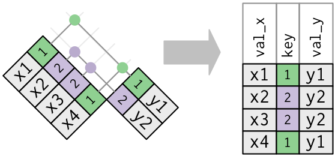

```{r setup, include=FALSE}
knitr::opts_chunk$set(echo = TRUE)
```

# Data transformation

## Introduction

Visualisation is an important tool for insight generation, but it is rare that you get the data in exactly the right form you need. Often you'll need to create some new variables or summaries, or maybe you just want to rename the variables or reorder the observations in order to make the data a little easier to work with. You'll learn how to do all that (and more!) in this chapter, which will teach you how to transform your data using the dplyr package and a new dataset on flights departing New York City in 2013.

### Prerequisites

In this chapter we're going to focus on how to use the dplyr package, another core member of the tidyverse. We'll illustrate the key ideas using data from the nycflights13 package, and use ggplot2 to help us understand the data. 

```{r}
library(nycflights13)
library(tidyverse)
```

Take careful note of the conflicts message that's printed when you load the tidyverse. It tells you that dplyr overwrites some functions in base R. If you want to use the base version of these functions after loading dplyr, you'll need to use their full names: `stats::filter()` and `stats::lag()`.

### nycflights13

To explore the basic data manipulation verbs of dplyr, we'll use `nycflights13::flights`. This data frame contains all `r format(nrow(nycflights13::flights), big.mark = ",")` flights that departed from New York City in 2013. The data comes from the US Bureau of Transportation Statistics, and is documented in `?flights`.

```{r}
flights
```

You might notice that this data frame prints a little differently from other data frames you might have used in the past: it only shows the first few rows and all the columns that fit on one screen. (To see the whole dataset, you can run `View(flights)` which will open the dataset in the RStudio viewer). It prints differently because it's a __tibble__. Tibbles are data frames, but slightly tweaked to work better in the tidyverse. For now, you don't need to worry about the differences; we'll come back to tibbles in more detail in wrangle.
 
You might also have noticed the row of three (or four) letter abbreviations under the column names. These describe the type of each variable:

* `int` stands for integers.

* `dbl` stands for doubles, or real numbers.

* `chr` stands for character vectors, or strings.

* `dttm` stands for date-times (a date + a time).

There are three other common types of variables that aren't used in this dataset but you'll encounter later in the book:

* `lgl` stands for logical, vectors that contain only `TRUE` or `FALSE`.

* `fctr` stands for factors, which R uses to represent categorical variables
  with fixed possible values.

* `date` stands for dates.

### dplyr basics

In this chapter you are going to learn the five key dplyr functions that allow you to solve the vast majority of your data manipulation challenges:

* Pick observations by their values (`filter()`).
* Reorder the rows (`arrange()`).
* Pick variables by their names (`select()`).
* Create new variables with functions of existing variables (`mutate()`).
* Collapse many values down to a single summary (`summarise()`).

These can all be used in conjunction with `group_by()` which changes the scope of each function from operating on the entire dataset to operating on it group-by-group. These six functions provide the verbs for a language of data manipulation.

All verbs work similarly: 

1.  The first argument is a data frame.

1.  The subsequent arguments describe what to do with the data frame,
    using the variable names (without quotes).
    
1.  The result is a new data frame.

Together these properties make it easy to chain together multiple simple steps to achieve a complex result. Let's dive in and see how these verbs work.

## Filter rows with `filter()`

`filter()` allows you to subset observations based on their values. The first argument is the name of the data frame. The second and subsequent arguments are the expressions that filter the data frame. For example, we can select all flights on January 1st with:

```{r}
filter(flights, month == 1, day == 1)
```

When you run that line of code, dplyr executes the filtering operation and returns a new data frame. dplyr functions never modify their inputs, so if you want to save the result, you'll need to use the assignment operator, `<-`:

```{r}
jan1 <- filter(flights, month == 1, day == 1)
```

R either prints out the results, or saves them to a variable. If you want to do both, you can wrap the assignment in parentheses:

```{r}
(dec25 <- filter(flights, month == 12, day == 25))
```

### Comparisons

To use filtering effectively, you have to know how to select the observations that you want using the comparison operators. R provides the standard suite: `>`, `>=`, `<`, `<=`, `!=` (not equal), and `==` (equal). 

When you're starting out with R, the easiest mistake to make is to use `=` instead of `==` when testing for equality. When this happens you'll get an informative error:

```{r, error = TRUE}
filter(flights, month = 1)
```

There's another common problem you might encounter when using `==`: floating point numbers. These results might surprise you!

```{r}
sqrt(2) ^ 2 == 2
1 / 49 * 49 == 1
```

Computers use finite precision arithmetic (they obviously can't store an infinite number of digits!) so remember that every number you see is an approximation. Instead of relying on `==`, use `near()`:

```{r}
near(sqrt(2) ^ 2,  2)
near(1 / 49 * 49, 1)
```

### Logical operators

Multiple arguments to `filter()` are combined with "and": every expression must be true in order for a row to be included in the output. For other types of combinations, you'll need to use Boolean operators yourself: `&` is "and", `|` is "or", and `!` is "not". Figure shows the complete set of Boolean operations.

```{r bool-ops, echo = FALSE, fig.cap = "Complete set of boolean operations. `x` is the left-hand circle, `y` is the right-hand circle, and the shaded region show which parts each operator selects."}
knitr::include_graphics("diagrams/transform-logical.png")
```

The following code finds all flights that departed in November or December:

```{r, eval = FALSE}
filter(flights, month == 11 | month == 12)
```

The order of operations doesn't work like English. You can't write `filter(flights, month == (11 | 12))`, which you might literally translate into  "finds all flights that departed in November or December". Instead it finds all months that equal `11 | 12`, an expression that evaluates to `TRUE`. In a numeric context (like here), `TRUE` becomes one, so this finds all flights in January, not November or December. This is quite confusing!

A useful short-hand for this problem is `x %in% y`. This will select every row where `x` is one of the values in `y`. We could use it to rewrite the code above:

```{r, eval = FALSE}
nov_dec <- filter(flights, month %in% c(11, 12))
```

Sometimes you can simplify complicated subsetting by remembering De Morgan's law: `!(x & y)` is the same as `!x | !y`, and `!(x | y)` is the same as `!x & !y`. For example, if you wanted to find flights that weren't delayed (on arrival or departure) by more than two hours, you could use either of the following two filters:

```{r, eval = FALSE}
filter(flights, !(arr_delay > 120 | dep_delay > 120))
filter(flights, arr_delay <= 120, dep_delay <= 120)
```

As well as `&` and `|`, R also has `&&` and `||`. Don't use them here! You'll learn when you should use them in [conditional execution].

Whenever you start using complicated, multipart expressions in `filter()`, consider making them explicit variables instead. That makes it much easier to check your work. You'll learn how to create new variables shortly.

### Missing values

One important feature of R that can make comparison tricky are missing values, or `NA`s ("not availables"). `NA` represents an unknown value so missing values are "contagious": almost any operation involving an unknown value will also be unknown.

```{r}
NA > 5
10 == NA
NA + 10
NA / 2
```

The most confusing result is this one:

```{r}
NA == NA
```

It's easiest to understand why this is true with a bit more context:

```{r}
# Let x be Mary's age. We don't know how old she is.
x <- NA

# Let y be John's age. We don't know how old he is.
y <- NA

# Are John and Mary the same age?
x == y
# We don't know!
```

If you want to determine if a value is missing, use `is.na()`:

```{r}
is.na(x)
```

`filter()` only includes rows where the condition is `TRUE`; it excludes both `FALSE` and `NA` values. If you want to preserve missing values, ask for them explicitly:

```{r}
df <- tibble(x = c(1, NA, 3))
filter(df, x > 1)
filter(df, is.na(x) | x > 1)
```

### Exercises

1.  Find all flights that

    1. Had an arrival delay of two or more hours
    1. Flew to Houston (`IAH` or `HOU`)
    1. Were operated by United, American, or Delta
    1. Departed in summer (July, August, and September)
    1. Arrived more than two hours late, but didn't leave late
    1. Were delayed by at least an hour, but made up over 30 minutes in flight
    1. Departed between midnight and 6am (inclusive)

1.  Another useful dplyr filtering helper is `between()`. What does it do?
    Can you use it to simplify the code needed to answer the previous 
    challenges?

1.  How many flights have a missing `dep_time`? What other variables are 
    missing? What might these rows represent?

1.  Why is `NA ^ 0` not missing? Why is `NA | TRUE` not missing?
    Why is `FALSE & NA` not missing? Can you figure out the general
    rule?  (`NA * 0` is a tricky counterexample!)

## Arrange rows with `arrange()`

`arrange()` works similarly to `filter()` except that instead of selecting rows, it changes their order. It takes a data frame and a set of column names (or more complicated expressions) to order by. If you provide more than one column name, each additional column will be used to break ties in the values of preceding columns:

```{r}
arrange(flights, year, month, day)
```

Use `desc()` to re-order by a column in descending order:

```{r}
arrange(flights, desc(dep_delay))
```

Missing values are always sorted at the end:

```{r}
df <- tibble(x = c(5, 2, NA))
arrange(df, x)
arrange(df, desc(x))
```

### Exercises

1.  How could you use `arrange()` to sort all missing values to the start?
    (Hint: use `is.na()`).
    
1.  Sort `flights` to find the most delayed flights. Find the flights that
    left earliest.

1.  Sort `flights` to find the fastest (highest speed) flights.

1.  Which flights travelled the farthest? Which travelled the shortest?

## Select columns with `select()`

It's not uncommon to get datasets with hundreds or even thousands of variables. In this case, the first challenge is often narrowing in on the variables you're actually interested in. `select()` allows you to rapidly zoom in on a useful subset using operations based on the names of the variables.

`select()` is not terribly useful with the flights data because we only have 19 variables, but you can still get the general idea:

```{r}
# Select columns by name
select(flights, year, month, day)
# Select all columns between year and day (inclusive)
select(flights, year:day)
# Select all columns except those from year to day (inclusive)
select(flights, -(year:day))
```

There are a number of helper functions you can use within `select()`:

* `starts_with("abc")`: matches names that begin with "abc".

* `ends_with("xyz")`: matches names that end with "xyz".

* `contains("ijk")`: matches names that contain "ijk".

* `matches("(.)\\1")`: selects variables that match a regular expression.
   This one matches any variables that contain repeated characters. You'll 
   learn more about regular expressions in [strings].
   
*  `num_range("x", 1:3)`: matches `x1`, `x2` and `x3`.
   
See `?select` for more details.

`select()` can be used to rename variables, but it's rarely useful because it drops all of the variables not explicitly mentioned. Instead, use `rename()`, which is a variant of `select()` that keeps all the variables that aren't explicitly mentioned:

```{r}
rename(flights, tail_num = tailnum)
```

Another option is to use `select()` in conjunction with the `everything()` helper. This is useful if you have a handful of variables you'd like to move to the start of the data frame.

```{r}
select(flights, time_hour, air_time, everything())
```

### Exercises

1.  Brainstorm as many ways as possible to select `dep_time`, `dep_delay`,
    `arr_time`, and `arr_delay` from `flights`.
    
1.  What happens if you include the name of a variable multiple times in
    a `select()` call?
  
1.  What does the `one_of()` function do? Why might it be helpful in conjunction
    with this vector?
    
    ```{r}
    vars <- c("year", "month", "day", "dep_delay", "arr_delay")
    ```
    
1.  Does the result of running the following code surprise you?  How do the
    select helpers deal with case by default? How can you change that default?

    ```{r, eval = FALSE}
    select(flights, contains("TIME"))
    ```

## Add new variables with `mutate()`

Besides selecting sets of existing columns, it's often useful to add new columns that are functions of existing columns. That's the job of `mutate()`. 

`mutate()` always adds new columns at the end of your dataset so we'll start by creating a narrower dataset so we can see the new variables. Remember that when you're in RStudio, the easiest way to see all the columns is `View()`.

```{r}
flights_sml <- select(flights, 
  year:day, 
  ends_with("delay"), 
  distance, 
  air_time
)
mutate(flights_sml,
  gain = dep_delay - arr_delay,
  speed = distance / air_time * 60
)
```

Note that you can refer to columns that you've just created:

```{r}
mutate(flights_sml,
  gain = dep_delay - arr_delay,
  hours = air_time / 60,
  gain_per_hour = gain / hours
)
```

If you only want to keep the new variables, use `transmute()`:

```{r}
transmute(flights,
  gain = dep_delay - arr_delay,
  hours = air_time / 60,
  gain_per_hour = gain / hours
)
```

### Useful creation functions

There are many functions for creating new variables that you can use with `mutate()`. The key property is that the function must be vectorised: it must take a vector of values as input, return a vector with the same number of values as output. There's no way to list every possible function that you might use, but here's a selection of functions that are frequently useful:

*   Arithmetic operators: `+`, `-`, `*`, `/`, `^`. These are all vectorised,
    using the so called "recycling rules". If one parameter is shorter than 
    the other, it will be automatically extended to be the same length. This 
    is most useful when one of the arguments is a single number: `air_time / 60`,
    `hours * 60 + minute`, etc.
    
    Arithmetic operators are also useful in conjunction with the aggregate
    functions you'll learn about later. For example, `x / sum(x)` calculates 
    the proportion of a total, and `y - mean(y)` computes the difference from 
    the mean.
    
*   Modular arithmetic: `%/%` (integer division) and `%%` (remainder), where
    `x == y * (x %/% y) + (x %% y)`. Modular arithmetic is a handy tool because 
    it allows you to break integers up into pieces. For example, in the 
    flights dataset, you can compute `hour` and `minute` from `dep_time` with:
    
    ```{r}
    transmute(flights,
      dep_time,
      hour = dep_time %/% 100,
      minute = dep_time %% 100
    )
    ```
  
*   Logs: `log()`, `log2()`, `log10()`. Logarithms are an incredibly useful
    transformation for dealing with data that ranges across multiple orders of
    magnitude. They also convert multiplicative relationships to additive, a
    feature we'll come back to in modelling.
    
    All else being equal, I recommend using `log2()` because it's easy to
    interpret: a difference of 1 on the log scale corresponds to doubling on
    the original scale and a difference of -1 corresponds to halving.

*   Offsets: `lead()` and `lag()` allow you to refer to leading or lagging 
    values. This allows you to compute running differences (e.g. `x - lag(x)`) 
    or find when values change (`x != lag(x)`). They are most useful in 
    conjunction with `group_by()`, which you'll learn about shortly.
    
    ```{r}
    (x <- 1:10)
    lag(x)
    lead(x)
    ```
  
*   Cumulative and rolling aggregates: R provides functions for running sums,
    products, mins and maxes: `cumsum()`, `cumprod()`, `cummin()`, `cummax()`; 
    and dplyr provides `cummean()` for cumulative means. If you need rolling
    aggregates (i.e. a sum computed over a rolling window), try the RcppRoll
    package.
    
    ```{r}
    x
    cumsum(x)
    cummean(x)
    ```

*   Logical comparisons, `<`, `<=`, `>`, `>=`, `!=`, and `==`, which you learned about
    earlier. If you're doing a complex sequence of logical operations it's 
    often a good idea to store the interim values in new variables so you can
    check that each step is working as expected.

*   Ranking: there are a number of ranking functions, but you should 
    start with `min_rank()`. It does the most usual type of ranking 
    (e.g. 1st, 2nd, 2nd, 4th). The default gives smallest values the small
    ranks; use `desc(x)` to give the largest values the smallest ranks. 
    
    ```{r}
    y <- c(1, 2, 2, NA, 3, 4)
    min_rank(y)
    min_rank(desc(y))
    ```
    
    If `min_rank()` doesn't do what you need, look at the variants
    `row_number()`, `dense_rank()`, `percent_rank()`, `cume_dist()`,
    `ntile()`.  See their help pages for more details.
    
    ```{r}
    row_number(y)
    dense_rank(y)
    percent_rank(y)
    cume_dist(y)
    ```

### Exercises

```{r, eval = FALSE, echo = FALSE}
flights <- flights %>% mutate(
  dep_time = hour * 60 + minute,
  arr_time = (arr_time %/% 100) * 60 + (arr_time %% 100),
  airtime2 = arr_time - dep_time,
  dep_sched = dep_time + dep_delay
)

ggplot(flights, aes(dep_sched)) + geom_histogram(binwidth = 60)
ggplot(flights, aes(dep_sched %% 60)) + geom_histogram(binwidth = 1)
ggplot(flights, aes(air_time - airtime2)) + geom_histogram()
```

1.  Currently `dep_time` and `sched_dep_time` are convenient to look at, but
    hard to compute with because they're not really continuous numbers. 
    Convert them to a more convenient representation of number of minutes
    since midnight.
    
1.  Compare `air_time` with `arr_time - dep_time`. What do you expect to see?
    What do you see? What do you need to do to fix it?
    
1.  Compare `dep_time`, `sched_dep_time`, and `dep_delay`. How would you
    expect those three numbers to be related?

1.  Find the 10 most delayed flights using a ranking function. How do you want 
    to handle ties? Carefully read the documentation for `min_rank()`.

1.  What does `1:3 + 1:10` return? Why?

1.  What trigonometric functions does R provide?

## Grouped summaries with `summarise()`

The last key verb is `summarise()`. It collapses a data frame to a single row:

```{r}
summarise(flights, delay = mean(dep_delay, na.rm = TRUE))
```

(We'll come back to what that `na.rm = TRUE` means very shortly.)

`summarise()` is not terribly useful unless we pair it with `group_by()`. This changes the unit of analysis from the complete dataset to individual groups. Then, when you use the dplyr verbs on a grouped data frame they'll be automatically applied "by group". For example, if we applied exactly the same code to a data frame grouped by date, we get the average delay per date:

```{r}
by_day <- group_by(flights, year, month, day)
summarise(by_day, delay = mean(dep_delay, na.rm = TRUE))
```

Together `group_by()` and `summarise()` provide one of the tools that you'll use most commonly when working with dplyr: grouped summaries. But before we go any further with this, we need to introduce a powerful new idea: the pipe.

### Combining multiple operations with the pipe

Imagine that we want to explore the relationship between the distance and average delay for each location. Using what you know about dplyr, you might write code like this:

```{r, fig.width = 6}
by_dest <- group_by(flights, dest)
delay <- summarise(by_dest,
  count = n(),
  dist = mean(distance, na.rm = TRUE),
  delay = mean(arr_delay, na.rm = TRUE)
)
delay <- filter(delay, count > 20, dest != "HNL")

# It looks like delays increase with distance up to ~750 miles 
# and then decrease. Maybe as flights get longer there's more 
# ability to make up delays in the air?
ggplot(data = delay, mapping = aes(x = dist, y = delay)) +
  geom_point(aes(size = count), alpha = 1/3) +
  geom_smooth(se = FALSE)
```

There are three steps to prepare this data:

1.  Group flights by destination.

1.  Summarise to compute distance, average delay, and number of flights.

1.  Filter to remove noisy points and Honolulu airport, which is almost
    twice as far away as the next closest airport.

This code is a little frustrating to write because we have to give each intermediate data frame a name, even though we don't care about it. Naming things is hard, so this slows down our analysis. 

There's another way to tackle the same problem with the pipe, `%>%`:

```{r}
delays <- flights %>% 
  group_by(dest) %>% 
  summarise(
    count = n(),
    dist = mean(distance, na.rm = TRUE),
    delay = mean(arr_delay, na.rm = TRUE)
  ) %>% 
  filter(count > 20, dest != "HNL")
```

This focuses on the transformations, not what's being transformed, which makes the code easier to read. You can read it as a series of imperative statements: group, then summarise, then filter. As suggested by this reading, a good way to pronounce `%>%` when reading code is "then".

Behind the scenes, `x %>% f(y)` turns into `f(x, y)`, and `x %>% f(y) %>% g(z)` turns into `g(f(x, y), z)` and so on. You can use the pipe to rewrite multiple operations in a way that you can read left-to-right, top-to-bottom. We'll use piping frequently from now on because it considerably improves the readability of code, and we'll come back to it in more detail in [pipes].

Working with the pipe is one of the key criteria for belonging to the tidyverse. The only exception is ggplot2: it was written before the pipe was discovered. Unfortunately, the next iteration of ggplot2, ggvis, which does use the pipe, isn't quite ready for prime time yet. 

### Missing values

You may have wondered about the `na.rm` argument we used above. What happens if we don't set it?

```{r}
flights %>% 
  group_by(year, month, day) %>% 
  summarise(mean = mean(dep_delay))
```

We get a lot of missing values! That's because aggregation functions obey the usual rule of missing values: if there's any missing value in the input, the output will be a missing value. Fortunately, all aggregation functions have an `na.rm` argument which removes the missing values prior to computation:

```{r}
flights %>% 
  group_by(year, month, day) %>% 
  summarise(mean = mean(dep_delay, na.rm = TRUE))
```

In this case, where missing values represent cancelled flights, we could also tackle the problem by first removing the cancelled flights. We'll save this dataset so we can reuse it in the next few examples.

```{r}
not_cancelled <- flights %>% 
  filter(!is.na(dep_delay), !is.na(arr_delay))

not_cancelled %>% 
  group_by(year, month, day) %>% 
  summarise(mean = mean(dep_delay))
```

### Counts

Whenever you do any aggregation, it's always a good idea to include either a count (`n()`), or a count of non-missing values (`sum(!is.na(x))`). That way you can check that you're not drawing conclusions based on very small amounts of data. For example, let's look at the planes (identified by their tail number) that have the highest average delays:

```{r}
delays <- not_cancelled %>% 
  group_by(tailnum) %>% 
  summarise(
    delay = mean(arr_delay)
  )

ggplot(data = delays, mapping = aes(x = delay)) + 
  geom_freqpoly(binwidth = 10)
```

Wow, there are some planes that have an _average_ delay of 5 hours (300 minutes)!

The story is actually a little more nuanced. We can get more insight if we draw a scatterplot of number of flights vs. average delay:

```{r}
delays <- not_cancelled %>% 
  group_by(tailnum) %>% 
  summarise(
    delay = mean(arr_delay, na.rm = TRUE),
    n = n()
  )

ggplot(data = delays, mapping = aes(x = n, y = delay)) + 
  geom_point(alpha = 1/10)
```

Not surprisingly, there is much greater variation in the average delay when there are few flights. The shape of this plot is very characteristic: whenever you plot a mean (or other summary) vs. group size, you'll see that the variation decreases as the sample size increases.

When looking at this sort of plot, it's often useful to filter out the groups with the smallest numbers of observations, so you can see more of the pattern and less of the extreme variation in the smallest groups. This is what the following code does, as well as showing you a handy pattern for integrating ggplot2 into dplyr flows. It's a bit painful that you have to switch from `%>%` to `+`, but once you get the hang of it, it's quite convenient.

```{r}
delays %>% 
  filter(n > 25) %>% 
  ggplot(mapping = aes(x = n, y = delay)) + 
    geom_point(alpha = 1/10)
```

--------------------------------------------------------------------------------

RStudio tip: a useful keyboard shortcut is Cmd/Ctrl + Shift + P. This resends the previously sent chunk from the editor to the console. This is very convenient when you're (e.g.) exploring the value of `n` in the example above. You send the whole block once with Cmd/Ctrl + Enter, then you modify the value of `n` and press Cmd/Ctrl + Shift + P to resend the complete block.

--------------------------------------------------------------------------------

There's another common variation of this type of pattern. Let's look at how the average performance of batters in baseball is related to the number of times they're at bat. Here I use data from the __Lahman__ package to compute the batting average (number of hits / number of attempts) of every major league baseball player.  

When I plot the skill of the batter (measured by the batting average, `ba`) against the number of opportunities to hit the ball (measured by at bat, `ab`), you see two patterns:

1.  As above, the variation in our aggregate decreases as we get more 
    data points.
    
2.  There's a positive correlation between skill (`ba`) and opportunities to 
    hit the ball (`ab`). This is because teams control who gets to play, 
    and obviously they'll pick their best players.

```{r}
# Convert to a tibble so it prints nicely
batting <- as_tibble(Lahman::Batting)

batters <- batting %>% 
  group_by(playerID) %>% 
  summarise(
    ba = sum(H, na.rm = TRUE) / sum(AB, na.rm = TRUE),
    ab = sum(AB, na.rm = TRUE)
  )

batters %>% 
  filter(ab > 100) %>% 
  ggplot(mapping = aes(x = ab, y = ba)) +
    geom_point() + 
    geom_smooth(se = FALSE)
```

This also has important implications for ranking. If you naively sort on `desc(ba)`, the people with the best batting averages are clearly lucky, not skilled:

```{r}
batters %>% 
  arrange(desc(ba))
```

You can find a good explanation of this problem at [http://varianceexplained.org/r/empirical_bayes_baseball/](http://varianceexplained.org/r/empirical_bayes_baseball/){target="_blank"} and [http://www.evanmiller.org/how-not-to-sort-by-average-rating.html](http://www.evanmiller.org/how-not-to-sort-by-average-rating.html){target="_blank"}.

### Useful summary functions

Just using means, counts, and sum can get you a long way, but R provides many other useful summary functions:

*   Measures of location: we've used `mean(x)`, but `median(x)` is also
    useful. The mean is the sum divided by the length; the median is a value 
    where 50% of `x` is above it, and 50% is below it.
    
    It's sometimes useful to combine aggregation with logical subsetting. 
    We haven't talked about this sort of subsetting yet, but you'll learn more
    about it in subsetting.
    
    ```{r}
    not_cancelled %>% 
      group_by(year, month, day) %>% 
      summarise(
        avg_delay1 = mean(arr_delay),
        avg_delay2 = mean(arr_delay[arr_delay > 0]) # the average positive delay
      )
    ```

*   Measures of spread: `sd(x)`, `IQR(x)`, `mad(x)`. The root mean squared deviation,
    or standard deviation `sd(x)`, is the standard measure of spread.
    The interquartile range `IQR(x)` and median absolute deviation `mad(x)`
    are robust equivalents that may be more useful if you have outliers.
    
    ```{r}
    # Why is distance to some destinations more variable than to others?
    not_cancelled %>% 
      group_by(dest) %>% 
      summarise(distance_sd = sd(distance)) %>% 
      arrange(desc(distance_sd))
    ```
  
*   Measures of rank: `min(x)`, `quantile(x, 0.25)`, `max(x)`. Quantiles
    are a generalisation of the median. For example, `quantile(x, 0.25)`
    will find a value of `x` that is greater than 25% of the values,
    and less than the remaining 75%.

    ```{r}
    # When do the first and last flights leave each day?
    not_cancelled %>% 
      group_by(year, month, day) %>% 
      summarise(
        first = min(dep_time),
        last = max(dep_time)
      )
    ```
  
*   Measures of position: `first(x)`, `nth(x, 2)`, `last(x)`. These work 
    similarly to `x[1]`, `x[2]`, and `x[length(x)]` but let you set a default 
    value if that position does not exist (i.e. you're trying to get the 3rd
    element from a group that only has two elements). For example, we can
    find the first and last departure for each day:
    
    ```{r}
    not_cancelled %>% 
      group_by(year, month, day) %>% 
      summarise(
        first_dep = first(dep_time), 
        last_dep = last(dep_time)
      )
    ```
    
    These functions are complementary to filtering on ranks. Filtering gives
    you all variables, with each observation in a separate row:
    
    ```{r}
    not_cancelled %>% 
      group_by(year, month, day) %>% 
      mutate(r = min_rank(desc(dep_time))) %>% 
      filter(r %in% range(r))
    ```

*   Counts: You've seen `n()`, which takes no arguments, and returns the 
    size of the current group. To count the number of non-missing values, use
    `sum(!is.na(x))`. To count the number of distinct (unique) values, use
    `n_distinct(x)`.
    
    ```{r}
    # Which destinations have the most carriers?
    not_cancelled %>% 
      group_by(dest) %>% 
      summarise(carriers = n_distinct(carrier)) %>% 
      arrange(desc(carriers))
    ```
    
    Counts are so useful that dplyr provides a simple helper if all you want is 
    a count:
    
    ```{r}
    not_cancelled %>% 
      count(dest)
    ```
    
    You can optionally provide a weight variable. For example, you could use 
    this to "count" (sum) the total number of miles a plane flew:
    
    ```{r}
    not_cancelled %>% 
      count(tailnum, wt = distance)
    ```
  
*   Counts and proportions of logical values: `sum(x > 10)`, `mean(y == 0)`.
    When used with numeric functions, `TRUE` is converted to 1 and `FALSE` to 0. 
    This makes `sum()` and `mean()` very useful: `sum(x)` gives the number of 
    `TRUE`s in `x`, and `mean(x)` gives the proportion.
    
    ```{r}
    # How many flights left before 5am? (these usually indicate delayed
    # flights from the previous day)
    not_cancelled %>% 
      group_by(year, month, day) %>% 
      summarise(n_early = sum(dep_time < 500))
    
    # What proportion of flights are delayed by more than an hour?
    not_cancelled %>% 
      group_by(year, month, day) %>% 
      summarise(hour_prop = mean(arr_delay > 60))
    ```

### Grouping by multiple variables

When you group by multiple variables, each summary peels off one level of the grouping. That makes it easy to progressively roll up a dataset:

```{r}
daily <- group_by(flights, year, month, day)
(per_day   <- summarise(daily, flights = n()))
(per_month <- summarise(per_day, flights = sum(flights)))
(per_year  <- summarise(per_month, flights = sum(flights)))
```

Be careful when progressively rolling up summaries: it's OK for sums and counts, but you need to think about weighting means and variances, and it's not possible to do it exactly for rank-based statistics like the median. In other words, the sum of groupwise sums is the overall sum, but the median of groupwise medians is not the overall median.

### Ungrouping

If you need to remove grouping, and return to operations on ungrouped data, use `ungroup()`. 

```{r}
daily %>% 
  ungroup() %>%             # no longer grouped by date
  summarise(flights = n())  # all flights
```

### Exercises

1.  Brainstorm at least 5 different ways to assess the typical delay 
    characteristics of a group of flights. Consider the following scenarios:
    
    * A flight is 15 minutes early 50% of the time, and 15 minutes late 50% of 
      the time.
      
    * A flight is always 10 minutes late.

    * A flight is 30 minutes early 50% of the time, and 30 minutes late 50% of 
      the time.
      
    * 99% of the time a flight is on time. 1% of the time it's 2 hours late.
    
    Which is more important: arrival delay or departure delay?

1.  Come up with another approach that will give you the same output as 
    `not_cancelled %>% count(dest)` and 
    `not_cancelled %>% count(tailnum, wt = distance)` (without using 
    `count()`).

1.  Our definition of cancelled flights (`is.na(dep_delay) | is.na(arr_delay)`
    ) is slightly suboptimal. Why? Which is the most important column?

1.  Look at the number of cancelled flights per day. Is there a pattern?
    Is the proportion of cancelled flights related to the average delay?

1.  Which carrier has the worst delays? Challenge: can you disentangle the
    effects of bad airports vs. bad carriers? Why/why not? (Hint: think about
    `flights %>% group_by(carrier, dest) %>% summarise(n())`)

1.  What does the `sort` argument to `count()` do. When might you use it?

## Grouped mutates (and filters)

Grouping is most useful in conjunction with `summarise()`, but you can also do convenient operations with `mutate()` and `filter()`:

*   Find the worst members of each group:

    ```{r}
    flights_sml %>% 
      group_by(year, month, day) %>%
      filter(rank(desc(arr_delay)) < 10)
    ```

*   Find all groups bigger than a threshold:

    ```{r}
    popular_dests <- flights %>% 
      group_by(dest) %>% 
      filter(n() > 365)
    popular_dests
    ```

*   Standardise to compute per group metrics:

    ```{r}
    popular_dests %>% 
      filter(arr_delay > 0) %>% 
      mutate(prop_delay = arr_delay / sum(arr_delay)) %>% 
      select(year:day, dest, arr_delay, prop_delay)
    ```

A grouped filter is a grouped mutate followed by an ungrouped filter. I generally avoid them except for quick and dirty manipulations: otherwise it's hard to check that you've done the manipulation correctly.

Functions that work most naturally in grouped mutates and filters are known as  window functions (vs. the summary functions used for summaries). You can learn more about useful window functions in the corresponding vignette: `vignette("window-functions")`.

### Exercises

1.  Refer back to the lists of useful mutate and filtering functions. 
    Describe how each operation changes when you combine it with grouping.

1.  Which plane (`tailnum`) has the worst on-time record?

1.  What time of day should you fly if you want to avoid delays as much
    as possible?
    
1.  For each destination, compute the total minutes of delay. For each 
    flight, compute the proportion of the total delay for its destination.
    
1.  Delays are typically temporally correlated: even once the problem that
    caused the initial delay has been resolved, later flights are delayed 
    to allow earlier flights to leave. Using `lag()`, explore how the delay
    of a flight is related to the delay of the immediately preceding flight.
    
1.  Look at each destination. Can you find flights that are suspiciously
    fast? (i.e. flights that represent a potential data entry error). Compute
    the air time of a flight relative to the shortest flight to that destination.
    Which flights were most delayed in the air?
    
1.  Find all destinations that are flown by at least two carriers. Use that
    information to rank the carriers.

1.  For each plane, count the number of flights before the first delay 
    of greater than 1 hour.
    
## datastep

People with experience in SAS® software know that it is sometimes advantageous
to process row-by-row.  In SAS®, row-by-row processing done with a 
data step.  The data step is one of the most fundamental operations
when working in SAS®.

The **libr** package offers a `datastep()` function that simulates this style
of row-by-row processing.  The function includes several of the most basic
parameters available to the SAS® datastep: keep, drop, rename, retain, and by.

```{r}
library(sassy) #library(libr)
```

### Simple Data Step

The data step itself is passed within the 
curly braces. You can put any number of conditional statements and assignments
inside the curly braces, just like a SAS® data step. Also like a 
SAS® data step, you do not need to 'declare' new variables.  Any name 
not identified as an R function name is assumed to be a new variable,
and will be created automatically on the input data.

#### Example 1: Simple Data Step

```{r}
# Add some columns to mtcars using data step logic
df <- datastep(mtcars[1:10, 1:3], {

    if (mpg >= 20) 
      mpgcat <- "High"
    else 
      mpgcat <- "Low"
      
    recdt <- as.Date("1974-06-10")
    
    if (cyl == 8)
      is8cyl <- TRUE

  })
  
# View results  
df
```
### Keep, Drop, and Rename 

The data step has parameters to perform basic shaping of the resulting
data frame.  These parameters are 'keep', 'drop', and 'rename'.  For example,
the above data step could have been performed by sending all columns into 
the data step, and keeping only the desired columns.  Using the `keep` 
parameter also allows you to order the resulting columns.

#### Example 2: Keeping Data Step Variables
```{r}
library(libr)

# Keep and order output columns 
df <- datastep(mtcars[1:10,], 
  keep = c("mpg", "cyl", "disp", "mpgcat", "recdt"), {

    if (mpg >= 20) 
      mpgcat <- "High"
    else 
      mpgcat <- "Low"
      
    recdt <- as.Date("1974-06-10")
    
    if (cyl == 8)
      is8cyl <- TRUE

  })
  
df
```
### The Retain Parameter

The retain parameter allows you to define variables
that will be seeded with the value from the previous step. The retain
option is useful for creating cumulative values or for performing 
conditions based on the value of the previous row.

#### Example 3: Drop, Retain, and Rename Parameters
```{r}
library(libr)

df <- datastep(mtcars[1:10, ],
               drop = c("disp", "hp", "drat", "qsec",
                        "vs", "am", "gear", "carb"),
               retain = list(cumwt = 0 ),
               rename = c(mpg = "MPG", cyl = "Cylinders", wt = "Wgt",
                          cumwt = "Cumulative Wgt"), {

  cumwt <- cumwt + wt

 })

df
```
### By Group Processing
The `datastep()` function also has the capabilities of performing by-group
processing.  A by-group is accomplished using the `by` parameter, and passing
a vector of column names that define the group.  Once a by-group is 
defined, the `first.` and `last.` automatic variables become active, which
allow you to identify the boundaries between groups.  Note that, by default,
your data must be sorted properly before sending it into the data step. To 
turn the sort check off, set the `sort_check` parameter to FALSE.

#### Example 4: By Groups
```{r}
# Identify start and end of by-groups
df <- datastep(mtcars[1:10,], 
  keep = c("mpg", "cyl", "gear", "grp"), 
  by = c("gear"), sort_check = FALSE, {

    if (first. & last.)
      grp <- "Start - End"
    else if (first.)
      grp <- "Start"
    else if (last.)
      grp <- "End"
    else 
      grp <- "-"

  })
  
df
```
### Using Summary Functions
There may be times when you want to combine row-by-row conditional 
processing with column-by-column vector operations.  For example, 
let's say you want to calculate a mean and then perform conditional 
processing on that mean.  This 
situation can be handled using the `calculate` parameter on the `datastep()`
function. The function will execute the `calculate` block first, add any
assigned variables to the data frame, and then execute the data step.  Below 
is an example of such a scenario:

#### Example 5: Calculate Block
```{r}
# Categorize mpg as above or below the mean
df <- datastep(mtcars, 
  keep = c("mpg", "cyl", "mean_mpg", "mpgcat"), 
  calculate = { mean_mpg = mean(mpg) },
  {

    if (mpg >= mean_mpg)
      mpgcat <- "High"
    else 
      mpgcat <- "Low"

  })
  
df[1:10,]
```
### Data Steps with `dplyr`
Note that the `datastep()` function is pipe-friendly, and can be combined
with **dplyr** functions in a data pipeline.  Also note that the `datastep()`
function will recognize any group attributes added by the `group_by()` 
function.  Therefore, within a **dplyr** pipeline, it is not necessary to 
use any `datastep` parameters.  The following example recreates the above 
data frame from Example 5, but with a **dplyr** pipeline.

#### Example 6: Data Pipeline
```{r}
# Add datastep to dplyr pipeline
df <- mtcars %>% 
  select(mpg, cyl, gear) %>% 
  mutate(mean_mpg = mean(mpg)) %>% 
  datastep({

    if (mpg >= mean_mpg)
      mpgcat <- "High"
    else 
      mpgcat <- "Low"

  }) %>% 
  filter(row_number() <= 10)
  
df
```

# Tidy data

## Introduction

> "Happy families are all alike; every unhappy family is unhappy in its
> own way." --– Leo Tolstoy

> "Tidy datasets are all alike, but every messy dataset is messy in its
> own way." --– Hadley Wickham

In this chapter, you will learn a consistent way to organise your data in R, an organisation called __tidy data__. Getting your data into this format requires some upfront work, but that work pays off in the long term. Once you have tidy data and the tidy tools provided by packages in the tidyverse, you will spend much less time munging data from one representation to another, allowing you to spend more time on the analytic questions at hand.

This chapter will give you a practical introduction to tidy data and the accompanying tools in the __tidyr__ package. If you'd like to learn more about the underlying theory, you might enjoy the *Tidy Data* paper published in the Journal of Statistical Software, <http://www.jstatsoft.org/v59/i10/paper>.

### Prerequisites

In this chapter we'll focus on tidyr, a package that provides a bunch of tools to help tidy up your messy datasets. tidyr is a member of the core tidyverse.

```{r}
library(tidyverse)
```

## Tidy data

You can represent the same underlying data in multiple ways. The example below shows the same data organised in four different ways. Each dataset shows the same values of four variables *country*, *year*, *population*, and *cases*, but each dataset organises the values in a different way.

```{r}
table1
table2
table3

# Spread across two tibbles
table4a  # cases
table4b  # population
```

These are all representations of the same underlying data, but they are not equally easy to use. One dataset, the tidy dataset, will be much easier to work with inside the tidyverse. 

There are three interrelated rules which make a dataset tidy:

1.  Each variable must have its own column.
1.  Each observation must have its own row.
1.  Each value must have its own cell.

Figure shows the rules visually.

```{r tidy-structure, echo = FALSE, out.width = "100%", fig.cap = "Following three rules makes a dataset tidy: variables are in columns, observations are in rows, and values are in cells."}
knitr::include_graphics("images/tidy-1.png")
```

These three rules are interrelated because it's impossible to only satisfy two of the three. That interrelationship leads to an even simpler set of practical instructions:

1.  Put each dataset in a tibble.
1.  Put each variable in a column.

In this example, only `table1` is tidy. It's the only representation where each column is a variable.

Why ensure that your data is tidy? There are two main advantages:

1.  There's a general advantage to picking one consistent way of storing
    data. If you have a consistent data structure, it's easier to learn the
    tools that work with it because they have an underlying uniformity.
    
1.  There's a specific advantage to placing variables in columns because
    it allows R's vectorised nature to shine. As you learned in
    mutate and summary functions, most 
    built-in R functions work with vectors of values. That makes transforming 
    tidy data feel particularly natural.

dplyr, ggplot2, and all the other packages in the tidyverse are designed to work with tidy data. Here are a couple of small examples showing how you might work with `table1`.

```{r, out.width = "50%"}
# Compute rate per 10,000
table1 %>% 
  mutate(rate = cases / population * 10000)

# Compute cases per year
table1 %>% 
  count(year, wt = cases)

# Visualise changes over time
library(ggplot2)
ggplot(table1, aes(year, cases)) + 
  geom_line(aes(group = country), colour = "grey50") + 
  geom_point(aes(colour = country))
```

### Exercises

1.  Using prose, describe how the variables and observations are organised in
    each of the sample tables.

1.  Compute the `rate` for `table2`, and `table4a` + `table4b`. 
    You will need to perform four operations:

    1.  Extract the number of TB cases per country per year.
    1.  Extract the matching population per country per year.
    1.  Divide cases by population, and multiply by 10000.
    1.  Store back in the appropriate place.
    
    Which representation is easiest to work with? Which is hardest? Why?

1.  Recreate the plot showing change in cases over time using `table2`
    instead of `table1`. What do you need to do first?

## Pivoting

The principles of tidy data seem so obvious that you might wonder if you'll ever encounter a dataset that isn't tidy. Unfortunately, however, most data that you will encounter will be untidy. There are two main reasons:

1.  Most people aren't familiar with the principles of tidy data, and it's hard
    to derive them yourself unless you spend a _lot_ of time working with data.
    
1.  Data is often organised to facilitate some use other than analysis. For 
    example, data is often organised to make entry as easy as possible.
    
This means for most real analyses, you'll need to do some tidying. The first step is always to figure out what the variables and observations are. Sometimes this is easy; other times you'll need to consult with the people who originally generated the data. 
The second step is to resolve one of two common problems:

1. One variable might be spread across multiple columns.

1. One observation might be scattered across multiple rows.

Typically a dataset will only suffer from one of these problems; it'll only suffer from both if you're really unlucky! To fix these problems, you'll need the two most important functions in tidyr: `pivot_longer()` and `pivot_wider()`.

### Longer

A common problem is a dataset where some of the column names are not names of variables, but _values_ of a variable. Take `table4a`: the column names `1999` and `2000` represent values of the `year` variable, the values in the `1999` and `2000` columns represent values of the `cases` variable, and each row represents two observations, not one.

```{r}
table4a
```

To tidy a dataset like this, we need to __pivot__ the offending columns into a new pair of variables. To describe that operation we need three parameters:

* The set of columns whose names are values, not variables. In this example, 
  those are the columns `1999` and `2000`.

* The name of the variable to move the column names to. Here it is `year`.

* The name of the variable to move the column values to. Here it's `cases`.
  
Together those parameters generate the call to `pivot_longer()`:

```{r}
table4a %>% 
  pivot_longer(c(`1999`, `2000`), names_to = "year", values_to = "cases")
```

The columns to pivot are specified with `dplyr::select()` style notation. Here there are only two columns, so we list them individually. Note that "1999" and "2000" are non-syntactic names (because they don't start with a letter) so we have to surround them in backticks. To refresh your memory of the other ways to select columns, see select.

`year` and `cases` do not exist in `table4a` so we put their names in quotes.

```{r tidy-gather, echo = FALSE, out.width = "100%", fig.cap = "Pivoting `table4` into a longer, tidy form."}
knitr::include_graphics("images/tidy-9.png")
```

In the final result, the pivoted columns are dropped, and we get new `year` and `cases` columns. Otherwise, the relationships between the original variables are preserved. Visually, this is shown in Figure. 

`pivot_longer()` makes datasets longer by increasing the number of rows and decreasing the number of columns. I don’t believe it makes sense to describe a dataset as being in “long form”. Length is a relative term, and you can only say (e.g.) that dataset A is longer than dataset B.

We can use `pivot_longer()` to tidy `table4b` in a similar fashion. The only difference is the variable stored in the cell values:

```{r}
table4b %>% 
  pivot_longer(c(`1999`, `2000`), names_to = "year", values_to = "population")
```

To combine the tidied versions of `table4a` and `table4b` into a single tibble, we need to use `dplyr::left_join()`, which you'll learn about in [relational data].

```{r}
tidy4a <- table4a %>% 
  pivot_longer(c(`1999`, `2000`), names_to = "year", values_to = "cases")
tidy4b <- table4b %>% 
  pivot_longer(c(`1999`, `2000`), names_to = "year", values_to = "population")
left_join(tidy4a, tidy4b)
```

### Wider

`pivot_wider()` is the opposite of `pivot_longer()`. You use it when an observation is scattered across multiple rows. For example, take `table2`: an observation is a country in a year, but each observation is spread across two rows.

```{r}
table2
```

To tidy this up, we first analyse the representation in similar way to `pivot_longer()`. This time, however, we only need two parameters:

* The column to take variable names from. Here, it's `type`.

* The column to take values from. Here it's `count`.

Once we've figured that out, we can use `pivot_wider()`, as shown programmatically below, and visually in Figure.

```{r}
table2 %>%
    pivot_wider(names_from = type, values_from = count)
```

```{r tidy-spread, echo = FALSE, out.width = "100%", fig.cap = "Pivoting `table2` into a \"wider\", tidy form."}
knitr::include_graphics("images/tidy-8.png")
```

As you might have guessed from their names, `pivot_wider()` and `pivot_longer()` are complements. `pivot_longer()` makes wide tables narrower and longer; `pivot_wider()` makes long tables shorter and wider.

### Exercises

1.  Why are `pivot_longer()` and `pivot_wider()` not perfectly symmetrical?  
    Carefully consider the following example:
    
    ```{r, eval = FALSE}
    stocks <- tibble(
      year   = c(2015, 2015, 2016, 2016),
      half  = c(   1,    2,     1,    2),
      return = c(1.88, 0.59, 0.92, 0.17)
    )
    stocks %>% 
      pivot_wider(names_from = year, values_from = return) %>% 
      pivot_longer(`2015`:`2016`, names_to = "year", values_to = "return")
    ```
    
    (Hint: look at the variable types and think about column _names_.)
    
    `pivot_longer()` has a `names_ptype` argument, e.g. 
    `names_ptype = list(year = double())`. What does it do?

1.  Why does this code fail?

    ```{r, error = TRUE}
    table4a %>% 
      pivot_longer(c(1999, 2000), names_to = "year", values_to = "cases")
    ```

1.  What would happen if you widen this table? Why? How could you add a 
    new column to uniquely identify each value?

    ```{r}
    people <- tribble(
      ~name,             ~names,  ~values,
      #-----------------|--------|------
      "Phillip Woods",   "age",       45,
      "Phillip Woods",   "height",   186,
      "Phillip Woods",   "age",       50,
      "Jessica Cordero", "age",       37,
      "Jessica Cordero", "height",   156
    )
    ```

1.  Tidy the simple tibble below. Do you need to make it wider or longer?
    What are the variables?

    ```{r}
    preg <- tribble(
      ~pregnant, ~male, ~female,
      "yes",     NA,    10,
      "no",      20,    12
    )
    ```

## Separating and uniting

So far you've learned how to tidy `table2` and `table4`, but not `table3`. `table3` has a different problem: we have one column (`rate`) that contains two variables (`cases` and `population`). To fix this problem, we'll need the `separate()` function. You'll also learn about the complement of `separate()`: `unite()`, which you use if a single variable is spread across multiple columns.

### Separate

`separate()` pulls apart one column into multiple columns, by splitting wherever a separator character appears. Take `table3`:

```{r}
table3
```

The `rate` column contains both `cases` and `population` variables, and we need to split it into two variables. `separate()` takes the name of the column to separate, and the names of the columns to separate into, as shown in Figure and the code below.

```{r}
table3 %>% 
  separate(rate, into = c("cases", "population"))
```

```{r tidy-separate, echo = FALSE, out.width = "75%", fig.cap = "Separating `table3` makes it tidy"}
knitr::include_graphics("images/tidy-17.png")
```

By default, `separate()` will split values wherever it sees a non-alphanumeric character (i.e. a character that isn't a number or letter). For example, in the code above, `separate()` split the values of `rate` at the forward slash characters. If you wish to use a specific character to separate a column, you can pass the character to the `sep` argument of `separate()`. For example, we could rewrite the code above as:

```{r eval = FALSE}
table3 %>% 
  separate(rate, into = c("cases", "population"), sep = "/")
```

(Formally, `sep` is a regular expression, which you'll learn more about in [strings].)

Look carefully at the column types: you'll notice that `cases` and `population` are character columns. This is the default behaviour in `separate()`: it leaves the type of the column as is. Here, however, it's not very useful as those really are numbers. We can ask `separate()` to try and convert to better types using `convert = TRUE`:

```{r}
table3 %>% 
  separate(rate, into = c("cases", "population"), convert = TRUE)
```

You can also pass a vector of integers to `sep`. `separate()` will interpret the integers as positions to split at. Positive values start at 1 on the far-left of the strings; negative value start at -1 on the far-right of the strings. When using integers to separate strings, the length of `sep` should be one less than the number of names in `into`. 

You can use this arrangement to separate the last two digits of each year. This make this data less tidy, but is useful in other cases, as you'll see in a little bit.

```{r}
table3 %>% 
  separate(year, into = c("century", "year"), sep = 2)
```

### Unite

`unite()` is the inverse of `separate()`: it combines multiple columns into a single column. You'll need it much less frequently than `separate()`, but it's still a useful tool to have in your back pocket.

```{r tidy-unite, echo = FALSE, out.width = "75%", fig.cap = "Uniting `table5` makes it tidy"}
knitr::include_graphics("images/tidy-18.png")
```

We can use `unite()` to rejoin the *century* and *year* columns that we created in the last example. That data is saved as `tidyr::table5`. `unite()` takes a data frame, the name of the new variable to create, and a set of columns to combine, again specified in `dplyr::select()` style:

```{r}
table5 %>% 
  unite(new, century, year)
```

In this case we also need to use the `sep` argument. The default will place an underscore (`_`) between the values from different columns. Here we don't want any separator so we use `""`:

```{r}
table5 %>% 
  unite(new, century, year, sep = "")
```

### Exercises

1.  What do the `extra` and `fill` arguments do in `separate()`? 
    Experiment with the various options for the following two toy datasets.
    
    ```{r, eval = FALSE}
    tibble(x = c("a,b,c", "d,e,f,g", "h,i,j")) %>% 
      separate(x, c("one", "two", "three"))
    
    tibble(x = c("a,b,c", "d,e", "f,g,i")) %>% 
      separate(x, c("one", "two", "three"))
    ```

1.  Both `unite()` and `separate()` have a `remove` argument. What does it
    do? Why would you set it to `FALSE`?

1.  Compare and contrast `separate()` and `extract()`.  Why are there
    three variations of separation (by position, by separator, and with
    groups), but only one unite?

## Missing values

Changing the representation of a dataset brings up an important subtlety of missing values. Surprisingly, a value can be missing in one of two possible ways:

* __Explicitly__, i.e. flagged with `NA`.
* __Implicitly__, i.e. simply not present in the data.

Let's illustrate this idea with a very simple data set:

```{r}
stocks <- tibble(
  year   = c(2015, 2015, 2015, 2015, 2016, 2016, 2016),
  qtr    = c(   1,    2,    3,    4,    2,    3,    4),
  return = c(1.88, 0.59, 0.35,   NA, 0.92, 0.17, 2.66)
)
```

There are two missing values in this dataset:

* The return for the fourth quarter of 2015 is explicitly missing, because
  the cell where its value should be instead contains `NA`.
  
* The return for the first quarter of 2016 is implicitly missing, because it
  simply does not appear in the dataset.
  
One way to think about the difference is with this Zen-like koan: An explicit missing value is the presence of an absence; an implicit missing value is the absence of a presence.

The way that a dataset is represented can make implicit values explicit. For example, we can make the implicit missing value explicit by putting years in the columns:

```{r}
stocks %>% 
  pivot_wider(names_from = year, values_from = return)
```

Because these explicit missing values may not be important in other representations of the data, you can set `values_drop_na = TRUE` in `pivot_longer()` to turn explicit missing values implicit:

```{r}
stocks %>% 
  pivot_wider(names_from = year, values_from = return) %>% 
  pivot_longer(
    cols = c(`2015`, `2016`), 
    names_to = "year", 
    values_to = "return", 
    values_drop_na = TRUE
  )
```

Another important tool for making missing values explicit in tidy data is `complete()`:

```{r}
stocks %>% 
  complete(year, qtr)
```

`complete()` takes a set of columns, and finds all unique combinations. It then ensures the original dataset contains all those values, filling in explicit `NA`s where necessary.

There's one other important tool that you should know for working with missing values. Sometimes when a data source has primarily been used for data entry, missing values indicate that the previous value should be carried forward:

```{r}
treatment <- tribble(
  ~ person,           ~ treatment, ~response,
  "Derrick Whitmore", 1,           7,
  NA,                 2,           10,
  NA,                 3,           9,
  "Katherine Burke",  1,           4
)
```

You can fill in these missing values with `fill()`. It takes a set of columns where you want missing values to be replaced by the most recent non-missing value (sometimes called last observation carried forward).

```{r}
treatment %>% 
  fill(person)
```

### Exercises

1.  Compare and contrast the `fill` arguments to `pivot_wider()` and `complete()`. 

1.  What does the direction argument to `fill()` do?


# Relational data

## Introduction

It's rare that a data analysis involves only a single table of data. Typically you have many tables of data, and you must combine them to answer the questions that you're interested in. Collectively, multiple tables of data are called __relational data__ because it is the relations, not just the individual datasets, that are important.

Relations are always defined between a pair of tables. All other relations are built up from this simple idea: the relations of three or more tables are always a property of the relations between each pair. Sometimes both elements of a pair can be the same table! This is needed if, for example, you have a table of people, and each person has a reference to their parents.

To work with relational data you need verbs that work with pairs of tables. There are three families of verbs designed to work with relational data:

* __Mutating joins__, which add new variables to one data frame from matching
  observations in another.

* __Filtering joins__, which filter observations from one data frame based on
  whether or not they match an observation in the other table.

* __Set operations__, which treat observations as if they were set elements.

The most common place to find relational data is in a _relational_ database management system (or RDBMS), a term that encompasses almost all modern databases. If you've used a database before, you've almost certainly used SQL. If so, you should find the concepts in this chapter familiar, although their expression in dplyr is a little different. Generally, dplyr is a little easier to use than SQL because dplyr is specialised to do data analysis: it makes common data analysis operations easier, at the expense of making it more difficult to do other things that aren't commonly needed for data analysis.

### Prerequisites

We will explore relational data from `nycflights13` using the two-table verbs from dplyr.

```{r}
library(tidyverse)
library(nycflights13)
```

## nycflights13

We will use the nycflights13 package to learn about relational data. nycflights13 contains four tibbles that are related to the `flights` table that you used in [data transformation]:

*   `airlines` lets you look up the full carrier name from its abbreviated
    code:

    ```{r}
    airlines
    ```

*   `airports` gives information about each airport, identified by the `faa`
    airport code:

    ```{r}
    airports
    ```

*   `planes` gives information about each plane, identified by its `tailnum`:

    ```{r}
    planes
    ```

*   `weather` gives the weather at each NYC airport for each hour:

    ```{r}
    weather
    ```

One way to show the relationships between the different tables is with a drawing:

```{r, echo = FALSE}
knitr::include_graphics("diagrams/relational-nycflights.png")
```

This diagram is a little overwhelming, but it's simple compared to some you'll see in the wild! The key to understanding diagrams like this is to remember each relation always concerns a pair of tables. You don't need to understand the whole thing; you just need to understand the chain of relations between the tables that you are interested in.

For nycflights13:

* `flights` connects to `planes` via a single variable, `tailnum`. 

* `flights` connects to `airlines` through the `carrier` variable.

* `flights` connects to `airports` in two ways: via the `origin` and
  `dest` variables.

* `flights` connects to `weather` via `origin` (the location), and
  `year`, `month`, `day` and `hour` (the time).

### Exercises

1.  Imagine you wanted to draw (approximately) the route each plane flies from
    its origin to its destination. What variables would you need? What tables
    would you need to combine?

1.  I forgot to draw the relationship between `weather` and `airports`.
    What is the relationship and how should it appear in the diagram?

1.  `weather` only contains information for the origin (NYC) airports. If
    it contained weather records for all airports in the USA, what additional
    relation would it define with `flights`?

1.  We know that some days of the year are "special", and fewer people than
    usual fly on them. How might you represent that data as a data frame?
    What would be the primary keys of that table? How would it connect to the
    existing tables?

## Keys

The variables used to connect each pair of tables are called __keys__. A key is a variable (or set of variables) that uniquely identifies an observation. In simple cases, a single variable is sufficient to identify an observation. For example, each plane is uniquely identified by its `tailnum`. In other cases, multiple variables may be needed. For example, to identify an observation in `weather` you need five variables: `year`, `month`, `day`, `hour`, and `origin`.

There are two types of keys:

* A __primary key__ uniquely identifies an observation in its own table.
  For example, `planes$tailnum` is a primary key because it uniquely identifies
  each plane in the `planes` table.

* A __foreign key__ uniquely identifies an observation in another table.
  For example, `flights$tailnum` is a foreign key because it appears in the 
  `flights` table where it matches each flight to a unique plane.

A variable can be both a primary key _and_ a foreign key. For example, `origin` is part of the `weather` primary key, and is also a foreign key for the `airport` table.

Once you've identified the primary keys in your tables, it's good practice to verify that they do indeed uniquely identify each observation. One way to do that is to `count()` the primary keys and look for entries where `n` is greater than one:

```{r}
planes %>% 
  count(tailnum) %>% 
  filter(n > 1)

weather %>% 
  count(year, month, day, hour, origin) %>% 
  filter(n > 1)
```

Sometimes a table doesn't have an explicit primary key: each row is an observation, but no combination of variables reliably identifies it. For example, what's the primary key in the `flights` table? You might think it would be the date plus the flight or tail number, but neither of those are unique:

```{r}
flights %>% 
  count(year, month, day, flight) %>% 
  filter(n > 1)

flights %>% 
  count(year, month, day, tailnum) %>% 
  filter(n > 1)
```

When starting to work with this data, I had naively assumed that each flight number would be only used once per day: that would make it much easier to communicate problems with a specific flight. Unfortunately that is not the case! If a table lacks a primary key, it's sometimes useful to add one with `mutate()` and `row_number()`. That makes it easier to match observations if you've done some filtering and want to check back in with the original data. This is called a __surrogate key__.

A primary key and the corresponding foreign key in another table form a __relation__. Relations are typically one-to-many. For example, each flight has one plane, but each plane has many flights. In other data, you'll occasionally see a 1-to-1 relationship. You can think of this as a special case of 1-to-many. You can model many-to-many relations with a many-to-1 relation plus a 1-to-many relation. For example, in this data there's a many-to-many relationship between airlines and airports: each airline flies to many airports; each airport hosts many airlines.

### Exercises

1.  Add a surrogate key to `flights`.

1.  Identify the keys in the following datasets

    1.  `Lahman::Batting`,
    1.  `babynames::babynames`
    1.  `nasaweather::atmos`
    1.  `fueleconomy::vehicles`
    1.  `ggplot2::diamonds`
    
    (You might need to install some packages and read some documentation.)

1.  Draw a diagram illustrating the connections between the `Batting`,
    `Master`, and `Salaries` tables in the Lahman package. Draw another diagram
    that shows the relationship between `Master`, `Managers`, `AwardsManagers`.

    How would you characterise the relationship between the `Batting`,
    `Pitching`, and `Fielding` tables?

## Mutating joins

The first tool we'll look at for combining a pair of tables is the __mutating join__. A mutating join allows you to combine variables from two tables. It first matches observations by their keys, then copies across variables from one table to the other.

Like `mutate()`, the join functions add variables to the right, so if you have a lot of variables already, the new variables won't get printed out. For these examples, we'll make it easier to see what's going on in the examples by creating a narrower dataset:

```{r}
flights2 <- flights %>% 
  select(year:day, hour, origin, dest, tailnum, carrier)
flights2
```

(Remember, when you're in RStudio, you can also use `View()` to avoid this problem.)

Imagine you want to add the full airline name to the `flights2` data. You can combine the `airlines` and `flights2` data frames with `left_join()`:

```{r}
flights2 %>%
  select(-origin, -dest) %>% 
  left_join(airlines, by = "carrier")
```

The result of joining airlines to flights2 is an additional variable: `name`. This is why I call this type of join a mutating join. In this case, you could have got to the same place using `mutate()` and R's base subsetting:

```{r}
flights2 %>%
  select(-origin, -dest) %>% 
  mutate(name = airlines$name[match(carrier, airlines$carrier)])
```

But this is hard to generalise when you need to match multiple variables, and takes close reading to figure out the overall intent.

The following sections explain, in detail, how mutating joins work. You'll start by learning a useful visual representation of joins. We'll then use that to explain the four mutating join functions: the inner join, and the three outer joins. When working with real data, keys don't always uniquely identify observations, so next we'll talk about what happens when there isn't a unique match. Finally, you'll learn how to tell dplyr which variables are the keys for a given join.

### Understanding joins

To help you learn how joins work, I'm going to use a visual representation:

```{r, echo = FALSE, out.width = NULL}
knitr::include_graphics("diagrams/join-setup.png")
```
```{r}
x <- tribble(
  ~key, ~val_x,
     1, "x1",
     2, "x2",
     3, "x3"
)
y <- tribble(
  ~key, ~val_y,
     1, "y1",
     2, "y2",
     4, "y3"
)
```

The coloured column represents the "key" variable: these are used to match the rows between the tables. The grey column represents the "value" column that is carried along for the ride. In these examples I'll show a single key variable, but the idea generalises in a straightforward way to multiple keys and multiple values.

A join is a way of connecting each row in `x` to zero, one, or more rows in `y`. The following diagram shows each potential match as an intersection of a pair of lines.

```{r, echo = FALSE, out.width = NULL}
knitr::include_graphics("diagrams/join-setup2.png")
```

(If you look closely, you might notice that we've switched the order of the key and value columns in `x`. This is to emphasise that joins match based on the key; the value is just carried along for the ride.)

In an actual join, matches will be indicated with dots. The number of dots = the number of matches = the number of rows in the output.

```{r, echo = FALSE, out.width = NULL}
knitr::include_graphics("diagrams/join-inner.png")
```

### Inner join

The simplest type of join is the __inner join__. An inner join matches pairs of observations whenever their keys are equal:

```{r, echo = FALSE, out.width = NULL}
knitr::include_graphics("diagrams/join-inner.png")
```

(To be precise, this is an inner __equijoin__ because the keys are matched using the equality operator. Since most joins are equijoins we usually drop that specification.)

The output of an inner join is a new data frame that contains the key, the x values, and the y values. We use `by` to tell dplyr which variable is the key:

```{r}
x %>% 
  inner_join(y, by = "key")
```

The most important property of an inner join is that unmatched rows are not included in the result. This means that generally inner joins are usually not appropriate for use in analysis because it's too easy to lose observations.

### Outer joins

An inner join keeps observations that appear in both tables. An __outer join__ keeps observations that appear in at least one of the tables. There are three types of outer joins:

* A __left join__ keeps all observations in `x`.
* A __right join__ keeps all observations in `y`.
* A __full join__ keeps all observations in `x` and `y`.

These joins work by adding an additional "virtual" observation to each table. This observation has a key that always matches (if no other key matches), and a value filled with `NA`.

Graphically, that looks like:

```{r, echo = FALSE, out.width = NULL}
knitr::include_graphics("diagrams/join-outer.png")
```

The most commonly used join is the left join: you use this whenever you look up additional data from another table, because it preserves the original observations even when there isn't a match. The left join should be your default join: use it unless you have a strong reason to prefer one of the others.

Another way to depict the different types of joins is with a Venn diagram:

```{r, echo = FALSE, out.width = NULL}
knitr::include_graphics("diagrams/join-venn.png")
```

However, this is not a great representation. It might jog your memory about which join preserves the observations in which table, but it suffers from a major limitation: a Venn diagram can't show what happens when keys don't uniquely identify an observation.

### Duplicate keys

So far all the diagrams have assumed that the keys are unique. But that's not always the case. This section explains what happens when the keys are not unique. There are two possibilities:

1.  One table has duplicate keys. This is useful when you want to
    add in additional information as there is typically a one-to-many
    relationship.

    ```{r, echo = FALSE, out.width = NULL}
    
    ```

    Note that I've put the key column in a slightly different position
    in the output. This reflects that the key is a primary key in `y`
    and a foreign key in `x`.

    ```{r}
    x <- tribble(
      ~key, ~val_x,
         1, "x1",
         2, "x2",
         2, "x3",
         1, "x4"
    )
    y <- tribble(
      ~key, ~val_y,
         1, "y1",
         2, "y2"
    )
    left_join(x, y, by = "key")
    ```

1.  Both tables have duplicate keys. This is usually an error because in
    neither table do the keys uniquely identify an observation. When you join
    duplicated keys, you get all possible combinations, the Cartesian product:

    ```{r, echo = FALSE, out.width = NULL}
    knitr::include_graphics("diagrams/join-many-to-many.png")
    ```

    ```{r}
    x <- tribble(
      ~key, ~val_x,
         1, "x1",
         2, "x2",
         2, "x3",
         3, "x4"
    )
    y <- tribble(
      ~key, ~val_y,
         1, "y1",
         2, "y2",
         2, "y3",
         3, "y4"
    )
    left_join(x, y, by = "key")
    ```

### Defining the key columns

So far, the pairs of tables have always been joined by a single variable, and that variable has the same name in both tables. That constraint was encoded by `by = "key"`. You can use other values for `by` to connect the tables in other ways:

  * The default, `by = NULL`, uses all variables that appear in both tables,
    the so called __natural__ join. For example, the flights and weather tables
    match on their common variables: `year`, `month`, `day`, `hour` and
    `origin`.

    ```{r}
    flights2 %>% 
      left_join(weather)
    ```

  * A character vector, `by = "x"`. This is like a natural join, but uses only
    some of the common variables. For example, `flights` and `planes` have
    `year` variables, but they mean different things so we only want to join by
    `tailnum`.

    ```{r}
    flights2 %>% 
      left_join(planes, by = "tailnum")
    ```

    Note that the `year` variables (which appear in both input data frames,
    but are not constrained to be equal) are disambiguated in the output with
    a suffix.

  * A named character vector: `by = c("a" = "b")`. This will
    match variable `a` in table `x` to variable `b` in table `y`. The
    variables from `x` will be used in the output.

    For example, if we want to draw a map we need to combine the flights data
    with the airports data which contains the location (`lat` and `lon`) of
    each airport. Each flight has an origin and destination `airport`, so we
    need to specify which one we want to join to:

    ```{r}
    flights2 %>% 
      left_join(airports, c("dest" = "faa"))
    
    flights2 %>% 
      left_join(airports, c("origin" = "faa"))
    ```

### Exercises

1.  Compute the average delay by destination, then join on the `airports`
    data frame so you can show the spatial distribution of delays. Here's an
    easy way to draw a map of the United States:

    ```{r, eval = FALSE}
    airports %>%
      semi_join(flights, c("faa" = "dest")) %>%
      ggplot(aes(lon, lat)) +
        borders("state") +
        geom_point() +
        coord_quickmap()
    ```

    (Don't worry if you don't understand what `semi_join()` does --- you'll
    learn about it next.)

    You might want to use the `size` or `colour` of the points to display
    the average delay for each airport.

1.  Add the location of the origin _and_ destination (i.e. the `lat` and `lon`)
    to `flights`.

1.  Is there a relationship between the age of a plane and its delays?

1.  What weather conditions make it more likely to see a delay?

1.  What happened on June 13 2013? Display the spatial pattern of delays,
    and then use Google to cross-reference with the weather.

    ```{r, eval = FALSE, include = FALSE}
    worst <- filter(flights, !is.na(dep_time), month == 6, day == 13)
    worst %>%
      group_by(dest) %>%
      summarise(delay = mean(arr_delay), n = n()) %>%
      filter(n > 5) %>%
      inner_join(airports, by = c("dest" = "faa")) %>%
      ggplot(aes(lon, lat)) +
        borders("state") +
        geom_point(aes(size = n, colour = delay)) +
        coord_quickmap()
    ```

### Other implementations

`base::merge()` can perform all four types of mutating join:

dplyr              | merge
-------------------|-------------------------------------------
`inner_join(x, y)` | `merge(x, y)`
`left_join(x, y)`  | `merge(x, y, all.x = TRUE)`
`right_join(x, y)` | `merge(x, y, all.y = TRUE)`,
`full_join(x, y)`  | `merge(x, y, all.x = TRUE, all.y = TRUE)`

The advantages of the specific dplyr verbs is that they more clearly convey the intent of your code: the difference between the joins is really important but concealed in the arguments of `merge()`. dplyr's joins are considerably faster and don't mess with the order of the rows.

SQL is the inspiration for dplyr's conventions, so the translation is straightforward:

dplyr                        | SQL
-----------------------------|-------------------------------------------
`inner_join(x, y, by = "z")` | `SELECT * FROM x INNER JOIN y USING (z)`
`left_join(x, y, by = "z")`  | `SELECT * FROM x LEFT OUTER JOIN y USING (z)`
`right_join(x, y, by = "z")` | `SELECT * FROM x RIGHT OUTER JOIN y USING (z)`
`full_join(x, y, by = "z")`  | `SELECT * FROM x FULL OUTER JOIN y USING (z)`

Note that "INNER" and "OUTER" are optional, and often omitted.

Joining different variables between the tables, e.g. `inner_join(x, y, by = c("a" = "b"))` uses a slightly different syntax in SQL: `SELECT * FROM x INNER JOIN y ON x.a = y.b`. As this syntax suggests, SQL supports a wider  range of join types than dplyr because you can connect the tables using constraints other than equality (sometimes called non-equijoins).

## Filtering joins

Filtering joins match observations in the same way as mutating joins, but affect the observations, not the variables. There are two types:

* `semi_join(x, y)` __keeps__ all observations in `x` that have a match in `y`.
* `anti_join(x, y)` __drops__ all observations in `x` that have a match in `y`.

Semi-joins are useful for matching filtered summary tables back to the original rows. For example, imagine you've found the top ten most popular destinations:

```{r}
top_dest <- flights %>%
  count(dest, sort = TRUE) %>%
  head(10)
top_dest
```

Now you want to find each flight that went to one of those destinations. You could construct a filter yourself:

```{r}
flights %>% 
  filter(dest %in% top_dest$dest)
```

But it's difficult to extend that approach to multiple variables. For example, imagine that you'd found the 10 days with highest average delays. How would you construct the filter statement that used `year`, `month`, and `day` to match it back to `flights`?

Instead you can use a semi-join, which connects the two tables like a mutating join, but instead of adding new columns, only keeps the rows in `x` that have a match in `y`:

```{r}
flights %>% 
  semi_join(top_dest)
```

Graphically, a semi-join looks like this:

```{r, echo = FALSE, out.width = NULL}
knitr::include_graphics("diagrams/join-semi.png")
```

Only the existence of a match is important; it doesn't matter which observation is matched. This means that filtering joins never duplicate rows like mutating joins do:

```{r, echo = FALSE, out.width = NULL}
knitr::include_graphics("diagrams/join-semi-many.png")
```

The inverse of a semi-join is an anti-join. An anti-join keeps the rows that _don't_ have a match:

```{r, echo = FALSE, out.width = NULL}
knitr::include_graphics("diagrams/join-anti.png")
```

Anti-joins are useful for diagnosing join mismatches. For example, when connecting `flights` and `planes`, you might be interested to know that there are many `flights` that don't have a match in `planes`:

```{r}
flights %>%
  anti_join(planes, by = "tailnum") %>%
  count(tailnum, sort = TRUE)
```

### Exercises

1.  What does it mean for a flight to have a missing `tailnum`? What do the
    tail numbers that don't have a matching record in `planes` have in common?
    (Hint: one variable explains ~90% of the problems.)

1.  Filter flights to only show flights with planes that have flown at least 100
    flights.

1.  Combine `fueleconomy::vehicles` and `fueleconomy::common` to find only the
    records for the most common models.

1.  Find the 48 hours (over the course of the whole year) that have the worst
    delays. Cross-reference it with the `weather` data. Can you see any
    patterns?

1.  What does `anti_join(flights, airports, by = c("dest" = "faa"))` tell you?
    What does `anti_join(airports, flights, by = c("faa" = "dest"))` tell you?

1.  You might expect that there's an implicit relationship between plane
    and airline, because each plane is flown by a single airline. Confirm
    or reject this hypothesis using the tools you've learned above.

## Join problems

The data you've been working with in this chapter has been cleaned up so that you'll have as few problems as possible. Your own data is unlikely to be so nice, so there are a few things that you should do with your own data to make your joins go smoothly.

1.  Start by identifying the variables that form the primary key in each table.
    You should usually do this based on your understanding of the data, not
    empirically by looking for a combination of variables that give a
    unique identifier. If you just look for variables without thinking about
    what they mean, you might get (un)lucky and find a combination that's
    unique in your current data but the relationship might not be true in
    general.

    For example, the altitude and longitude uniquely identify each airport,
    but they are not good identifiers!

    ```{r}
    airports %>% count(alt, lon) %>% filter(n > 1)
    ```

1.  Check that none of the variables in the primary key are missing. If
    a value is missing then it can't identify an observation!

1.  Check that your foreign keys match primary keys in another table. The
    best way to do this is with an `anti_join()`. It's common for keys
    not to match because of data entry errors. Fixing these is often a lot of
    work.

    If you do have missing keys, you'll need to be thoughtful about your
    use of inner vs. outer joins, carefully considering whether or not you
    want to drop rows that don't have a match.

Be aware that simply checking the number of rows before and after the join is not sufficient to ensure that your join has gone smoothly. If you have an inner join with duplicate keys in both tables, you might get unlucky as the number of dropped rows might exactly equal the number of duplicated rows!

## Set operations

The final type of two-table verb are the set operations. Generally, I use these the least frequently, but they are occasionally useful when you want to break a single complex filter into simpler pieces. All these operations work with a complete row, comparing the values of every variable. These expect the `x` and `y` inputs to have the same variables, and treat the observations like sets:

* `intersect(x, y)`: return only observations in both `x` and `y`.
* `union(x, y)`: return unique observations in `x` and `y`.
* `setdiff(x, y)`: return observations in `x`, but not in `y`.

Given this simple data:

```{r}
df1 <- tribble(
  ~x, ~y,
   1,  1,
   2,  1
)
df2 <- tribble(
  ~x, ~y,
   1,  1,
   1,  2
)
```

The four possibilities are:

```{r}
intersect(df1, df2)

# Note that we get 3 rows, not 4
union(df1, df2)

setdiff(df1, df2)

setdiff(df2, df1)
```
